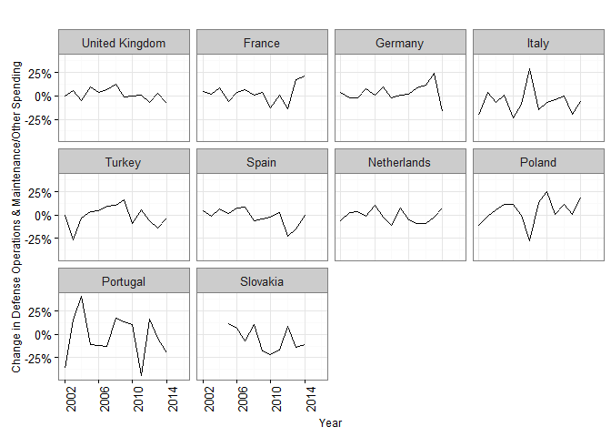
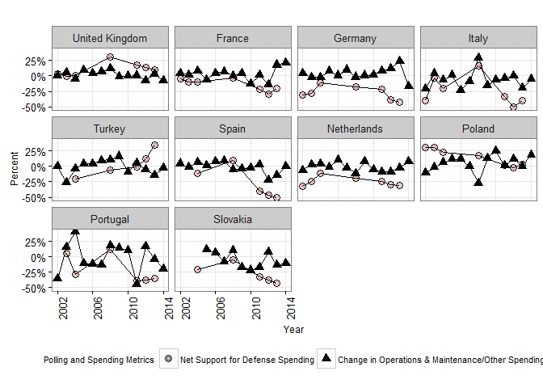
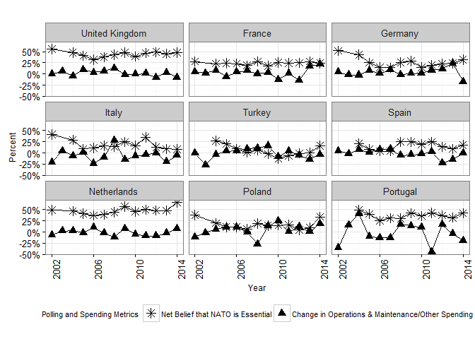

This is an R Markdown document. Markdown is a simple formatting syntax for authoring HTML, PDF, and MS Word documents. For more details on using R Markdown see <http://rmarkdown.rstudio.com>.

When you click the **Knit** button a document will be generated that includes both content as well as the output of any embedded R code chunks within the document. You can embed an R code chunk like this:


# Setup


## Dataset Prep

```r
EuropeSample<-read.csv("..\\Data\\EuropeSample.csv", 
                                 header = TRUE) 

EuropeSample$Cabinet<-"Cabinet"
EuropeSample$Opposition<-"Opposition"

EuropeDefOrEquDelt<-melt(EuropeSample,
                 measure.vars=c("DefSpendDelt","DefSpendDelt_lead",
                                "EquSpendDelt","EquSpendDelt_lead",
                                "OnMspendDelt","OnMspendDelt_lead"),
                 variable.name="DefOrEqu",
                 value.name = "ExpenditureDelt")


EuropeDefOrEqu<-melt(EuropeSample,
                 measure.vars=c("DefSpend","DefSpend_lead",
                                "EquSpend","EquSpend_lead",
                                "OnMspend","OnMspend_lead"),
                 variable.name="DefOrEqu",
                 value.name = "Expenditure")

EuropeLong<-melt(EuropeSample,
                     id.vars=c("Country","Year"),
                 measure.vars=c("DefSpendDelt","DefSpendDelt_lead",
                                "EquSpendDelt_lead","EquSpendDelt",
                                "OnMspendDelt_lead","OnMspendDelt",
                                "DefSpend","DefSpend_lead",
                                "EquSpend_lead","EquSpend",
                                "OnMspend_lead","OnMspend",
                                "DefSpread","DefSpread_lag1","DefSpread_lag2",
                                "EUldrSpread","EUldrSpread_lag1","EUldrSpread_lag2",
                                "NATOessSpread","NATOessSpread_lag1","NATOessSpread_lag2", 
                                "EUcloserUSspread", "EUcloserUSspread_lag1","EUcloserUSspread_lag2",
                                "NGDP_eu2014","NGDP_eu2014Delt","EUdebt_NGDP","Dfc_NGDP","Debt_NGDP",
                                "IntAt", "DomAt","GCivilWarBRD","UNmilitaryPMil","RussiaDefSpend",
                                "Cab_left_right","Opp_left_right","left_right_ls_spread",
                                "Cab_liberty_authority","Opp_liberty_authority","liberty_authority_ls_spread",
                                "Cab_eu_anti_pro","Opp_eu_anti_pro","Opp_eu_anti_pro"),
                 variable.name="MetricName",
                 value.name = "MetricValue")

        

EuropeLong<-subset(EuropeLong,!is.na(MetricValue))
```

You can also embed plots, for example:

#Dependent Variables


```
## Warning: One or more parsing issues, call `problems()` on your data frame for details,
## e.g.:
##   dat <- vroom(...)
##   problems(dat)
```

```
## Rows: 849 Columns: 6
## ── Column specification ────────────────────────────────────────────────────────
## Delimiter: ","
## chr (4): column, coloration.key, title, share.title
## lgl (2): period.title, is.colon.split
## 
## ℹ Use `spec()` to retrieve the full column specification for this data.
## ℹ Specify the column types or set `show_col_types = FALSE` to quiet this message.
```

```
## Warning in prepare_labels_and_colors(EuropeSample): Country

## Warning in prepare_labels_and_colors(EuropeSample): One or more parsing issues, call `problems()` on your data frame for details,
## e.g.:
##   dat <- vroom(...)
##   problems(dat)
```

```
## Rows: 849 Columns: 6
## ── Column specification ────────────────────────────────────────────────────────
## Delimiter: ","
## chr (4): column, coloration.key, title, share.title
## lgl (2): period.title, is.colon.split
## 
## ℹ Use `spec()` to retrieve the full column specification for this data.
## ℹ Specify the column types or set `show_col_types = FALSE` to quiet this message.
```

```
## Warning: `summarise_()` was deprecated in dplyr 0.7.0.
## ℹ Please use `summarise()` instead.
## ℹ The deprecated feature was likely used in the dplyr package.
##   Please report the issue at <]8;;https://github.com/tidyverse/dplyr/issueshttps://github.com/tidyverse/dplyr/issues]8;;>.
```

```
## Warning: `group_by_()` was deprecated in dplyr 0.7.0.
## ℹ Please use `group_by()` instead.
## ℹ See vignette('programming') for more help
## ℹ The deprecated feature was likely used in the dplyr package.
##   Please report the issue at <]8;;https://github.com/tidyverse/dplyr/issueshttps://github.com/tidyverse/dplyr/issues]8;;>.
```

```
## Scale for y is already present.
## Adding another scale for y, which will replace the existing scale.
```

```
## Warning: The `guide` argument in `scale_*()` cannot be `FALSE`. This was deprecated in
## ggplot2 3.3.4.
## ℹ Please use "none" instead.
## ℹ The deprecated feature was likely used in the csis360 package.
##   Please report the issue to the authors.
```

<!-- -->

```
## Scale for y is already present.
## Adding another scale for y, which will replace the existing scale.
```

<!-- -->

```
## Scale for y is already present.
## Adding another scale for y, which will replace the existing scale.
```

<!-- -->

```
## Warning: Removed 2 rows containing missing values (`geom_point()`).
```

<!-- -->

```
## Warning: Removed 2 rows containing missing values (`geom_point()`).
```

<!-- -->

```
## Warning: Removed 10 rows containing missing values (`geom_point()`).
```

<!-- -->

```
## Warning: Removed 5 rows containing missing values (`geom_point()`).
```

<!-- -->

```
## Warning in format_data_for_plot(data = data, share = share, fy_var = x_var, :
## facet_var missing from labels_and_colors
```

```
## Scale for y is already present.
## Adding another scale for y, which will replace the existing scale.
```

<!-- -->

```
## Warning in grid.Call(C_stringMetric, as.graphicsAnnot(x$label)): font family not
## found in Windows font database
```

```
## Warning in grid.Call(C_stringMetric, as.graphicsAnnot(x$label)): font family not
## found in Windows font database
```

```
## Warning in grid.Call(C_textBounds, as.graphicsAnnot(x$label), x$x, x$y, : font
## family not found in Windows font database

## Warning in grid.Call(C_textBounds, as.graphicsAnnot(x$label), x$x, x$y, : font
## family not found in Windows font database

## Warning in grid.Call(C_textBounds, as.graphicsAnnot(x$label), x$x, x$y, : font
## family not found in Windows font database

## Warning in grid.Call(C_textBounds, as.graphicsAnnot(x$label), x$x, x$y, : font
## family not found in Windows font database

## Warning in grid.Call(C_textBounds, as.graphicsAnnot(x$label), x$x, x$y, : font
## family not found in Windows font database

## Warning in grid.Call(C_textBounds, as.graphicsAnnot(x$label), x$x, x$y, : font
## family not found in Windows font database

## Warning in grid.Call(C_textBounds, as.graphicsAnnot(x$label), x$x, x$y, : font
## family not found in Windows font database
```

```
## Warning in grid.Call.graphics(C_text, as.graphicsAnnot(x$label), x$x, x$y, :
## font family not found in Windows font database
```

<!-- -->

```
## Warning in grid.Call(C_textBounds, as.graphicsAnnot(x$label), x$x, x$y, : font
## family not found in Windows font database
```

```
## Warning in grid.Call(C_textBounds, as.graphicsAnnot(x$label), x$x, x$y, : font
## family not found in Windows font database

## Warning in grid.Call(C_textBounds, as.graphicsAnnot(x$label), x$x, x$y, : font
## family not found in Windows font database

## Warning in grid.Call(C_textBounds, as.graphicsAnnot(x$label), x$x, x$y, : font
## family not found in Windows font database

## Warning in grid.Call(C_textBounds, as.graphicsAnnot(x$label), x$x, x$y, : font
## family not found in Windows font database

## Warning in grid.Call(C_textBounds, as.graphicsAnnot(x$label), x$x, x$y, : font
## family not found in Windows font database

## Warning in grid.Call(C_textBounds, as.graphicsAnnot(x$label), x$x, x$y, : font
## family not found in Windows font database
```

```
## Warning in grid.Call.graphics(C_text, as.graphicsAnnot(x$label), x$x, x$y, :
## font family not found in Windows font database
```

<!-- -->

```
## Warning in grid.Call(C_textBounds, as.graphicsAnnot(x$label), x$x, x$y, : font
## family not found in Windows font database
```

```
## Warning in grid.Call(C_textBounds, as.graphicsAnnot(x$label), x$x, x$y, : font
## family not found in Windows font database

## Warning in grid.Call(C_textBounds, as.graphicsAnnot(x$label), x$x, x$y, : font
## family not found in Windows font database

## Warning in grid.Call(C_textBounds, as.graphicsAnnot(x$label), x$x, x$y, : font
## family not found in Windows font database

## Warning in grid.Call(C_textBounds, as.graphicsAnnot(x$label), x$x, x$y, : font
## family not found in Windows font database

## Warning in grid.Call(C_textBounds, as.graphicsAnnot(x$label), x$x, x$y, : font
## family not found in Windows font database

## Warning in grid.Call(C_textBounds, as.graphicsAnnot(x$label), x$x, x$y, : font
## family not found in Windows font database
```

```
## Warning in grid.Call.graphics(C_text, as.graphicsAnnot(x$label), x$x, x$y, :
## font family not found in Windows font database
```

<!-- -->

## Logged

```
## Scale for y is already present.
## Adding another scale for y, which will replace the existing scale.
```

```
## Warning: Removed 2 rows containing missing values (`geom_line()`).
## Removed 2 rows containing missing values (`geom_line()`).
```

<!-- -->

```
## Warning: Removed 2 rows containing missing values (`geom_line()`).
## Removed 2 rows containing missing values (`geom_line()`).
```

<!-- -->

```
## Scale for y is already present.
## Adding another scale for y, which will replace the existing scale.
```

```
## Warning: Removed 2 rows containing missing values (`geom_line()`).
## Removed 2 rows containing missing values (`geom_line()`).
```

<!-- -->

```
## Warning: Removed 2 rows containing missing values (`geom_line()`).
## Removed 2 rows containing missing values (`geom_line()`).
```

<!-- -->

```
## Scale for y is already present.
## Adding another scale for y, which will replace the existing scale.
```

```
## Warning: Removed 2 rows containing missing values (`geom_line()`).
```

<!-- -->

```
## Scale for y is already present.
## Adding another scale for y, which will replace the existing scale.
```

```
## Warning: Removed 2 rows containing missing values (`geom_line()`).
```

<!-- -->

```
## Warning: Removed 2 rows containing missing values (`geom_line()`).
```

<!-- -->

```
## Scale for y is already present.
## Adding another scale for y, which will replace the existing scale.
```

```
## Warning: Removed 2 rows containing missing values (`geom_line()`).
```

<!-- -->

```
## Scale for y is already present.
## Adding another scale for y, which will replace the existing scale.
```

```
## Warning: Removed 2 rows containing missing values (`geom_line()`).
```

<!-- -->

```
## Warning: Removed 2 rows containing missing values (`geom_line()`).
```

<!-- -->

```
## Warning: Removed 2 rows containing missing values (`geom_point()`).
```

<!-- -->

```
## Warning in grid.Call(C_textBounds, as.graphicsAnnot(x$label), x$x, x$y, : font
## family not found in Windows font database
```

```
## Warning in grid.Call(C_stringMetric, as.graphicsAnnot(x$label)): font family not
## found in Windows font database
```

```
## Warning in grid.Call(C_textBounds, as.graphicsAnnot(x$label), x$x, x$y, : font
## family not found in Windows font database

## Warning in grid.Call(C_textBounds, as.graphicsAnnot(x$label), x$x, x$y, : font
## family not found in Windows font database

## Warning in grid.Call(C_textBounds, as.graphicsAnnot(x$label), x$x, x$y, : font
## family not found in Windows font database

## Warning in grid.Call(C_textBounds, as.graphicsAnnot(x$label), x$x, x$y, : font
## family not found in Windows font database

## Warning in grid.Call(C_textBounds, as.graphicsAnnot(x$label), x$x, x$y, : font
## family not found in Windows font database

## Warning in grid.Call(C_textBounds, as.graphicsAnnot(x$label), x$x, x$y, : font
## family not found in Windows font database
```

```
## Warning in grid.Call.graphics(C_text, as.graphicsAnnot(x$label), x$x, x$y, :
## font family not found in Windows font database
```

```
## Warning in grid.Call(C_textBounds, as.graphicsAnnot(x$label), x$x, x$y, : font
## family not found in Windows font database

## Warning in grid.Call(C_textBounds, as.graphicsAnnot(x$label), x$x, x$y, : font
## family not found in Windows font database
```

<!-- -->

#Polling
## Defense Too Much Too Little

```r
(
DefTooMuchTooLittle.Def<-build_plot(
                             labels_and_colors=Eur_lc,column_key=Eur_ck,
                             data=subset(EuropeLong,MetricName %in% c("DefSpendDelt","DefSpread")),
                             # ,VAR.ncol=NA
                             x_var="Year",
                             y_var="MetricValue",
                             color_var="MetricName",
                             facet_var="Country"
                             # second_var="Country"
                             #                       ,VAR.override.coloration=NA
)+labs(x="Year",y="Percent")+
  geom_point()+
    aes(x=Year, y=MetricValue, shape=factor(MetricName))+#,levels=labels.category.DF$variable
    theme(legend.position="bottom")+
    scale_y_continuous(labels = percent_format())+
    geom_line(color="black")+
    geom_point(color="black",aes(shape=MetricName),size=3)+
    scale_color_discrete(guide=F)+
    theme_bw()+
    theme(legend.position="bottom")+
    theme(axis.text.x = element_text(angle = 90, hjust = 1),
          axis.title= element_text(size=9),
          legend.title= element_text(size=8),
          legend.text= element_text(size=8))+
    scale_x_continuous(breaks=c(2002,2006,2010,2014))+    
    scale_shape_manual(name="Polling and Spending Metrics",
                       limits=c("DefSpread",
                                "DefSpendDelt"),
                       labels=c("Net Support for Defense Spending", 
                                "Change in Defense Spending"),
                       values=c(1,16))
)
```

```
## Warning in add_preassigned_scales(mainplot, labels_and_colors, var = color_var):
## MetricName not found in labels_and_colors
```

```
## Scale for y is already present.
## Adding another scale for y, which will replace the existing scale.
## Scale for colour is already present.
## Adding another scale for colour, which will replace the existing scale.
```

<!-- -->

```r
(
DefTooMuchTooLittle.Equ<-build_plot(chart_geom="Line Chart",
                             labels_and_colors=Eur_lc,column_key=Eur_ck,
                             data=subset(EuropeLong,MetricName %in% c("EquSpendDelt","DefSpread")),
                             x_var="Year",
                             y_var="MetricValue",
                             color_var="MetricName",
                             facet_var="Country",
)+labs(x="Year",y="Percent")+
    geom_point()+
    aes(x=Year, y=MetricValue, shape=factor(MetricName))+ #,levels=labels.category.DF$variable)+
    theme(legend.position="bottom")+
    scale_y_continuous(labels = percent_format())+
    geom_line(color="black")+
    geom_point(color="black",aes(shape=MetricName),size=3)+
    scale_color_discrete(guide=F)+
    theme_bw()+
    theme(legend.position="bottom")+
    theme(axis.text.x = element_text(angle = 90, hjust = 1),
          axis.title= element_text(size=9),
          legend.title= element_text(size=8),
          legend.text= element_text(size=8))+
    scale_x_continuous(breaks=c(2002,2006,2010,2014))+    
    scale_shape_manual(name="Polling and Spending Metrics",
                       limits=c("DefSpread",
                                # "DefSpendDelt",
                                "EquSpendDelt"),
                       labels=c("Net Support for Defense Spending", 
                                # "Change in Defense Spending",
                                "Change in Equipment Spending"),
                       values=c(1,
                                # 16,
                                17))
)
```

```
## Warning in add_preassigned_scales(mainplot, labels_and_colors, var = color_var):
## MetricName not found in labels_and_colors
```

```
## Scale for y is already present.
## Adding another scale for y, which will replace the existing scale.
## Scale for colour is already present.
## Adding another scale for colour, which will replace the existing scale.
```

<!-- -->

```r
(
DefTooMuchTooLittle.OnM<-build_plot(chart_geom="Line Chart",
                             labels_and_colors=Eur_lc,column_key=Eur_ck,
                             data=subset(EuropeLong,MetricName %in% c("OnMspendDelt","DefSpread")),
                             # ,VAR.ncol=NA
                             x_var="Year",
                             y_var="MetricValue",
                             color_var="MetricName",
                             facet_var="Country",
                             # second_var="Country"
                             #                       ,VAR.override.coloration=NA
)+labs(x="Year",y="Percent")+geom_point()+
    aes(x=Year, y=MetricValue, shape=factor(MetricName))+ #,levels=labels.category.DF$variable)+
    theme(legend.position="bottom")+
    scale_y_continuous(labels = percent_format())+
    geom_line(color="black")+
    geom_point(color="black",aes(shape=MetricName),size=3)+
    scale_color_discrete(guide=F)+
    theme_bw()+
    theme(legend.position="bottom")+
    theme(axis.text.x = element_text(angle = 90, hjust = 1),
          axis.title= element_text(size=9),
          legend.title= element_text(size=8),
          legend.text= element_text(size=8))+
    scale_x_continuous(breaks=c(2002,2006,2010,2014))+    
    scale_shape_manual(name="Polling and Spending Metrics",
                       limits=c("DefSpread",
                                # "DefSpendDelt",
                                "OnMspendDelt"),
                       labels=c("Net Support for Defense Spending", 
                                # "Change in Defense Spending",
                                "Change in Operations & Maintenance/Other Spending"),
                       values=c(1,
                                # 16,
                                17)))
```

```
## Warning in add_preassigned_scales(mainplot, labels_and_colors, var = color_var):
## MetricName not found in labels_and_colors
```

```
## Scale for y is already present.
## Adding another scale for y, which will replace the existing scale.
## Scale for colour is already present.
## Adding another scale for colour, which will replace the existing scale.
```

<!-- -->


## EU Leadership


```r
(EUleadership.Def<-build_plot(chart_geom="Line Chart",
                             labels_and_colors=Eur_lc,column_key=Eur_ck,
                             data=subset(EuropeLong,MetricName %in% c("DefSpendDelt","EUldrSpread")&
                                                    Country!="Slovakia"),
                             # ,VAR.ncol=NA
                             x_var="Year",
                             y_var="MetricValue",
                             color_var="MetricName",
                             facet_var="Country",
                             #                       ,VAR.override.coloration=NA
)+labs(x="Year",y="Percent")+
aes(x=Year, y=MetricValue, shape=factor(MetricName))+ #,levels=labels.category.DF$variable)+
    theme(legend.position="bottom")+
    scale_y_continuous(labels = percent_format())+
    geom_line(color="black")+
    geom_point(color="black",aes(shape=MetricName),size=3)+
    scale_color_discrete(guide=F)+
    theme_bw()+
    theme(legend.position="bottom")+
    theme(axis.text.x = element_text(angle = 90, hjust = 1),
          axis.title= element_text(size=9),
          legend.title= element_text(size=8),
          legend.text= element_text(size=8))+
    scale_x_continuous(breaks=c(2002,2006,2010,2014))+    
    scale_shape_manual(name="Polling and Spending Metrics",
                       limits=c(
                            # "DefSpread",
                                "EUldrSpread",
                                "DefSpendDelt"
                                # "EquSpendDelt"
                                ),
                       labels=c(
                           # "Net Support for Defense Spending", 
                                "Net Desire for Strong EU Leadership",
                                "Change in Defense Spending"
                                # "Change in Equipment Spending"
                                ),
                       values=c(
                           # 1,
                                4,
                                16
                                # 17
                                )))
```

```
## Warning in add_preassigned_scales(mainplot, labels_and_colors, var = color_var):
## MetricName not found in labels_and_colors
```

```
## Scale for y is already present.
## Adding another scale for y, which will replace the existing scale.
## Scale for colour is already present.
## Adding another scale for colour, which will replace the existing scale.
```

<!-- -->

```r
(EUleadership.Equ<-build_plot(chart_geom="Line Chart",
                             labels_and_colors=Eur_lc,column_key=Eur_ck,
                             data=subset(EuropeLong,MetricName %in% c("EquSpendDelt","EUldrSpread") &
                                                     Country!="Slovakia"),
                             # ,VAR.ncol=NA
                             x_var="Year",
                             y_var="MetricValue",
                             color_var="MetricName",
                             facet_var="Country",
                             # second_var="Country"
                             
                             
                             
                             #                       ,VAR.override.coloration=NA
)+labs(x="Year",y="Percent")+
geom_point()+aes(x=Year, y=MetricValue, shape=factor(MetricName))+ #,levels=labels.category.DF$variable)+
    theme(legend.position="bottom")+
    scale_y_continuous(labels = percent_format())+
    geom_line(color="black")+
    geom_point(color="black",aes(shape=MetricName),size=3)+
    scale_color_discrete(guide=F)+
    theme_bw()+
    theme(legend.position="bottom")+
    theme(axis.text.x = element_text(angle = 90, hjust = 1),
          axis.title= element_text(size=9),
          legend.title= element_text(size=8),
          legend.text= element_text(size=8))+
    scale_x_continuous(breaks=c(2002,2006,2010,2014))+    
    scale_shape_manual(name="Polling and Spending Metrics",
                       limits=c(
                            # "DefSpread",
                                "EUldrSpread",
                                # "DefSpendDelt"
                                "EquSpendDelt"
                                ),
                       labels=c(
                           # "Net Support for Defense Spending", 
                                "Net Desire for Strong EU Leadership",
                                # "Change in Defense Spending"
                                "Change in Equipment Spending"
                                ),
                       values=c(
                           # 1,
                                4,
                                # 16
                                17
                                )))
```

```
## Warning in add_preassigned_scales(mainplot, labels_and_colors, var = color_var):
## MetricName not found in labels_and_colors
```

```
## Scale for y is already present.
## Adding another scale for y, which will replace the existing scale.
## Scale for colour is already present.
## Adding another scale for colour, which will replace the existing scale.
```

<!-- -->

```r
(
EUleadership.OnM<-build_plot(chart_geom="Line Chart",
                             labels_and_colors=Eur_lc,column_key=Eur_ck,
                             data=subset(EuropeLong,MetricName %in% c("OnMspendDelt","EUldrSpread") &
                                                     Country!="Slovakia"),
                             # ,VAR.ncol=NA
                             x_var="Year",
                             y_var="MetricValue",
                             color_var="MetricName",
                             facet_var="Country",
                             # second_var="Country"
                             
                             
                             
                             #                       ,VAR.override.coloration=NA
)+labs(x="Year",y="Percent")+
geom_point()+aes(x=Year, y=MetricValue, shape=factor(MetricName))+ #,levels=labels.category.DF$variable)+
    theme(legend.position="bottom")+
    scale_y_continuous(labels = percent_format())+
    geom_line(color="black")+
    geom_point(color="black",aes(shape=MetricName),size=3)+
    scale_color_discrete(guide=F)+
    theme_bw()+
    theme(legend.position="bottom")+
    theme(axis.text.x = element_text(angle = 90, hjust = 1),
          axis.title= element_text(size=9),
          legend.title= element_text(size=8),
          legend.text= element_text(size=8))+
    scale_x_continuous(breaks=c(2002,2006,2010,2014))+    
    scale_shape_manual(name="Polling and Spending Metrics",
                       limits=c(
                            # "DefSpread",
                                "EUldrSpread",
                                # "DefSpendDelt"
                                "OnMspendDelt"
                                ),
                       labels=c(
                           # "Net Support for Defense Spending", 
                                "Net Desire for Strong EU Leadership",
                                # "Change in Defense Spending"
                                "Change in Operations & Maintenance / Other Spending"
                                ),
                       values=c(
                           # 1,
                                4,
                                # 16
                                17
                                ))
)
```

```
## Warning in add_preassigned_scales(mainplot, labels_and_colors, var = color_var):
## MetricName not found in labels_and_colors
```

```
## Scale for y is already present.
## Adding another scale for y, which will replace the existing scale.
## Scale for colour is already present.
## Adding another scale for colour, which will replace the existing scale.
```

<!-- -->
## NATO Essential

```r
(NATOessen.Def<-build_plot(chart_geom="Line Chart",
                             labels_and_colors=Eur_lc,column_key=Eur_ck,
                             data=subset(EuropeLong,MetricName %in% c("DefSpendDelt","NATOessSpread")&
                                                    Country!="Slovakia"),
                             # ,VAR.ncol=NA
                             x_var="Year",
                             y_var="MetricValue",
                             color_var="MetricName",
                             facet_var="Country",
                             # second_var="Country"
                             #                       ,VAR.override.coloration=NA
)+labs(x="Year",y="Percent")+
  aes(x=Year, y=MetricValue, shape=factor(MetricName))+ #,levels=labels.category.DF$variable)+
    theme(legend.position="bottom")+
    scale_y_continuous(labels = percent_format())+
    geom_line(color="black")+
    geom_point(color="black",aes(shape=MetricName),size=3)+
    scale_color_discrete(guide=F)+
    theme_bw()+
    theme(legend.position="bottom")+
    theme(axis.text.x = element_text(angle = 90, hjust = 1),
          axis.title= element_text(size=9),
          legend.title= element_text(size=8),
          legend.text= element_text(size=8))+
    scale_x_continuous(breaks=c(2002,2006,2010,2014))+    
    scale_shape_manual(name="Polling and Spending Metrics",
                       limits=c(
                            # "DefSpread",
                                # "EUldrSpread",
                                "NATOessSpread",
                                "DefSpendDelt"
                                # "EquSpendDelt"
                                ),
                       labels=c(
                           # "Net Support for Defense Spending", 
                                # "Net Desire for Strong EU Leadership",
                                "Net Belief that NATO is Essential",
                                "Change in Defense Spending"
                                # "Change in Equipment Spending"
                                ),
                       values=c(
                           # 1,
                                # 4,
                                8,
                                16
                                # 17
                                )))
```

```
## Warning in add_preassigned_scales(mainplot, labels_and_colors, var = color_var):
## MetricName not found in labels_and_colors
```

```
## Scale for y is already present.
## Adding another scale for y, which will replace the existing scale.
## Scale for colour is already present.
## Adding another scale for colour, which will replace the existing scale.
```

<!-- -->

```r
(NATOessen.Equ<-build_plot(chart_geom="Line Chart",
                             labels_and_colors=Eur_lc,column_key=Eur_ck,
                             data=subset(EuropeLong,MetricName %in% c("EquSpendDelt","NATOessSpread")&
                                                    Country!="Slovakia"),
                             # ,VAR.ncol=NA
                             x_var="Year",
                             y_var="MetricValue",
                             color_var="MetricName",
                             facet_var="Country",
                             # second_var="Country"
                             
                             
                             
                             #                       ,VAR.override.coloration=NA
)+labs(x="Year",y="Percent")+aes(x=Year, y=MetricValue, shape=factor(MetricName))+ #,levels=labels.category.DF$variable)+
    theme(legend.position="bottom")+
    scale_y_continuous(labels = percent_format())+
    geom_line(color="black")+
    geom_point(color="black",aes(shape=MetricName),size=3)+
    scale_color_discrete(guide=F)+
    theme_bw()+
    theme(legend.position="bottom")+
    theme(axis.text.x = element_text(angle = 90, hjust = 1),
          axis.title= element_text(size=9),
          legend.title= element_text(size=8),
          legend.text= element_text(size=8))+
    scale_x_continuous(breaks=c(2002,2006,2010,2014))+    
    scale_shape_manual(name="Polling and Spending Metrics",
                       limits=c(
                            # "DefSpread",
                                # "EUldrSpread",
                           "NATOessSpread",
                                # "DefSpendDelt"
                                "EquSpendDelt"
                                ),
                       labels=c(
                           # "Net Support for Defense Spending", 
                                # "Net Desire for Strong EU Leadership",
                                "Net Belief that NATO is Essential",
                                # "Change in Defense Spending"
                                "Change in Equipment Spending"
                                ),
                       values=c(
                           # 1,
                                # 4,
                                8,
                                # 16
                                17
                                )))
```

```
## Warning in add_preassigned_scales(mainplot, labels_and_colors, var = color_var):
## MetricName not found in labels_and_colors
```

```
## Scale for y is already present.
## Adding another scale for y, which will replace the existing scale.
## Scale for colour is already present.
## Adding another scale for colour, which will replace the existing scale.
```

<!-- -->

```r
(NATOessen.OnM<-build_plot(chart_geom="Line Chart",
                             labels_and_colors=Eur_lc,column_key=Eur_ck,
                             data=subset(EuropeLong,MetricName %in% c("OnMspendDelt","NATOessSpread")&
                                                    Country!="Slovakia"),
                             # ,VAR.ncol=NA
                             x_var="Year",
                             y_var="MetricValue",
                             color_var="MetricName",
                             facet_var="Country",
                             # second_var="Country"
                             
                             
                             
                             #                       ,VAR.override.coloration=NA
)+labs(x="Year",y="Percent")+
  aes(x=Year, y=MetricValue, shape=factor(MetricName))+ #,levels=labels.category.DF$variable)+
    theme(legend.position="bottom")+
    scale_y_continuous(labels = percent_format())+
    geom_line(color="black")+
    geom_point(color="black",aes(shape=MetricName),size=3)+
    scale_color_discrete(guide=F)+
    theme_bw()+
    theme(legend.position="bottom")+
    theme(axis.text.x = element_text(angle = 90, hjust = 1),
          axis.title= element_text(size=9),
          legend.title= element_text(size=8),
          legend.text= element_text(size=8))+
    scale_x_continuous(breaks=c(2002,2006,2010,2014))+    
    scale_shape_manual(name="Polling and Spending Metrics",
                       limits=c(
                            # "DefSpread",
                                # "EUldrSpread",
                           "NATOessSpread",
                                # "DefSpendDelt"
                                "OnMspendDelt"
                                ),
                       labels=c(
                           # "Net Support for Defense Spending", 
                                # "Net Desire for Strong EU Leadership",
                                "Net Belief that NATO is Essential",
                                # "Change in Defense Spending"
                                "Change in Operations & Maintenance/Other Spending"
                                ),
                       values=c(
                           # 1,
                                # 4,
                                8,
                                # 16
                                17
                                ))
)
```

```
## Warning in add_preassigned_scales(mainplot, labels_and_colors, var = color_var):
## MetricName not found in labels_and_colors
```

```
## Scale for y is already present.
## Adding another scale for y, which will replace the existing scale.
## Scale for colour is already present.
## Adding another scale for colour, which will replace the existing scale.
```

<!-- -->
## EU Closer to the U.S.


```r
(EUcloserUSconv.Def<-build_plot(chart_geom="Line Chart",
                             labels_and_colors=Eur_lc,column_key=Eur_ck,
                             data=subset(EuropeLong,MetricName %in% c("DefSpendDelt","EUcloserUSspread")&
                                                    Country!="Slovakia"),
                             # ,VAR.ncol=NA
                             x_var="Year",
                             y_var="MetricValue",
                             color_var="MetricName",
                             facet_var="Country",
                             # second_var="Country"
                             
                             
                             
                             #                       ,VAR.override.coloration=NA
)+labs(x="Year",y="Percent")+
  aes(x=Year, y=MetricValue, shape=factor(MetricName))+ #,levels=labels.category.DF$variable)+
    theme(legend.position="bottom")+
    scale_y_continuous(labels = percent_format())+
    geom_line(color="black")+
    geom_point(color="black",aes(shape=MetricName),size=3)+
    scale_color_discrete(guide=F)+
    theme_bw()+
    theme(legend.position="bottom")+
    theme(axis.text.x = element_text(angle = 90, hjust = 1),
          axis.title= element_text(size=9),
          legend.title= element_text(size=8),
          legend.text= element_text(size=8))+
    scale_x_continuous(breaks=c(2002,2006,2010,2014))+    
    scale_shape_manual(name="Polling and Spending Metrics",
                       limits=c(
                            # "DefSpread",
                                # "EUldrSpread",
                                # "NATOessSpread",
                                "EUcloserUSspread",
                                "DefSpendDelt"
                                # "EquSpendDelt"
                                ),
                       labels=c(
                           # "Net Support for Defense Spending", 
                                # "Net Desire for Strong EU Leadership",
                                # "Net Belief that NATO is Essential",
                           "Net Support for U.S.-EU Partnership",
                                "Change in Defense Spending"
                                # "Change in Equipment Spending"
                                ),
                       values=c(
                           # 1,
                                # 4,
                                # 8,
                           7,
                                16
                                # 17
                                )))
```

```
## Warning in add_preassigned_scales(mainplot, labels_and_colors, var = color_var):
## MetricName not found in labels_and_colors
```

```
## Scale for y is already present.
## Adding another scale for y, which will replace the existing scale.
## Scale for colour is already present.
## Adding another scale for colour, which will replace the existing scale.
```

<!-- -->

```r
(EUcloserUSconv.Equ<-build_plot(chart_geom="Line Chart",
                             labels_and_colors=Eur_lc,column_key=Eur_ck,
                             data=subset(EuropeLong,MetricName %in% c("EquSpendDelt","EUcloserUSspread")&
                                                    Country!="Slovakia"),
                             # ,VAR.ncol=NA
                             x_var="Year",
                             y_var="MetricValue",
                             color_var="MetricName",
                             facet_var="Country",
                             # second_var="Country"
                             
                             
                             
                             #                       ,VAR.override.coloration=NA
)+labs(x="Year",y="Percent")+
    aes(x=Year, y=MetricValue, shape=factor(MetricName))+ #,levels=labels.category.DF$variable)+
    theme(legend.position="bottom")+
    scale_y_continuous(labels = percent_format())+
    geom_line(color="black")+
    geom_point(color="black",aes(shape=MetricName),size=3)+
    scale_color_discrete(guide=F)+
    theme_bw()+
    theme(legend.position="bottom")+
    theme(axis.text.x = element_text(angle = 90, hjust = 1),
          axis.title= element_text(size=9),
          legend.title= element_text(size=8),
          legend.text= element_text(size=8))+
    scale_x_continuous(breaks=c(2002,2006,2010,2014))+    
    scale_shape_manual(name="Polling and Spending Metrics",
                       limits=c(
                            # "DefSpread",
                                # "EUldrSpread",
                           # "NATOessSpread",
                           "EUcloserUSspread",
                                # "DefSpendDelt"
                                "EquSpendDelt"
                                ),
                       labels=c(
                           # "Net Support for Defense Spending", 
                                # "Net Desire for Strong EU Leadership",
                                # "Net Belief that NATO is Essential",
                                "Net Support for U.S.-EU Partnership",
                                # "Change in Defense Spending"
                                "Change in Equipment Spending"
                                ),
                       values=c(
                           # 1,
                                # 4,
                                # 8,
                           7,
                                # 16
                                17
                                )))
```

```
## Warning in add_preassigned_scales(mainplot, labels_and_colors, var = color_var):
## MetricName not found in labels_and_colors
```

```
## Scale for y is already present.
## Adding another scale for y, which will replace the existing scale.
## Scale for colour is already present.
## Adding another scale for colour, which will replace the existing scale.
```

<!-- -->

```r
(EUcloserUSconv.OnM<-build_plot(chart_geom="Line Chart",
                             labels_and_colors=Eur_lc,column_key=Eur_ck,
                             data=subset(EuropeLong,MetricName %in% c("OnMspendDelt","EUcloserUSspread")&
                                                    Country!="Slovakia"),
                             # ,VAR.ncol=NA
                             x_var="Year",
                             y_var="MetricValue",
                             color_var="MetricName",
                             facet_var="Country",
                             # second_var="Country"
                             
                             
                             
                             #                       ,VAR.override.coloration=NA
)+labs(x="Year",y="Percent")+
  aes(x=Year, y=MetricValue, shape=factor(MetricName))+ #,levels=labels.category.DF$variable)+
    theme(legend.position="bottom")+
    scale_y_continuous(labels = percent_format())+
    geom_line(color="black")+
    geom_point(color="black",aes(shape=MetricName),size=3)+
    scale_color_discrete(guide=F)+
    theme_bw()+
    theme(legend.position="bottom")+
    theme(axis.text.x = element_text(angle = 90, hjust = 1),
          axis.title= element_text(size=9),
          legend.title= element_text(size=8),
          legend.text= element_text(size=8))+
    scale_x_continuous(breaks=c(2002,2006,2010,2014))+    
    scale_shape_manual(name="Polling and Spending Metrics",
                       limits=c(
                            # "DefSpread",
                                # "EUldrSpread",
                           # "NATOessSpread",
                           "EUcloserUSspread",
                                # "DefSpendDelt"
                                "OnMspendDelt"
                                ),
                       labels=c(
                           # "Net Support for Defense Spending", 
                                # "Net Desire for Strong EU Leadership",
                                # "Net Belief that NATO is Essential",
                                "Net Support for U.S.-EU Partnership",
                                # "Change in Defense Spending"
                                "Change in Operations & Maintenance/Other Spending"
                                ),
                       values=c(
                           # 1,
                                # 4,
                                # 8,
                           7,
                                # 16
                                17
                                )))
```

```
## Warning in add_preassigned_scales(mainplot, labels_and_colors, var = color_var):
## MetricName not found in labels_and_colors
```

```
## Scale for y is already present.
## Adding another scale for y, which will replace the existing scale.
## Scale for colour is already present.
## Adding another scale for colour, which will replace the existing scale.
```

<!-- -->
#Macroeconomic Variables


```
## Warning: Removed 160 rows containing missing values (`geom_point()`).
```

```
## Warning in grid.Call(C_textBounds, as.graphicsAnnot(x$label), x$x, x$y, : font
## family not found in Windows font database

## Warning in grid.Call(C_textBounds, as.graphicsAnnot(x$label), x$x, x$y, : font
## family not found in Windows font database

## Warning in grid.Call(C_textBounds, as.graphicsAnnot(x$label), x$x, x$y, : font
## family not found in Windows font database

## Warning in grid.Call(C_textBounds, as.graphicsAnnot(x$label), x$x, x$y, : font
## family not found in Windows font database

## Warning in grid.Call(C_textBounds, as.graphicsAnnot(x$label), x$x, x$y, : font
## family not found in Windows font database

## Warning in grid.Call(C_textBounds, as.graphicsAnnot(x$label), x$x, x$y, : font
## family not found in Windows font database

## Warning in grid.Call(C_textBounds, as.graphicsAnnot(x$label), x$x, x$y, : font
## family not found in Windows font database

## Warning in grid.Call(C_textBounds, as.graphicsAnnot(x$label), x$x, x$y, : font
## family not found in Windows font database
```

<!-- -->

```
## Warning: Removed 20 rows containing missing values (`geom_point()`).
## font family not found in Windows font database
## font family not found in Windows font database
## font family not found in Windows font database
## font family not found in Windows font database
## font family not found in Windows font database
## font family not found in Windows font database
## font family not found in Windows font database
## font family not found in Windows font database
## font family not found in Windows font database
## font family not found in Windows font database
```

```
## Warning in grid.Call.graphics(C_text, as.graphicsAnnot(x$label), x$x, x$y, :
## font family not found in Windows font database
```

```
## Warning in grid.Call(C_textBounds, as.graphicsAnnot(x$label), x$x, x$y, : font
## family not found in Windows font database
```

<!-- -->

```
## Warning: Removed 23 rows containing missing values (`geom_point()`).
## font family not found in Windows font database
## font family not found in Windows font database
## font family not found in Windows font database
## font family not found in Windows font database
## font family not found in Windows font database
## font family not found in Windows font database
## font family not found in Windows font database
## font family not found in Windows font database
## font family not found in Windows font database
## font family not found in Windows font database
```

```
## Warning in grid.Call.graphics(C_text, as.graphicsAnnot(x$label), x$x, x$y, :
## font family not found in Windows font database
```

```
## Warning in grid.Call(C_textBounds, as.graphicsAnnot(x$label), x$x, x$y, : font
## family not found in Windows font database
```

<!-- -->

```
## Warning: Removed 10 rows containing missing values (`geom_line()`).
## font family not found in Windows font database
## font family not found in Windows font database
## font family not found in Windows font database
## font family not found in Windows font database
## font family not found in Windows font database
## font family not found in Windows font database
## font family not found in Windows font database
```

```
## Warning in grid.Call.graphics(C_text, as.graphicsAnnot(x$label), x$x, x$y, :
## font family not found in Windows font database
```

```
## Warning in grid.Call(C_textBounds, as.graphicsAnnot(x$label), x$x, x$y, : font
## family not found in Windows font database

## Warning in grid.Call(C_textBounds, as.graphicsAnnot(x$label), x$x, x$y, : font
## family not found in Windows font database
```

<!-- -->

```
## Scale for colour is already present.
## Adding another scale for colour, which will replace the existing scale.
## Scale for y is already present.
## Adding another scale for y, which will replace the existing scale.
```

```
## Warning: Removed 10 rows containing missing values (`geom_line()`).
```

```
## Warning: Removed 1 row containing missing values (`geom_line()`).
```

<!-- -->

```
## Warning: Removed 10 rows containing missing values (`geom_line()`).
## Removed 1 row containing missing values (`geom_line()`).
```

<!-- -->

```
## Scale for y is already present.
## Adding another scale for y, which will replace the existing scale.
```

```
## Warning: Removed 10 rows containing missing values (`geom_line()`).
## Removed 1 row containing missing values (`geom_line()`).
```

<!-- -->

```
## Warning: Removed 17 rows containing missing values (`geom_line()`).
```

```
## Warning in grid.Call(C_textBounds, as.graphicsAnnot(x$label), x$x, x$y, : font
## family not found in Windows font database

## Warning in grid.Call(C_textBounds, as.graphicsAnnot(x$label), x$x, x$y, : font
## family not found in Windows font database

## Warning in grid.Call(C_textBounds, as.graphicsAnnot(x$label), x$x, x$y, : font
## family not found in Windows font database

## Warning in grid.Call(C_textBounds, as.graphicsAnnot(x$label), x$x, x$y, : font
## family not found in Windows font database

## Warning in grid.Call(C_textBounds, as.graphicsAnnot(x$label), x$x, x$y, : font
## family not found in Windows font database

## Warning in grid.Call(C_textBounds, as.graphicsAnnot(x$label), x$x, x$y, : font
## family not found in Windows font database

## Warning in grid.Call(C_textBounds, as.graphicsAnnot(x$label), x$x, x$y, : font
## family not found in Windows font database
```

```
## Warning in grid.Call.graphics(C_text, as.graphicsAnnot(x$label), x$x, x$y, :
## font family not found in Windows font database
```

```
## Warning in grid.Call(C_textBounds, as.graphicsAnnot(x$label), x$x, x$y, : font
## family not found in Windows font database

## Warning in grid.Call(C_textBounds, as.graphicsAnnot(x$label), x$x, x$y, : font
## family not found in Windows font database
```

<!-- --><!-- --><!-- --><!-- -->


#Parliamentary Variables

##Left Right


```
## Warning: Removed 20 rows containing missing values (`geom_point()`).
```

```
## Warning in grid.Call(C_textBounds, as.graphicsAnnot(x$label), x$x, x$y, : font
## family not found in Windows font database

## Warning in grid.Call(C_textBounds, as.graphicsAnnot(x$label), x$x, x$y, : font
## family not found in Windows font database

## Warning in grid.Call(C_textBounds, as.graphicsAnnot(x$label), x$x, x$y, : font
## family not found in Windows font database

## Warning in grid.Call(C_textBounds, as.graphicsAnnot(x$label), x$x, x$y, : font
## family not found in Windows font database

## Warning in grid.Call(C_textBounds, as.graphicsAnnot(x$label), x$x, x$y, : font
## family not found in Windows font database

## Warning in grid.Call(C_textBounds, as.graphicsAnnot(x$label), x$x, x$y, : font
## family not found in Windows font database

## Warning in grid.Call(C_textBounds, as.graphicsAnnot(x$label), x$x, x$y, : font
## family not found in Windows font database

## Warning in grid.Call(C_textBounds, as.graphicsAnnot(x$label), x$x, x$y, : font
## family not found in Windows font database

## Warning in grid.Call(C_textBounds, as.graphicsAnnot(x$label), x$x, x$y, : font
## family not found in Windows font database

## Warning in grid.Call(C_textBounds, as.graphicsAnnot(x$label), x$x, x$y, : font
## family not found in Windows font database
```

```
## Warning in grid.Call.graphics(C_text, as.graphicsAnnot(x$label), x$x, x$y, :
## font family not found in Windows font database
```

```
## Warning in grid.Call(C_textBounds, as.graphicsAnnot(x$label), x$x, x$y, : font
## family not found in Windows font database
```

<!-- -->

```
## Warning: Removed 23 rows containing missing values (`geom_point()`).
## font family not found in Windows font database
## font family not found in Windows font database
## font family not found in Windows font database
## font family not found in Windows font database
## font family not found in Windows font database
## font family not found in Windows font database
## font family not found in Windows font database
## font family not found in Windows font database
## font family not found in Windows font database
## font family not found in Windows font database
```

```
## Warning in grid.Call.graphics(C_text, as.graphicsAnnot(x$label), x$x, x$y, :
## font family not found in Windows font database
```

```
## Warning in grid.Call(C_textBounds, as.graphicsAnnot(x$label), x$x, x$y, : font
## family not found in Windows font database
```

<!-- -->

```
## Warning: Use of `EuropeSample$Cabinet` is discouraged.
## ℹ Use `Cabinet` instead.
```

```
## Warning: Use of `EuropeSample$Opposition` is discouraged.
## ℹ Use `Opposition` instead.
```

```
## Warning: Removed 2 rows containing missing values (`geom_line()`).
```

```
## Warning: Removed 20 rows containing missing values (`geom_point()`).
```

```
## Warning: Removed 2 rows containing missing values (`geom_line()`).
```

```
## Warning: Removed 20 rows containing missing values (`geom_point()`).
```

<!-- -->


##Liberty Authority


```
## Warning: Removed 20 rows containing missing values (`geom_point()`).
```

```
## Warning in grid.Call(C_textBounds, as.graphicsAnnot(x$label), x$x, x$y, : font
## family not found in Windows font database

## Warning in grid.Call(C_textBounds, as.graphicsAnnot(x$label), x$x, x$y, : font
## family not found in Windows font database

## Warning in grid.Call(C_textBounds, as.graphicsAnnot(x$label), x$x, x$y, : font
## family not found in Windows font database

## Warning in grid.Call(C_textBounds, as.graphicsAnnot(x$label), x$x, x$y, : font
## family not found in Windows font database

## Warning in grid.Call(C_textBounds, as.graphicsAnnot(x$label), x$x, x$y, : font
## family not found in Windows font database

## Warning in grid.Call(C_textBounds, as.graphicsAnnot(x$label), x$x, x$y, : font
## family not found in Windows font database

## Warning in grid.Call(C_textBounds, as.graphicsAnnot(x$label), x$x, x$y, : font
## family not found in Windows font database

## Warning in grid.Call(C_textBounds, as.graphicsAnnot(x$label), x$x, x$y, : font
## family not found in Windows font database

## Warning in grid.Call(C_textBounds, as.graphicsAnnot(x$label), x$x, x$y, : font
## family not found in Windows font database

## Warning in grid.Call(C_textBounds, as.graphicsAnnot(x$label), x$x, x$y, : font
## family not found in Windows font database
```

```
## Warning in grid.Call.graphics(C_text, as.graphicsAnnot(x$label), x$x, x$y, :
## font family not found in Windows font database
```

```
## Warning in grid.Call(C_textBounds, as.graphicsAnnot(x$label), x$x, x$y, : font
## family not found in Windows font database
```

<!-- -->

```
## Warning: Removed 23 rows containing missing values (`geom_point()`).
## font family not found in Windows font database
## font family not found in Windows font database
## font family not found in Windows font database
## font family not found in Windows font database
## font family not found in Windows font database
## font family not found in Windows font database
## font family not found in Windows font database
## font family not found in Windows font database
## font family not found in Windows font database
## font family not found in Windows font database
```

```
## Warning in grid.Call.graphics(C_text, as.graphicsAnnot(x$label), x$x, x$y, :
## font family not found in Windows font database
```

```
## Warning in grid.Call(C_textBounds, as.graphicsAnnot(x$label), x$x, x$y, : font
## family not found in Windows font database
```

<!-- -->

```
## Warning: Use of `EuropeSample$Cabinet` is discouraged.
## ℹ Use `Cabinet` instead.
```

```
## Warning: Use of `EuropeSample$Opposition` is discouraged.
## ℹ Use `Opposition` instead.
```

```
## Warning: Removed 2 rows containing missing values (`geom_line()`).
```

```
## Warning: Removed 20 rows containing missing values (`geom_point()`).
```

```
## Warning: Removed 2 rows containing missing values (`geom_line()`).
```

```
## Warning: Removed 21 rows containing missing values (`geom_point()`).
```

<!-- -->


##EU Anti Pro


```
## Warning: Removed 20 rows containing missing values (`geom_point()`).
```

```
## Warning in grid.Call(C_textBounds, as.graphicsAnnot(x$label), x$x, x$y, : font
## family not found in Windows font database

## Warning in grid.Call(C_textBounds, as.graphicsAnnot(x$label), x$x, x$y, : font
## family not found in Windows font database

## Warning in grid.Call(C_textBounds, as.graphicsAnnot(x$label), x$x, x$y, : font
## family not found in Windows font database

## Warning in grid.Call(C_textBounds, as.graphicsAnnot(x$label), x$x, x$y, : font
## family not found in Windows font database

## Warning in grid.Call(C_textBounds, as.graphicsAnnot(x$label), x$x, x$y, : font
## family not found in Windows font database

## Warning in grid.Call(C_textBounds, as.graphicsAnnot(x$label), x$x, x$y, : font
## family not found in Windows font database

## Warning in grid.Call(C_textBounds, as.graphicsAnnot(x$label), x$x, x$y, : font
## family not found in Windows font database

## Warning in grid.Call(C_textBounds, as.graphicsAnnot(x$label), x$x, x$y, : font
## family not found in Windows font database

## Warning in grid.Call(C_textBounds, as.graphicsAnnot(x$label), x$x, x$y, : font
## family not found in Windows font database

## Warning in grid.Call(C_textBounds, as.graphicsAnnot(x$label), x$x, x$y, : font
## family not found in Windows font database
```

```
## Warning in grid.Call.graphics(C_text, as.graphicsAnnot(x$label), x$x, x$y, :
## font family not found in Windows font database
```

```
## Warning in grid.Call(C_textBounds, as.graphicsAnnot(x$label), x$x, x$y, : font
## family not found in Windows font database
```

<!-- -->

```
## Warning: Removed 23 rows containing missing values (`geom_point()`).
## font family not found in Windows font database
## font family not found in Windows font database
## font family not found in Windows font database
## font family not found in Windows font database
## font family not found in Windows font database
## font family not found in Windows font database
## font family not found in Windows font database
## font family not found in Windows font database
## font family not found in Windows font database
## font family not found in Windows font database
```

```
## Warning in grid.Call.graphics(C_text, as.graphicsAnnot(x$label), x$x, x$y, :
## font family not found in Windows font database
```

```
## Warning in grid.Call(C_textBounds, as.graphicsAnnot(x$label), x$x, x$y, : font
## family not found in Windows font database
```

<!-- -->

```
## Warning: Use of `EuropeSample$Cabinet` is discouraged.
## ℹ Use `Cabinet` instead.
```

```
## Warning: Use of `EuropeSample$Opposition` is discouraged.
## ℹ Use `Opposition` instead.
```

```
## Warning: Removed 2 rows containing missing values (`geom_line()`).
```

```
## Warning: Removed 20 rows containing missing values (`geom_point()`).
```

```
## Warning: Removed 2 rows containing missing values (`geom_line()`).
```

```
## Warning: Removed 21 rows containing missing values (`geom_point()`).
```

<!-- -->


```r
# path="Data\\"
# 
# lookup.countries <- read.csv(paste(path, "CountryNameStandardize.csv", sep =""), header = TRUE)
# data.nato <- read.csv(paste(path, "SSI_NATO.csv", sep =""), header = TRUE)
#     data.ally <- melt(data.nato, id = "Year", variable.name="Country",value.name="NATOally")
#     colnames(data.ally)[colnames(data.ally)=="year"] <- "Year"
#     data.ally<-StandardizeCountries(data.ally,lookup.countries)
#     NATO.countries<-unique(subset(data.ally,NATOally==1)$Country)
#     
# data.euds <- read.csv(paste(path, "European_Total_Constant_Euros.csv", sep =""), header = TRUE)
#   data.euds<-RenameYearColumns(data.euds)
#     data.euds<-subset(data.euds,select=-c(Region,X2001.2011,X2001.2010,X2001.2013))
#     data.euds <- melt(data.euds, id=c("Country", "Unit.Currency"), variable.name="Year",value.name="DefSpnd")
#     data.euds$DefSpnd <- as.numeric(gsub(",","",str_trim(as.character(data.euds$DefSpnd))))
#     data.euds$Year <- as.integer(as.character(data.euds$Year))
#     data.euds$DefSpnd <- data.euds$DefSpnd*1000000
#     data.euds<-StandardizeCountries(data.euds,lookup.countries)
# 
# unique(data.euds$Country[!data.euds$Country %in% NATO.countries])
# unique(NATO.countries[!NATO.countries %in% unique(data.euds$Country)])
# 
# data.euds.NATO<-subset(data.euds,Year==2014)
# data.euds.NATO<-subset(data.euds.NATO,Country %in% NATO.countries)
# data.euds.NATO$share<-data.euds.NATO$DefSpnd/sum(data.euds.NATO$DefSpnd,na.rm=TRUE)
# #No Albania, but they aren't that big a spender.
# 
# sum(data.euds.NATO$share[data.euds.NATO$Country %in% c("France","Germany","United Kingdom","Italy","Netherlands","Poland",
#                                                      "Portugal","Slovakia","Spain","Turkey")])
# sum(data.euds.NATO$share[data.euds.NATO$Country %in% c("France","Germany","United Kingdom","Italy","Netherlands","Poland",
#                                                      "Portugal","Spain")])
#     
```


```r
# str(EuropeSample$DefSpend)
# 
# library(gplots)
# 
# plotmeans(log(EquSpend) ~ Country, main="Heterogeineityacross countries", data=DefSpend)
# plotmeans(log(EquSpend) ~ Country, main="Heterogeineityacross countries", data=EquSpend)
# plotmeans(log(OnMspend) ~ Country, main="Heterogeineityacross countries", data=EuropeSample)

# plotmeansdraw a 95% confidence interval around the means
# detach("package:gplots")
# Remove package 'gplots' from the workspace
```
