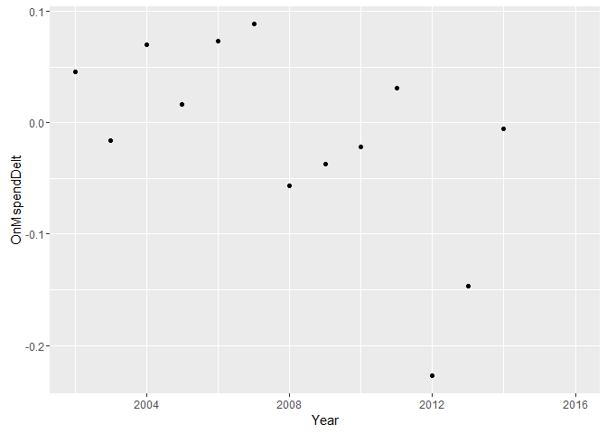
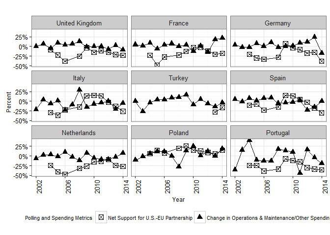
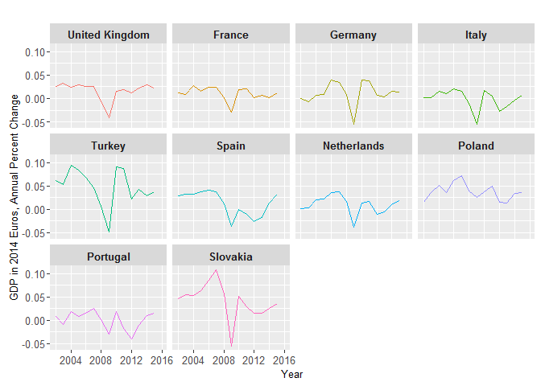
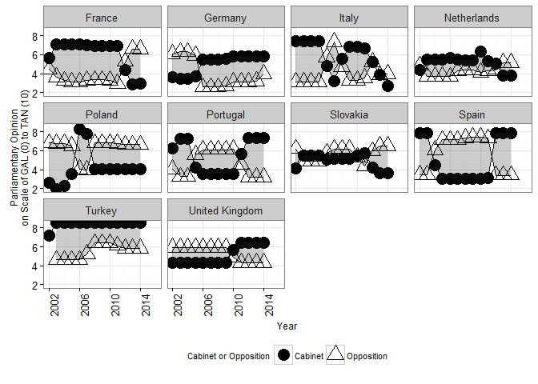
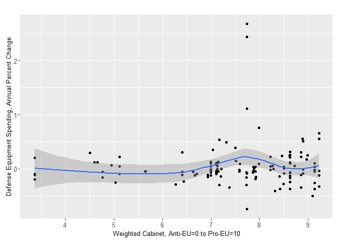

# Europe Data Exploration
Greg Sanders  
October 25, 2015  

This is an R Markdown document. Markdown is a simple formatting syntax for authoring HTML, PDF, and MS Word documents. For more details on using R Markdown see <http://rmarkdown.rstudio.com>.

When you click the **Knit** button a document will be generated that includes both content as well as the output of any embedded R code chunks within the document. You can embed an R code chunk like this:


```r
EuropeSample<-read.csv("Data\\EuropeSample.csv", 
                                 header = TRUE) 

EuropeSample$Cabinet<-"Cabinet"
EuropeSample$Opposition<-"Opposition"

EuropeDefOrEquDelt<-melt(EuropeSample,
                 measure.vars=c("DefSpendDelt","DefSpendDelt_lead",
                                "EquSpendDelt","EquSpendDelt_lead",
                                "OnMspendDelt","OnMspendDelt_lead"),
                 variable.name="DefOrEqu",
                 value.name = "ExpenditureDelt")


EuropeDefOrEqu<-melt(EuropeSample,
                 measure.vars=c("DefSpend","DefSpend_lead",
                                "EquSpend","EquSpend_lead",
                                "OnMspend","OnMspend_lead"),
                 variable.name="DefOrEqu",
                 value.name = "Expenditure")

EuropeLong<-melt(EuropeSample,
                     id.vars=c("Country","Year"),
                 measure.vars=c("DefSpendDelt","DefSpendDelt_lead",
                                "EquSpendDelt_lead","EquSpendDelt",
                                "OnMspendDelt_lead","OnMspendDelt",
                                "DefSpend","DefSpend_lead",
                                "EquSpend_lead","EquSpend",
                                "OnMspend_lead","OnMspend",
                                "DefSpread","DefSpread_lag1","DefSpread_lag2",
                                "EUldrSpread","EUldrSpread_lag1","EUldrSpread_lag2",
                                "NATOessSpread","NATOessSpread_lag1","NATOessSpread_lag2", 
                                "EUcloserUSspread", "EUcloserUSspread_lag1","EUcloserUSspread_lag2",
                                "NGDP_eu2014","EUdebt_NGDP","Dfc_NGDP","Debt_NGDP",
                                "IntAt", "DomAt","GCivilWarBRD","UNmilitaryPMil","RussiaDefSpend",
                                "Cab_left_right","Opp_left_right","left_right_ls_spread",
                                "Cab_liberty_authority","Opp_liberty_authority","liberty_authority_ls_spread",
                                "Cab_eu_anti_pro","Opp_eu_anti_pro","Opp_eu_anti_pro"),
                 variable.name="MetricName",
                 value.name = "MetricValue")

        

EuropeLong<-subset(EuropeLong,!is.na(MetricValue))
```

You can also embed plots, for example:

#Dependent Variables


```
## Warning: `stat` is deprecated
```

```
## Scale for 'y' is already present. Adding another scale for 'y', which
## will replace the existing scale.
```

```
## Warning: Removed 20 rows containing missing values (geom_path).
```

```
## Warning: Removed 2 rows containing missing values (geom_path).
```

<!-- -->

```
## Warning: `stat` is deprecated
```

```
## Scale for 'y' is already present. Adding another scale for 'y', which
## will replace the existing scale.
```

```
## Warning: Removed 23 rows containing missing values (geom_path).

## Warning: Removed 2 rows containing missing values (geom_path).
```

<!-- -->

```
## Warning: `stat` is deprecated
```

```
## Scale for 'y' is already present. Adding another scale for 'y', which
## will replace the existing scale.
```

```
## Warning: Removed 23 rows containing missing values (geom_path).

## Warning: Removed 2 rows containing missing values (geom_path).
```

<!-- -->

```
## Warning: Removed 2 rows containing missing values (geom_point).
```

<!-- -->

```
## Warning: Removed 2 rows containing missing values (geom_point).
```

<!-- -->

```
## Warning: Removed 10 rows containing missing values (geom_point).
```

<!-- -->

```
## Warning: Removed 5 rows containing missing values (geom_point).
```

<!-- -->

```
## Warning: `stat` is deprecated
```

```
## Warning: The labeller API has been updated. Labellers taking `variable`and
## `value` arguments are now deprecated. See labellers documentation.
```

```
## Warning in grid.Call(L_textBounds, as.graphicsAnnot(x$label), x$x, x$y, :
## font family not found in Windows font database

## Warning in grid.Call(L_textBounds, as.graphicsAnnot(x$label), x$x, x$y, :
## font family not found in Windows font database
```

```
## Warning: Removed 30 rows containing non-finite values (stat_smooth).
```

```
## Warning: Removed 30 rows containing missing values (geom_point).
```

```
## Warning in validDetails.text(x): NAs introduced by coercion
```

```
## text[GRID.text.1761]
```

```
## Warning in validDetails.text(x): NAs introduced by coercion
```

```
## text[GRID.text.1762]
```

```
## Warning in validDetails.text(x): NAs introduced by coercion
```

```
## text[GRID.text.1763]
```

```
## Warning in validDetails.text(x): NAs introduced by coercion
```

```
## text[GRID.text.1764]
```

```
## Warning: Removed 33 rows containing non-finite values (stat_smooth).
```

```
## Warning: Removed 33 rows containing missing values (geom_point).
```

```
## Warning in validDetails.text(x): NAs introduced by coercion
```

```
## text[GRID.text.1811]
```

```
## Warning in validDetails.text(x): NAs introduced by coercion
```

```
## text[GRID.text.1812]
```

```
## Warning in validDetails.text(x): NAs introduced by coercion
```

```
## text[GRID.text.1813]
```

```
## Warning in validDetails.text(x): NAs introduced by coercion
```

```
## text[GRID.text.1814]
```

```
## Warning: Removed 33 rows containing non-finite values (stat_smooth).
```

```
## Warning: Removed 33 rows containing missing values (geom_point).
```

```
## Warning in validDetails.text(x): NAs introduced by coercion
```

```
## text[GRID.text.1861]
```

```
## Warning in validDetails.text(x): NAs introduced by coercion
```

```
## text[GRID.text.1862]
```

```
## Warning in validDetails.text(x): NAs introduced by coercion
```

```
## text[GRID.text.1863]
```

```
## Warning in validDetails.text(x): NAs introduced by coercion
```

<!-- -->

```
## text[GRID.text.1864]
```


```
## Warning: `stat` is deprecated
```

```
## Scale for 'y' is already present. Adding another scale for 'y', which
## will replace the existing scale.
```

```
## Warning: Removed 20 rows containing missing values (geom_path).
```

```
## Warning: Removed 2 rows containing missing values (geom_path).
```

<!-- -->

```
## Scale for 'y' is already present. Adding another scale for 'y', which
## will replace the existing scale.
```

```
## Warning: Removed 20 rows containing missing values (geom_path).

## Warning: Removed 2 rows containing missing values (geom_path).
```

<!-- -->

```
## Warning: Removed 20 rows containing missing values (geom_path).

## Warning: Removed 2 rows containing missing values (geom_path).
```

<!-- -->

```
## Warning: `stat` is deprecated
```

```
## Scale for 'y' is already present. Adding another scale for 'y', which
## will replace the existing scale.
```

```
## Warning: Removed 22 rows containing missing values (geom_path).

## Warning: Removed 2 rows containing missing values (geom_path).
```

<!-- -->

```
## Warning: Removed 22 rows containing missing values (geom_path).
```

<!-- -->

```
## Scale for 'y' is already present. Adding another scale for 'y', which
## will replace the existing scale.
```

```
## Warning: Removed 22 rows containing missing values (geom_path).
```

<!-- -->

```
## Warning: Removed 22 rows containing missing values (geom_path).
```

<!-- -->

```
## Warning: `stat` is deprecated
```

```
## Scale for 'y' is already present. Adding another scale for 'y', which
## will replace the existing scale.
```

```
## Warning: Removed 22 rows containing missing values (geom_path).

## Warning: Removed 2 rows containing missing values (geom_path).
```

<!-- -->

```
## Warning: Removed 22 rows containing missing values (geom_path).
```

<!-- -->

```
## Scale for 'y' is already present. Adding another scale for 'y', which
## will replace the existing scale.
```

```
## Warning: Removed 22 rows containing missing values (geom_path).
```

<!-- -->

```
## Warning: Removed 22 rows containing missing values (geom_path).
```

<!-- -->

```
## Warning: Removed 2 rows containing missing values (geom_point).
```

<!-- -->

```
## Warning: `stat` is deprecated
```

```
## Warning: The labeller API has been updated. Labellers taking `variable`and
## `value` arguments are now deprecated. See labellers documentation.
```

```
## Warning in grid.Call(L_textBounds, as.graphicsAnnot(x$label), x$x, x$y, :
## font family not found in Windows font database

## Warning in grid.Call(L_textBounds, as.graphicsAnnot(x$label), x$x, x$y, :
## font family not found in Windows font database
```

<!-- -->

#Polling


```r
DefTooMuchTooLittle.Def<-LatticeLineWrapper(VAR.color.legend.label="",
                             VAR.main.label="",
                             VAR.X.label="Year",
                             VAR.Y.label="Percent",
                             VAR.Coloration=Coloration,
                             VAR.long.DF=subset(EuropeLong,MetricName %in% c("DefSpendDelt","DefSpread")),
                             # ,VAR.ncol=NA
                             VAR.x.variable="Year",
                             VAR.y.variable="MetricValue",
                             VAR.y.series="MetricName",
                             VAR.facet.primary="Country",
                             # VAR.facet.secondary="Country"
                             # MovingAverage=1
                             # MovingSides=1
                             DataLabels=FALSE
                             #                       ,VAR.override.coloration=NA
)
```

```
## Warning in `levels<-`(`*tmp*`, value = if (nl == nL) as.character(labels)
## else paste0(labels, : duplicated levels in factors are deprecated

## Warning in `levels<-`(`*tmp*`, value = if (nl == nL) as.character(labels)
## else paste0(labels, : duplicated levels in factors are deprecated
```

```
## Warning: `stat` is deprecated
```

```r
DefTooMuchTooLittle.Def+geom_point()+
    aes(shape=factor(category,levels=labels.category.DF$variable))+
    theme(legend.position="bottom")+
    scale_y_continuous(labels = percent_format())+
    geom_line(color="black")+
    geom_point(color="black",aes(shape=category),size=3)+
    scale_color_discrete(guide=F)+
    theme_bw()+
    theme(legend.position="bottom")+
    theme(axis.text.x = element_text(angle = 90, hjust = 1),
          axis.title= element_text(size=9),
          legend.title= element_text(size=8),
          legend.text= element_text(size=8))+
    scale_x_continuous(breaks=c(2002,2006,2010,2014))+    
    scale_shape_manual(name="Polling and Spending Metrics",
                       limits=c("DefSpread",
                                "DefSpendDelt"),
                       labels=c("Net Support for Defense Spending", 
                                "Change in Defense Spending"),
                       values=c(1,16))
```

```
## Scale for 'y' is already present. Adding another scale for 'y', which
## will replace the existing scale.
```

<!-- -->

```r
DefTooMuchTooLittle.Equ<-LatticeLineWrapper(VAR.color.legend.label="",
                             VAR.main.label="",
                             VAR.X.label="Year",
                             VAR.Y.label="Percent",
                             VAR.Coloration=Coloration,
                             VAR.long.DF=subset(EuropeLong,MetricName %in% c("EquSpendDelt","DefSpread")),
                             # ,VAR.ncol=NA
                             VAR.x.variable="Year",
                             VAR.y.variable="MetricValue",
                             VAR.y.series="MetricName",
                             VAR.facet.primary="Country",
                             # VAR.facet.secondary="Country"
                             # MovingAverage=1
                             # MovingSides=1
                             DataLabels=FALSE
                             #                       ,VAR.override.coloration=NA
)
```

```
## Warning in `levels<-`(`*tmp*`, value = if (nl == nL) as.character(labels)
## else paste0(labels, : duplicated levels in factors are deprecated
```

```
## Warning in `levels<-`(`*tmp*`, value = if (nl == nL) as.character(labels)
## else paste0(labels, : duplicated levels in factors are deprecated
```

```
## Warning: `stat` is deprecated
```

```r
DefTooMuchTooLittle.Equ+geom_point()+
    aes(shape=factor(category,levels=labels.category.DF$variable))+
    theme(legend.position="bottom")+
    scale_y_continuous(labels = percent_format())+
    geom_line(color="black")+
    geom_point(color="black",aes(shape=category),size=3)+
    scale_color_discrete(guide=F)+
    theme_bw()+
    theme(legend.position="bottom")+
    theme(axis.text.x = element_text(angle = 90, hjust = 1),
          axis.title= element_text(size=9),
          legend.title= element_text(size=8),
          legend.text= element_text(size=8))+
    scale_x_continuous(breaks=c(2002,2006,2010,2014))+    
    scale_shape_manual(name="Polling and Spending Metrics",
                       limits=c("DefSpread",
                                # "DefSpendDelt",
                                "EquSpendDelt"),
                       labels=c("Net Support for Defense Spending", 
                                # "Change in Defense Spending",
                                "Change in Equipment Spending"),
                       values=c(1,
                                # 16,
                                17))
```

```
## Scale for 'y' is already present. Adding another scale for 'y', which
## will replace the existing scale.
```

<!-- -->

```r
DefTooMuchTooLittle.OnM<-LatticeLineWrapper(VAR.color.legend.label="",
                             VAR.main.label="",
                             VAR.X.label="Year",
                             VAR.Y.label="Percent",
                             VAR.Coloration=Coloration,
                             VAR.long.DF=subset(EuropeLong,MetricName %in% c("OnMspendDelt","DefSpread")),
                             # ,VAR.ncol=NA
                             VAR.x.variable="Year",
                             VAR.y.variable="MetricValue",
                             VAR.y.series="MetricName",
                             VAR.facet.primary="Country",
                             # VAR.facet.secondary="Country"
                             # MovingAverage=1
                             # MovingSides=1
                             DataLabels=FALSE
                             #                       ,VAR.override.coloration=NA
)
```

```
## Warning in `levels<-`(`*tmp*`, value = if (nl == nL) as.character(labels)
## else paste0(labels, : duplicated levels in factors are deprecated
```

```
## Warning in `levels<-`(`*tmp*`, value = if (nl == nL) as.character(labels)
## else paste0(labels, : duplicated levels in factors are deprecated
```

```
## Warning: `stat` is deprecated
```

```r
DefTooMuchTooLittle.OnM+geom_point()+
    aes(shape=factor(category,levels=labels.category.DF$variable))+
    theme(legend.position="bottom")+
    scale_y_continuous(labels = percent_format())+
    geom_line(color="black")+
    geom_point(color="black",aes(shape=category),size=3)+
    scale_color_discrete(guide=F)+
    theme_bw()+
    theme(legend.position="bottom")+
    theme(axis.text.x = element_text(angle = 90, hjust = 1),
          axis.title= element_text(size=9),
          legend.title= element_text(size=8),
          legend.text= element_text(size=8))+
    scale_x_continuous(breaks=c(2002,2006,2010,2014))+    
    scale_shape_manual(name="Polling and Spending Metrics",
                       limits=c("DefSpread",
                                # "DefSpendDelt",
                                "OnMspendDelt"),
                       labels=c("Net Support for Defense Spending", 
                                # "Change in Defense Spending",
                                "Change in Operations & Maintenance/Other Spending"),
                       values=c(1,
                                # 16,
                                17))
```

```
## Scale for 'y' is already present. Adding another scale for 'y', which
## will replace the existing scale.
```

<!-- -->


```r
EUleadership.Def<-LatticeLineWrapper(VAR.color.legend.label="",
                             VAR.main.label="",
                             VAR.X.label="Year",
                             VAR.Y.label="Percent",
                             VAR.Coloration=Coloration,
                             VAR.long.DF=subset(EuropeLong,MetricName %in% c("DefSpendDelt","EUldrSpread")&
                                                    Country!="Slovakia"),
                             # ,VAR.ncol=NA
                             VAR.x.variable="Year",
                             VAR.y.variable="MetricValue",
                             VAR.y.series="MetricName",
                             VAR.facet.primary="Country",
                             # VAR.facet.secondary="Country"
                             # MovingAverage=1
                             # MovingSides=1
                             DataLabels=FALSE
                             #                       ,VAR.override.coloration=NA
)
```

```
## Warning in `levels<-`(`*tmp*`, value = if (nl == nL) as.character(labels)
## else paste0(labels, : duplicated levels in factors are deprecated

## Warning in `levels<-`(`*tmp*`, value = if (nl == nL) as.character(labels)
## else paste0(labels, : duplicated levels in factors are deprecated
```

```
## Warning: `stat` is deprecated
```

```r
EUleadership.Def+aes(shape=factor(category,levels=labels.category.DF$variable))+
    theme(legend.position="bottom")+
    scale_y_continuous(labels = percent_format())+
    geom_line(color="black")+
    geom_point(color="black",aes(shape=category),size=3)+
    scale_color_discrete(guide=F)+
    theme_bw()+
    theme(legend.position="bottom")+
    theme(axis.text.x = element_text(angle = 90, hjust = 1),
          axis.title= element_text(size=9),
          legend.title= element_text(size=8),
          legend.text= element_text(size=8))+
    scale_x_continuous(breaks=c(2002,2006,2010,2014))+    
    scale_shape_manual(name="Polling and Spending Metrics",
                       limits=c(
                            # "DefSpread",
                                "EUldrSpread",
                                "DefSpendDelt"
                                # "EquSpendDelt"
                                ),
                       labels=c(
                           # "Net Support for Defense Spending", 
                                "Net Desire for Strong EU Leadership",
                                "Change in Defense Spending"
                                # "Change in Equipment Spending"
                                ),
                       values=c(
                           # 1,
                                4,
                                16
                                # 17
                                ))
```

```
## Scale for 'y' is already present. Adding another scale for 'y', which
## will replace the existing scale.
```

<!-- -->

```r
EUleadership.Equ<-LatticeLineWrapper(VAR.color.legend.label="",
                             VAR.main.label="",
                             VAR.X.label="Year",
                             VAR.Y.label="Percent",
                             VAR.Coloration=Coloration,
                             VAR.long.DF=subset(EuropeLong,MetricName %in% c("EquSpendDelt","EUldrSpread") &
                                                     Country!="Slovakia"),
                             # ,VAR.ncol=NA
                             VAR.x.variable="Year",
                             VAR.y.variable="MetricValue",
                             VAR.y.series="MetricName",
                             VAR.facet.primary="Country",
                             # VAR.facet.secondary="Country"
                             # MovingAverage=1
                             # MovingSides=1
                             DataLabels=FALSE
                             #                       ,VAR.override.coloration=NA
)
```

```
## Warning in `levels<-`(`*tmp*`, value = if (nl == nL) as.character(labels)
## else paste0(labels, : duplicated levels in factors are deprecated
```

```
## Warning in `levels<-`(`*tmp*`, value = if (nl == nL) as.character(labels)
## else paste0(labels, : duplicated levels in factors are deprecated
```

```
## Warning: `stat` is deprecated
```

```r
EUleadership.Equ+geom_point()+aes(shape=factor(category,levels=labels.category.DF$variable))+
    theme(legend.position="bottom")+
    scale_y_continuous(labels = percent_format())+
    geom_line(color="black")+
    geom_point(color="black",aes(shape=category),size=3)+
    scale_color_discrete(guide=F)+
    theme_bw()+
    theme(legend.position="bottom")+
    theme(axis.text.x = element_text(angle = 90, hjust = 1),
          axis.title= element_text(size=9),
          legend.title= element_text(size=8),
          legend.text= element_text(size=8))+
    scale_x_continuous(breaks=c(2002,2006,2010,2014))+    
    scale_shape_manual(name="Polling and Spending Metrics",
                       limits=c(
                            # "DefSpread",
                                "EUldrSpread",
                                # "DefSpendDelt"
                                "EquSpendDelt"
                                ),
                       labels=c(
                           # "Net Support for Defense Spending", 
                                "Net Desire for Strong EU Leadership",
                                # "Change in Defense Spending"
                                "Change in Equipment Spending"
                                ),
                       values=c(
                           # 1,
                                4,
                                # 16
                                17
                                ))
```

```
## Scale for 'y' is already present. Adding another scale for 'y', which
## will replace the existing scale.
```

<!-- -->

```r
EUleadership.OnM<-LatticeLineWrapper(VAR.color.legend.label="",
                             VAR.main.label="",
                             VAR.X.label="Year",
                             VAR.Y.label="Percent",
                             VAR.Coloration=Coloration,
                             VAR.long.DF=subset(EuropeLong,MetricName %in% c("OnMspendDelt","EUldrSpread") &
                                                     Country!="Slovakia"),
                             # ,VAR.ncol=NA
                             VAR.x.variable="Year",
                             VAR.y.variable="MetricValue",
                             VAR.y.series="MetricName",
                             VAR.facet.primary="Country",
                             # VAR.facet.secondary="Country"
                             # MovingAverage=1
                             # MovingSides=1
                             DataLabels=FALSE
                             #                       ,VAR.override.coloration=NA
)
```

```
## Warning in `levels<-`(`*tmp*`, value = if (nl == nL) as.character(labels)
## else paste0(labels, : duplicated levels in factors are deprecated
```

```
## Warning in `levels<-`(`*tmp*`, value = if (nl == nL) as.character(labels)
## else paste0(labels, : duplicated levels in factors are deprecated
```

```
## Warning: `stat` is deprecated
```

```r
EUleadership.OnM+geom_point()+aes(shape=factor(category,levels=labels.category.DF$variable))+
    theme(legend.position="bottom")+
    scale_y_continuous(labels = percent_format())+
    geom_line(color="black")+
    geom_point(color="black",aes(shape=category),size=3)+
    scale_color_discrete(guide=F)+
    theme_bw()+
    theme(legend.position="bottom")+
    theme(axis.text.x = element_text(angle = 90, hjust = 1),
          axis.title= element_text(size=9),
          legend.title= element_text(size=8),
          legend.text= element_text(size=8))+
    scale_x_continuous(breaks=c(2002,2006,2010,2014))+    
    scale_shape_manual(name="Polling and Spending Metrics",
                       limits=c(
                            # "DefSpread",
                                "EUldrSpread",
                                # "DefSpendDelt"
                                "OnMspendDelt"
                                ),
                       labels=c(
                           # "Net Support for Defense Spending", 
                                "Net Desire for Strong EU Leadership",
                                # "Change in Defense Spending"
                                "Change in Operations & Maintenance / Other Spending"
                                ),
                       values=c(
                           # 1,
                                4,
                                # 16
                                17
                                ))
```

```
## Scale for 'y' is already present. Adding another scale for 'y', which
## will replace the existing scale.
```

<!-- -->


```r
NATOessen.Def<-LatticeLineWrapper(VAR.color.legend.label="",
                             VAR.main.label="",
                             VAR.X.label="Year",
                             VAR.Y.label="Percent",
                             VAR.Coloration=Coloration,
                             VAR.long.DF=subset(EuropeLong,MetricName %in% c("DefSpendDelt","NATOessSpread")&
                                                    Country!="Slovakia"),
                             # ,VAR.ncol=NA
                             VAR.x.variable="Year",
                             VAR.y.variable="MetricValue",
                             VAR.y.series="MetricName",
                             VAR.facet.primary="Country",
                             # VAR.facet.secondary="Country"
                             # MovingAverage=1
                             # MovingSides=1
                             DataLabels=FALSE
                             #                       ,VAR.override.coloration=NA
)
```

```
## Warning in `levels<-`(`*tmp*`, value = if (nl == nL) as.character(labels)
## else paste0(labels, : duplicated levels in factors are deprecated

## Warning in `levels<-`(`*tmp*`, value = if (nl == nL) as.character(labels)
## else paste0(labels, : duplicated levels in factors are deprecated
```

```
## Warning: `stat` is deprecated
```

```r
NATOessen.Def+aes(shape=factor(category,levels=labels.category.DF$variable))+
    theme(legend.position="bottom")+
    scale_y_continuous(labels = percent_format())+
    geom_line(color="black")+
    geom_point(color="black",aes(shape=category),size=3)+
    scale_color_discrete(guide=F)+
    theme_bw()+
    theme(legend.position="bottom")+
    theme(axis.text.x = element_text(angle = 90, hjust = 1),
          axis.title= element_text(size=9),
          legend.title= element_text(size=8),
          legend.text= element_text(size=8))+
    scale_x_continuous(breaks=c(2002,2006,2010,2014))+    
    scale_shape_manual(name="Polling and Spending Metrics",
                       limits=c(
                            # "DefSpread",
                                # "EUldrSpread",
                                "NATOessSpread",
                                "DefSpendDelt"
                                # "EquSpendDelt"
                                ),
                       labels=c(
                           # "Net Support for Defense Spending", 
                                # "Net Desire for Strong EU Leadership",
                                "Net Belief that NATO is Essential",
                                "Change in Defense Spending"
                                # "Change in Equipment Spending"
                                ),
                       values=c(
                           # 1,
                                # 4,
                                8,
                                16
                                # 17
                                ))
```

```
## Scale for 'y' is already present. Adding another scale for 'y', which
## will replace the existing scale.
```

<!-- -->

```r
NATOessen.Equ<-LatticeLineWrapper(VAR.color.legend.label="",
                             VAR.main.label="",
                             VAR.X.label="Year",
                             VAR.Y.label="Percent",
                             VAR.Coloration=Coloration,
                             VAR.long.DF=subset(EuropeLong,MetricName %in% c("EquSpendDelt","NATOessSpread")&
                                                    Country!="Slovakia"),
                             # ,VAR.ncol=NA
                             VAR.x.variable="Year",
                             VAR.y.variable="MetricValue",
                             VAR.y.series="MetricName",
                             VAR.facet.primary="Country",
                             # VAR.facet.secondary="Country"
                             # MovingAverage=1
                             # MovingSides=1
                             DataLabels=FALSE
                             #                       ,VAR.override.coloration=NA
)
```

```
## Warning in `levels<-`(`*tmp*`, value = if (nl == nL) as.character(labels)
## else paste0(labels, : duplicated levels in factors are deprecated
```

```
## Warning in `levels<-`(`*tmp*`, value = if (nl == nL) as.character(labels)
## else paste0(labels, : duplicated levels in factors are deprecated
```

```
## Warning: `stat` is deprecated
```

```r
NATOessen.Equ+aes(shape=factor(category,levels=labels.category.DF$variable))+
    theme(legend.position="bottom")+
    scale_y_continuous(labels = percent_format())+
    geom_line(color="black")+
    geom_point(color="black",aes(shape=category),size=3)+
    scale_color_discrete(guide=F)+
    theme_bw()+
    theme(legend.position="bottom")+
    theme(axis.text.x = element_text(angle = 90, hjust = 1),
          axis.title= element_text(size=9),
          legend.title= element_text(size=8),
          legend.text= element_text(size=8))+
    scale_x_continuous(breaks=c(2002,2006,2010,2014))+    
    scale_shape_manual(name="Polling and Spending Metrics",
                       limits=c(
                            # "DefSpread",
                                # "EUldrSpread",
                           "NATOessSpread",
                                # "DefSpendDelt"
                                "EquSpendDelt"
                                ),
                       labels=c(
                           # "Net Support for Defense Spending", 
                                # "Net Desire for Strong EU Leadership",
                                "Net Belief that NATO is Essential",
                                # "Change in Defense Spending"
                                "Change in Equipment Spending"
                                ),
                       values=c(
                           # 1,
                                # 4,
                                8,
                                # 16
                                17
                                ))
```

```
## Scale for 'y' is already present. Adding another scale for 'y', which
## will replace the existing scale.
```

<!-- -->

```r
NATOessen.OnM<-LatticeLineWrapper(VAR.color.legend.label="",
                             VAR.main.label="",
                             VAR.X.label="Year",
                             VAR.Y.label="Percent",
                             VAR.Coloration=Coloration,
                             VAR.long.DF=subset(EuropeLong,MetricName %in% c("OnMspendDelt","NATOessSpread")&
                                                    Country!="Slovakia"),
                             # ,VAR.ncol=NA
                             VAR.x.variable="Year",
                             VAR.y.variable="MetricValue",
                             VAR.y.series="MetricName",
                             VAR.facet.primary="Country",
                             # VAR.facet.secondary="Country"
                             # MovingAverage=1
                             # MovingSides=1
                             DataLabels=FALSE
                             #                       ,VAR.override.coloration=NA
)
```

```
## Warning in `levels<-`(`*tmp*`, value = if (nl == nL) as.character(labels)
## else paste0(labels, : duplicated levels in factors are deprecated
```

```
## Warning in `levels<-`(`*tmp*`, value = if (nl == nL) as.character(labels)
## else paste0(labels, : duplicated levels in factors are deprecated
```

```
## Warning: `stat` is deprecated
```

```r
NATOessen.OnM+aes(shape=factor(category,levels=labels.category.DF$variable))+
    theme(legend.position="bottom")+
    scale_y_continuous(labels = percent_format())+
    geom_line(color="black")+
    geom_point(color="black",aes(shape=category),size=3)+
    scale_color_discrete(guide=F)+
    theme_bw()+
    theme(legend.position="bottom")+
    theme(axis.text.x = element_text(angle = 90, hjust = 1),
          axis.title= element_text(size=9),
          legend.title= element_text(size=8),
          legend.text= element_text(size=8))+
    scale_x_continuous(breaks=c(2002,2006,2010,2014))+    
    scale_shape_manual(name="Polling and Spending Metrics",
                       limits=c(
                            # "DefSpread",
                                # "EUldrSpread",
                           "NATOessSpread",
                                # "DefSpendDelt"
                                "OnMspendDelt"
                                ),
                       labels=c(
                           # "Net Support for Defense Spending", 
                                # "Net Desire for Strong EU Leadership",
                                "Net Belief that NATO is Essential",
                                # "Change in Defense Spending"
                                "Change in Operations & Maintenance/Other Spending"
                                ),
                       values=c(
                           # 1,
                                # 4,
                                8,
                                # 16
                                17
                                ))
```

```
## Scale for 'y' is already present. Adding another scale for 'y', which
## will replace the existing scale.
```

<!-- -->


```r
EUcloserUSconv.Def<-LatticeLineWrapper(VAR.color.legend.label="",
                             VAR.main.label="",
                             VAR.X.label="Year",
                             VAR.Y.label="Percent",
                             VAR.Coloration=Coloration,
                             VAR.long.DF=subset(EuropeLong,MetricName %in% c("DefSpendDelt","EUcloserUSspread")&
                                                    Country!="Slovakia"),
                             # ,VAR.ncol=NA
                             VAR.x.variable="Year",
                             VAR.y.variable="MetricValue",
                             VAR.y.series="MetricName",
                             VAR.facet.primary="Country",
                             # VAR.facet.secondary="Country"
                             # MovingAverage=1
                             # MovingSides=1
                             DataLabels=FALSE
                             #                       ,VAR.override.coloration=NA
)
```

```
## Warning in `levels<-`(`*tmp*`, value = if (nl == nL) as.character(labels)
## else paste0(labels, : duplicated levels in factors are deprecated

## Warning in `levels<-`(`*tmp*`, value = if (nl == nL) as.character(labels)
## else paste0(labels, : duplicated levels in factors are deprecated
```

```
## Warning: `stat` is deprecated
```

```r
EUcloserUSconv.Def+aes(shape=factor(category,levels=labels.category.DF$variable))+
    theme(legend.position="bottom")+
    scale_y_continuous(labels = percent_format())+
    geom_line(color="black")+
    geom_point(color="black",aes(shape=category),size=3)+
    scale_color_discrete(guide=F)+
    theme_bw()+
    theme(legend.position="bottom")+
    theme(axis.text.x = element_text(angle = 90, hjust = 1),
          axis.title= element_text(size=9),
          legend.title= element_text(size=8),
          legend.text= element_text(size=8))+
    scale_x_continuous(breaks=c(2002,2006,2010,2014))+    
    scale_shape_manual(name="Polling and Spending Metrics",
                       limits=c(
                            # "DefSpread",
                                # "EUldrSpread",
                                # "NATOessSpread",
                                "EUcloserUSspread",
                                "DefSpendDelt"
                                # "EquSpendDelt"
                                ),
                       labels=c(
                           # "Net Support for Defense Spending", 
                                # "Net Desire for Strong EU Leadership",
                                # "Net Belief that NATO is Essential",
                           "Net Support for U.S.-EU Partnership",
                                "Change in Defense Spending"
                                # "Change in Equipment Spending"
                                ),
                       values=c(
                           # 1,
                                # 4,
                                # 8,
                           7,
                                16
                                # 17
                                ))
```

```
## Scale for 'y' is already present. Adding another scale for 'y', which
## will replace the existing scale.
```

<!-- -->

```r
EUcloserUSconv.Equ<-LatticeLineWrapper(VAR.color.legend.label="",
                             VAR.main.label="",
                             VAR.X.label="Year",
                             VAR.Y.label="Percent",
                             VAR.Coloration=Coloration,
                             VAR.long.DF=subset(EuropeLong,MetricName %in% c("EquSpendDelt","EUcloserUSspread")&
                                                    Country!="Slovakia"),
                             # ,VAR.ncol=NA
                             VAR.x.variable="Year",
                             VAR.y.variable="MetricValue",
                             VAR.y.series="MetricName",
                             VAR.facet.primary="Country",
                             # VAR.facet.secondary="Country"
                             # MovingAverage=1
                             # MovingSides=1
                             DataLabels=FALSE
                             #                       ,VAR.override.coloration=NA
)
```

```
## Warning in `levels<-`(`*tmp*`, value = if (nl == nL) as.character(labels)
## else paste0(labels, : duplicated levels in factors are deprecated
```

```
## Warning in `levels<-`(`*tmp*`, value = if (nl == nL) as.character(labels)
## else paste0(labels, : duplicated levels in factors are deprecated
```

```
## Warning: `stat` is deprecated
```

```r
EUcloserUSconv.Equ+aes(shape=factor(category,levels=labels.category.DF$variable))+
    theme(legend.position="bottom")+
    scale_y_continuous(labels = percent_format())+
    geom_line(color="black")+
    geom_point(color="black",aes(shape=category),size=3)+
    scale_color_discrete(guide=F)+
    theme_bw()+
    theme(legend.position="bottom")+
    theme(axis.text.x = element_text(angle = 90, hjust = 1),
          axis.title= element_text(size=9),
          legend.title= element_text(size=8),
          legend.text= element_text(size=8))+
    scale_x_continuous(breaks=c(2002,2006,2010,2014))+    
    scale_shape_manual(name="Polling and Spending Metrics",
                       limits=c(
                            # "DefSpread",
                                # "EUldrSpread",
                           # "NATOessSpread",
                           "EUcloserUSspread",
                                # "DefSpendDelt"
                                "EquSpendDelt"
                                ),
                       labels=c(
                           # "Net Support for Defense Spending", 
                                # "Net Desire for Strong EU Leadership",
                                # "Net Belief that NATO is Essential",
                                "Net Support for U.S.-EU Partnership",
                                # "Change in Defense Spending"
                                "Change in Equipment Spending"
                                ),
                       values=c(
                           # 1,
                                # 4,
                                # 8,
                           7,
                                # 16
                                17
                                ))
```

```
## Scale for 'y' is already present. Adding another scale for 'y', which
## will replace the existing scale.
```

<!-- -->

```r
EUcloserUSconv.OnM<-LatticeLineWrapper(VAR.color.legend.label="",
                             VAR.main.label="",
                             VAR.X.label="Year",
                             VAR.Y.label="Percent",
                             VAR.Coloration=Coloration,
                             VAR.long.DF=subset(EuropeLong,MetricName %in% c("OnMspendDelt","EUcloserUSspread")&
                                                    Country!="Slovakia"),
                             # ,VAR.ncol=NA
                             VAR.x.variable="Year",
                             VAR.y.variable="MetricValue",
                             VAR.y.series="MetricName",
                             VAR.facet.primary="Country",
                             # VAR.facet.secondary="Country"
                             # MovingAverage=1
                             # MovingSides=1
                             DataLabels=FALSE
                             #                       ,VAR.override.coloration=NA
)
```

```
## Warning in `levels<-`(`*tmp*`, value = if (nl == nL) as.character(labels)
## else paste0(labels, : duplicated levels in factors are deprecated
```

```
## Warning in `levels<-`(`*tmp*`, value = if (nl == nL) as.character(labels)
## else paste0(labels, : duplicated levels in factors are deprecated
```

```
## Warning: `stat` is deprecated
```

```r
EUcloserUSconv.OnM+aes(shape=factor(category,levels=labels.category.DF$variable))+
    theme(legend.position="bottom")+
    scale_y_continuous(labels = percent_format())+
    geom_line(color="black")+
    geom_point(color="black",aes(shape=category),size=3)+
    scale_color_discrete(guide=F)+
    theme_bw()+
    theme(legend.position="bottom")+
    theme(axis.text.x = element_text(angle = 90, hjust = 1),
          axis.title= element_text(size=9),
          legend.title= element_text(size=8),
          legend.text= element_text(size=8))+
    scale_x_continuous(breaks=c(2002,2006,2010,2014))+    
    scale_shape_manual(name="Polling and Spending Metrics",
                       limits=c(
                            # "DefSpread",
                                # "EUldrSpread",
                           # "NATOessSpread",
                           "EUcloserUSspread",
                                # "DefSpendDelt"
                                "OnMspendDelt"
                                ),
                       labels=c(
                           # "Net Support for Defense Spending", 
                                # "Net Desire for Strong EU Leadership",
                                # "Net Belief that NATO is Essential",
                                "Net Support for U.S.-EU Partnership",
                                # "Change in Defense Spending"
                                "Change in Operations & Maintenance/Other Spending"
                                ),
                       values=c(
                           # 1,
                                # 4,
                                # 8,
                           7,
                                # 16
                                17
                                ))
```

```
## Scale for 'y' is already present. Adding another scale for 'y', which
## will replace the existing scale.
```

<!-- -->
#Macroeconomic Variables


```
## Warning: Removed 160 rows containing non-finite values (stat_smooth).
```

```
## Warning: Removed 160 rows containing missing values (geom_point).
```

```
## Warning in validDetails.text(x): NAs introduced by coercion
```

```
## text[GRID.text.10075]
```

```
## Warning in validDetails.text(x): NAs introduced by coercion
```

```
## text[GRID.text.10076]
```

```
## Warning in validDetails.text(x): NAs introduced by coercion
```

```
## text[GRID.text.10077]
```

```
## Warning in validDetails.text(x): NAs introduced by coercion
```

```
## text[GRID.text.10078]
```

```
## Warning: Removed 20 rows containing non-finite values (stat_smooth).
```

```
## Warning: Removed 20 rows containing missing values (geom_point).
```

```
## Warning in validDetails.text(x): NAs introduced by coercion
```

```
## text[GRID.text.10125]
```

```
## Warning in validDetails.text(x): NAs introduced by coercion
```

```
## text[GRID.text.10126]
```

```
## Warning in validDetails.text(x): NAs introduced by coercion
```

```
## text[GRID.text.10127]
```

```
## Warning in validDetails.text(x): NAs introduced by coercion
```

```
## text[GRID.text.10128]
```

```
## Warning: Removed 23 rows containing non-finite values (stat_smooth).
```

```
## Warning: Removed 23 rows containing missing values (geom_point).
```

```
## Warning in validDetails.text(x): NAs introduced by coercion
```

```
## text[GRID.text.10175]
```

```
## Warning in validDetails.text(x): NAs introduced by coercion
```

```
## text[GRID.text.10176]
```

```
## Warning in validDetails.text(x): NAs introduced by coercion
```

```
## text[GRID.text.10177]
```

```
## Warning in validDetails.text(x): NAs introduced by coercion
```

<!-- -->

```
## text[GRID.text.10178]
```

```
## Warning: `stat` is deprecated
```

```
## Warning: Removed 10 rows containing missing values (geom_path).
```

```
## Warning: Removed 10 rows containing missing values (geom_text).
```

<!-- -->

```
## Warning: `stat` is deprecated
```

```
## Warning in `levels<-`(`*tmp*`, value = if (nl == nL) as.character(labels)
## else paste0(labels, : duplicated levels in factors are deprecated

## Warning in `levels<-`(`*tmp*`, value = if (nl == nL) as.character(labels)
## else paste0(labels, : duplicated levels in factors are deprecated
```

<!-- -->


#Parliamentary Variables

#Left Right


```
## Warning: Removed 20 rows containing non-finite values (stat_smooth).
```

```
## Warning: Removed 20 rows containing missing values (geom_point).
```

```
## Warning in validDetails.text(x): NAs introduced by coercion
```

```
## text[GRID.text.10819]
```

```
## Warning in validDetails.text(x): NAs introduced by coercion
```

```
## text[GRID.text.10820]
```

```
## Warning in validDetails.text(x): NAs introduced by coercion
```

```
## text[GRID.text.10821]
```

```
## Warning in validDetails.text(x): NAs introduced by coercion
```

```
## text[GRID.text.10822]
```

```
## Warning: Removed 23 rows containing non-finite values (stat_smooth).
```

```
## Warning: Removed 23 rows containing missing values (geom_point).
```

```
## Warning in validDetails.text(x): NAs introduced by coercion
```

```
## text[GRID.text.10869]
```

```
## Warning in validDetails.text(x): NAs introduced by coercion
```

```
## text[GRID.text.10870]
```

```
## Warning in validDetails.text(x): NAs introduced by coercion
```

```
## text[GRID.text.10871]
```

```
## Warning in validDetails.text(x): NAs introduced by coercion
```

<!-- -->

```
## text[GRID.text.10872]
```

```
## Warning: Removed 2 rows containing missing values (geom_path).
```

```
## Warning: Removed 20 rows containing missing values (geom_point).
```

```
## Warning: Removed 2 rows containing missing values (geom_path).
```

```
## Warning: Removed 20 rows containing missing values (geom_point).
```

<!-- -->


#Liberty Authority


```
## Warning: Removed 20 rows containing non-finite values (stat_smooth).
```

```
## Warning: Removed 20 rows containing missing values (geom_point).
```

```
## Warning in validDetails.text(x): NAs introduced by coercion
```

```
## text[GRID.text.11279]
```

```
## Warning in validDetails.text(x): NAs introduced by coercion
```

```
## text[GRID.text.11280]
```

```
## Warning in validDetails.text(x): NAs introduced by coercion
```

```
## text[GRID.text.11281]
```

```
## Warning in validDetails.text(x): NAs introduced by coercion
```

```
## text[GRID.text.11282]
```

```
## Warning: Removed 23 rows containing non-finite values (stat_smooth).
```

```
## Warning: Removed 23 rows containing missing values (geom_point).
```

```
## Warning in validDetails.text(x): NAs introduced by coercion
```

```
## text[GRID.text.11329]
```

```
## Warning in validDetails.text(x): NAs introduced by coercion
```

```
## text[GRID.text.11330]
```

```
## Warning in validDetails.text(x): NAs introduced by coercion
```

```
## text[GRID.text.11331]
```

```
## Warning in validDetails.text(x): NAs introduced by coercion
```

<!-- -->

```
## text[GRID.text.11332]
```

```
## Warning: Removed 2 rows containing missing values (geom_path).
```

```
## Warning: Removed 20 rows containing missing values (geom_point).
```

```
## Warning: Removed 2 rows containing missing values (geom_path).
```

```
## Warning: Removed 21 rows containing missing values (geom_point).
```

<!-- -->


#EU Anti Pro


```
## Warning: Removed 20 rows containing non-finite values (stat_smooth).
```

```
## Warning: Removed 20 rows containing missing values (geom_point).
```

```
## Warning in validDetails.text(x): NAs introduced by coercion
```

```
## text[GRID.text.11779]
```

```
## Warning in validDetails.text(x): NAs introduced by coercion
```

```
## text[GRID.text.11780]
```

```
## Warning in validDetails.text(x): NAs introduced by coercion
```

```
## text[GRID.text.11781]
```

```
## Warning in validDetails.text(x): NAs introduced by coercion
```

```
## text[GRID.text.11782]
```

```
## Warning: Removed 23 rows containing non-finite values (stat_smooth).
```

```
## Warning: Removed 23 rows containing missing values (geom_point).
```

```
## Warning in validDetails.text(x): NAs introduced by coercion
```

```
## text[GRID.text.11829]
```

```
## Warning in validDetails.text(x): NAs introduced by coercion
```

```
## text[GRID.text.11830]
```

```
## Warning in validDetails.text(x): NAs introduced by coercion
```

```
## text[GRID.text.11831]
```

```
## Warning in validDetails.text(x): NAs introduced by coercion
```

<!-- -->

```
## text[GRID.text.11832]
```

```
## Warning: Removed 2 rows containing missing values (geom_path).
```

```
## Warning: Removed 20 rows containing missing values (geom_point).
```

```
## Warning: Removed 2 rows containing missing values (geom_path).
```

```
## Warning: Removed 21 rows containing missing values (geom_point).
```

<!-- -->


```r
# path="Data\\"
# 
# lookup.countries <- read.csv(paste(path, "CountryNameStandardize.csv", sep =""), header = TRUE)
# data.nato <- read.csv(paste(path, "SSI_NATO.csv", sep =""), header = TRUE)
#     data.ally <- melt(data.nato, id = "Year", variable.name="Country",value.name="NATOally")
#     colnames(data.ally)[colnames(data.ally)=="year"] <- "Year"
#     data.ally<-StandardizeCountries(data.ally,lookup.countries)
#     NATO.countries<-unique(subset(data.ally,NATOally==1)$Country)
#     
# data.euds <- read.csv(paste(path, "European_Total_Constant_Euros.csv", sep =""), header = TRUE)
#   data.euds<-RenameYearColumns(data.euds)
#     data.euds<-subset(data.euds,select=-c(Region,X2001.2011,X2001.2010,X2001.2013))
#     data.euds <- melt(data.euds, id=c("Country", "Unit.Currency"), variable.name="Year",value.name="DefSpnd")
#     data.euds$DefSpnd <- as.numeric(gsub(",","",str_trim(as.character(data.euds$DefSpnd))))
#     data.euds$Year <- as.integer(as.character(data.euds$Year))
#     data.euds$DefSpnd <- data.euds$DefSpnd*1000000
#     data.euds<-StandardizeCountries(data.euds,lookup.countries)
# 
# unique(data.euds$Country[!data.euds$Country %in% NATO.countries])
# unique(NATO.countries[!NATO.countries %in% unique(data.euds$Country)])
# 
# data.euds.NATO<-subset(data.euds,Year==2014)
# data.euds.NATO<-subset(data.euds.NATO,Country %in% NATO.countries)
# data.euds.NATO$share<-data.euds.NATO$DefSpnd/sum(data.euds.NATO$DefSpnd,na.rm=TRUE)
# #No Albania, but they aren't that big a spender.
# 
# sum(data.euds.NATO$share[data.euds.NATO$Country %in% c("France","Germany","United Kingdom","Italy","Netherlands","Poland",
#                                                      "Portugal","Slovakia","Spain","Turkey")])
# sum(data.euds.NATO$share[data.euds.NATO$Country %in% c("France","Germany","United Kingdom","Italy","Netherlands","Poland",
#                                                      "Portugal","Spain")])
#     
```


```r
# str(EuropeSample$DefSpend)
# 
# library(gplots)
# 
# plotmeans(log(EquSpend) ~ Country, main="Heterogeineityacross countries", data=DefSpend)
# plotmeans(log(EquSpend) ~ Country, main="Heterogeineityacross countries", data=EquSpend)
# plotmeans(log(OnMspend) ~ Country, main="Heterogeineityacross countries", data=EuropeSample)

# plotmeansdraw a 95% confidence interval around the means
# detach("package:gplots")
# Remove package 'gplots' from the workspace
```
