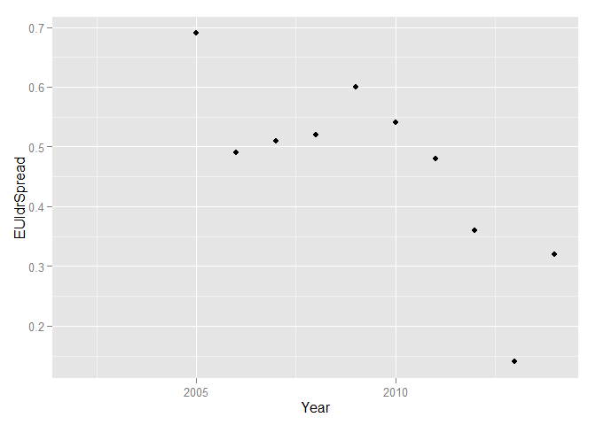
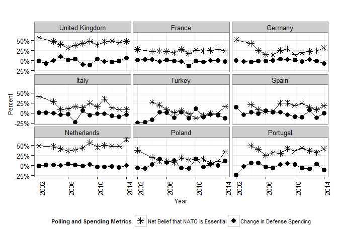
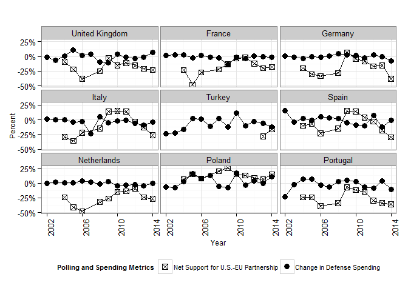
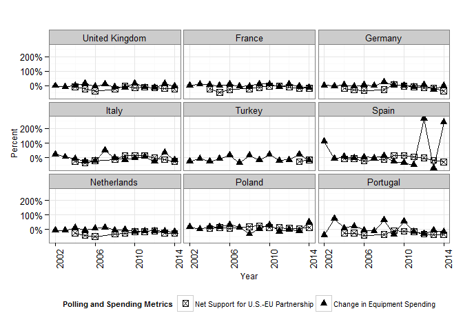
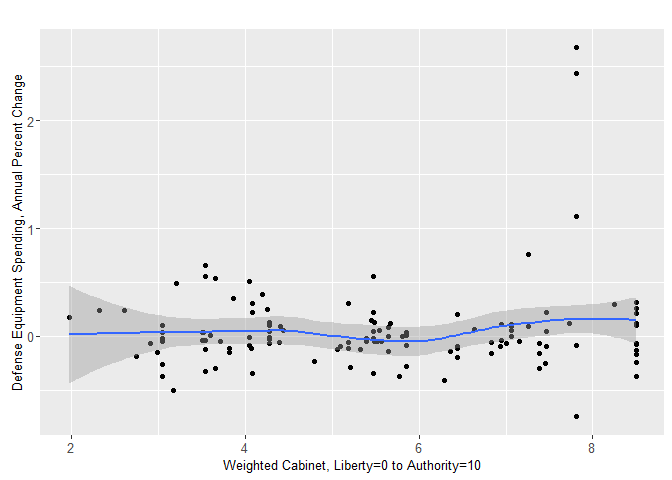

# Europe Data Exploration
Greg Sanders  
October 25, 2015  

This is an R Markdown document. Markdown is a simple formatting syntax for authoring HTML, PDF, and MS Word documents. For more details on using R Markdown see <http://rmarkdown.rstudio.com>.

When you click the **Knit** button a document will be generated that includes both content as well as the output of any embedded R code chunks within the document. You can embed an R code chunk like this:


You can also embed plots, for example:

#Dependent Variables


```
## Scale for 'y' is already present. Adding another scale for 'y', which will replace the existing scale.
```

 

```
## Scale for 'y' is already present. Adding another scale for 'y', which will replace the existing scale.
```

```
## Warning: Removed 3 rows containing missing values (geom_path).
```

```
## Warning: Removed 3 rows containing missing values (geom_path).
```

  

```
## Warning: Removed 8 rows containing missing values (geom_point).
```

 

```
## Warning: Removed 3 rows containing missing values (geom_point).
```

 

```
## Warning: Removed 8 rows containing missing values (geom_point).
```

 

```
## Warning in grid.Call(L_textBounds, as.graphicsAnnot(x$label), x$x, x$y, :
## font family not found in Windows font database
```

```
## Warning in grid.Call.graphics(L_text, as.graphicsAnnot(x$label), x$x, x$y,
## : font family not found in Windows font database
```

```
## Warning: Removed 10 rows containing missing values (stat_smooth).
```

```
## Warning: Removed 10 rows containing missing values (geom_point).
```

```
## Warning in validDetails.text(x): NAs introduced by coercion
```

```
## text[GRID.text.1284]
```

```
## Warning in validDetails.text(x): NAs introduced by coercion
```

```
## text[GRID.text.1285]
```

```
## Warning in validDetails.text(x): NAs introduced by coercion
```

```
## text[GRID.text.1286]
```

```
## Warning in validDetails.text(x): NAs introduced by coercion
```

```
## text[GRID.text.1287]
```

```
## Warning: Removed 13 rows containing missing values (stat_smooth).
```

```
## Warning: Removed 13 rows containing missing values (geom_point).
```

```
## Warning in validDetails.text(x): NAs introduced by coercion
```

```
## text[GRID.text.1332]
```

```
## Warning in validDetails.text(x): NAs introduced by coercion
```

```
## text[GRID.text.1333]
```

```
## Warning in validDetails.text(x): NAs introduced by coercion
```

```
## text[GRID.text.1334]
```

```
## Warning in validDetails.text(x): NAs introduced by coercion
```

 

```
## text[GRID.text.1335]
```


```r
DefTooMuchTooLittle.Def<-LatticeLineWrapper(VAR.color.legend.label="",
                             VAR.main.label="",
                             VAR.X.label="Year",
                             VAR.Y.label="Percent",
                             VAR.Coloration=Coloration,
                             VAR.long.DF=subset(EuropeLong,MetricName %in% c("DefSpendDelt","DefSpread")),
                             # ,VAR.ncol=NA
                             VAR.x.variable="Year",
                             VAR.y.variable="MetricValue",
                             VAR.y.series="MetricName",
                             VAR.facet.primary="Country",
                             # VAR.facet.secondary="Country"
                             # MovingAverage=1
                             # MovingSides=1
                             DataLabels=FALSE
                             #                       ,VAR.override.coloration=NA
)
```

```
## Warning in `levels<-`(`*tmp*`, value = if (nl == nL) as.character(labels)
## else paste0(labels, : duplicated levels in factors are deprecated
```

```
## Warning in `levels<-`(`*tmp*`, value = if (nl == nL) as.character(labels)
## else paste0(labels, : duplicated levels in factors are deprecated
```

```r
DefTooMuchTooLittle.Def+geom_point()+
    aes(shape=factor(category,levels=labels.category.DF$variable))+
    theme(legend.position="bottom")+
    scale_y_continuous(labels = percent_format())+
    geom_line(color="black")+
    geom_point(color="black",aes(shape=category),size=3)+
    scale_color_discrete(guide=F)+
    theme_bw()+
    theme(legend.position="bottom")+
    theme(axis.text.x = element_text(angle = 90, hjust = 1),
          axis.title= element_text(size=9),
          legend.title= element_text(size=8),
          legend.text= element_text(size=8))+
    scale_x_continuous(breaks=c(2002,2006,2010,2014))+    
    scale_shape_manual(name="Polling and Spending Metrics",
                       limits=c("DefSpread",
                                "DefSpendDelt"),
                       labels=c("Net Support for Defense Spending", 
                                "Change in Defense Spending"),
                       values=c(1,16))
```

```
## Scale for 'y' is already present. Adding another scale for 'y', which will replace the existing scale.
```

 

```r
DefTooMuchTooLittle.Equ<-LatticeLineWrapper(VAR.color.legend.label="",
                             VAR.main.label="",
                             VAR.X.label="Year",
                             VAR.Y.label="Percent",
                             VAR.Coloration=Coloration,
                             VAR.long.DF=subset(EuropeLong,MetricName %in% c("EquSpendDelt","DefSpread")),
                             # ,VAR.ncol=NA
                             VAR.x.variable="Year",
                             VAR.y.variable="MetricValue",
                             VAR.y.series="MetricName",
                             VAR.facet.primary="Country",
                             # VAR.facet.secondary="Country"
                             # MovingAverage=1
                             # MovingSides=1
                             DataLabels=FALSE
                             #                       ,VAR.override.coloration=NA
)
```

```
## Warning in `levels<-`(`*tmp*`, value = if (nl == nL) as.character(labels)
## else paste0(labels, : duplicated levels in factors are deprecated
```

```
## Warning in `levels<-`(`*tmp*`, value = if (nl == nL) as.character(labels)
## else paste0(labels, : duplicated levels in factors are deprecated
```

```r
DefTooMuchTooLittle.Equ+geom_point()+
    aes(shape=factor(category,levels=labels.category.DF$variable))+
    theme(legend.position="bottom")+
    scale_y_continuous(labels = percent_format())+
    geom_line(color="black")+
    geom_point(color="black",aes(shape=category),size=3)+
    scale_color_discrete(guide=F)+
    theme_bw()+
    theme(legend.position="bottom")+
    theme(axis.text.x = element_text(angle = 90, hjust = 1),
          axis.title= element_text(size=9),
          legend.title= element_text(size=8),
          legend.text= element_text(size=8))+
    scale_x_continuous(breaks=c(2002,2006,2010,2014))+    
    scale_shape_manual(name="Polling and Spending Metrics",
                       limits=c("DefSpread",
                                # "DefSpendDelt",
                                "EquSpendDelt"),
                       labels=c("Net Support for Defense Spending", 
                                # "Change in Defense Spending",
                                "Change in Equipment Spending"),
                       values=c(1,
                                # 16,
                                17))
```

```
## Scale for 'y' is already present. Adding another scale for 'y', which will replace the existing scale.
```

 

```r
EUleadership.Def<-LatticeLineWrapper(VAR.color.legend.label="",
                             VAR.main.label="",
                             VAR.X.label="Year",
                             VAR.Y.label="Percent",
                             VAR.Coloration=Coloration,
                             VAR.long.DF=subset(EuropeLong,MetricName %in% c("DefSpendDelt","EUldrSpread")&
                                                    Country!="Slovakia"),
                             # ,VAR.ncol=NA
                             VAR.x.variable="Year",
                             VAR.y.variable="MetricValue",
                             VAR.y.series="MetricName",
                             VAR.facet.primary="Country",
                             # VAR.facet.secondary="Country"
                             # MovingAverage=1
                             # MovingSides=1
                             DataLabels=FALSE
                             #                       ,VAR.override.coloration=NA
)
```

```
## Warning in `levels<-`(`*tmp*`, value = if (nl == nL) as.character(labels)
## else paste0(labels, : duplicated levels in factors are deprecated
```

```
## Warning in `levels<-`(`*tmp*`, value = if (nl == nL) as.character(labels)
## else paste0(labels, : duplicated levels in factors are deprecated
```

```r
EUleadership.Def+aes(shape=factor(category,levels=labels.category.DF$variable))+
    theme(legend.position="bottom")+
    scale_y_continuous(labels = percent_format())+
    geom_line(color="black")+
    geom_point(color="black",aes(shape=category),size=3)+
    scale_color_discrete(guide=F)+
    theme_bw()+
    theme(legend.position="bottom")+
    theme(axis.text.x = element_text(angle = 90, hjust = 1),
          axis.title= element_text(size=9),
          legend.title= element_text(size=8),
          legend.text= element_text(size=8))+
    scale_x_continuous(breaks=c(2002,2006,2010,2014))+    
    scale_shape_manual(name="Polling and Spending Metrics",
                       limits=c(
                            # "DefSpread",
                                "EUldrSpread",
                                "DefSpendDelt"
                                # "EquSpendDelt"
                                ),
                       labels=c(
                           # "Net Support for Defense Spending", 
                                "Net Desire for Strong EU Leadership",
                                "Change in Defense Spending"
                                # "Change in Equipment Spending"
                                ),
                       values=c(
                           # 1,
                                4,
                                16
                                # 17
                                ))
```

```
## Scale for 'y' is already present. Adding another scale for 'y', which will replace the existing scale.
```

 

```r
EUleadership.Equ<-LatticeLineWrapper(VAR.color.legend.label="",
                             VAR.main.label="",
                             VAR.X.label="Year",
                             VAR.Y.label="Percent",
                             VAR.Coloration=Coloration,
                             VAR.long.DF=subset(EuropeLong,MetricName %in% c("EquSpendDelt","EUldrSpread") &
                                                     Country!="Slovakia"),
                             # ,VAR.ncol=NA
                             VAR.x.variable="Year",
                             VAR.y.variable="MetricValue",
                             VAR.y.series="MetricName",
                             VAR.facet.primary="Country",
                             # VAR.facet.secondary="Country"
                             # MovingAverage=1
                             # MovingSides=1
                             DataLabels=FALSE
                             #                       ,VAR.override.coloration=NA
)
```

```
## Warning in `levels<-`(`*tmp*`, value = if (nl == nL) as.character(labels)
## else paste0(labels, : duplicated levels in factors are deprecated
```

```
## Warning in `levels<-`(`*tmp*`, value = if (nl == nL) as.character(labels)
## else paste0(labels, : duplicated levels in factors are deprecated
```

```r
EUleadership.Equ+geom_point()+aes(shape=factor(category,levels=labels.category.DF$variable))+
    theme(legend.position="bottom")+
    scale_y_continuous(labels = percent_format())+
    geom_line(color="black")+
    geom_point(color="black",aes(shape=category),size=3)+
    scale_color_discrete(guide=F)+
    theme_bw()+
    theme(legend.position="bottom")+
    theme(axis.text.x = element_text(angle = 90, hjust = 1),
          axis.title= element_text(size=9),
          legend.title= element_text(size=8),
          legend.text= element_text(size=8))+
    scale_x_continuous(breaks=c(2002,2006,2010,2014))+    
    scale_shape_manual(name="Polling and Spending Metrics",
                       limits=c(
                            # "DefSpread",
                                "EUldrSpread",
                                # "DefSpendDelt"
                                "EquSpendDelt"
                                ),
                       labels=c(
                           # "Net Support for Defense Spending", 
                                "Net Desire for Strong EU Leadership",
                                # "Change in Defense Spending"
                                "Change in Equipment Spending"
                                ),
                       values=c(
                           # 1,
                                4,
                                # 16
                                17
                                ))
```

```
## Scale for 'y' is already present. Adding another scale for 'y', which will replace the existing scale.
```

 

```r
NATOessen.Def<-LatticeLineWrapper(VAR.color.legend.label="",
                             VAR.main.label="",
                             VAR.X.label="Year",
                             VAR.Y.label="Percent",
                             VAR.Coloration=Coloration,
                             VAR.long.DF=subset(EuropeLong,MetricName %in% c("DefSpendDelt","NATOessSpread")&
                                                    Country!="Slovakia"),
                             # ,VAR.ncol=NA
                             VAR.x.variable="Year",
                             VAR.y.variable="MetricValue",
                             VAR.y.series="MetricName",
                             VAR.facet.primary="Country",
                             # VAR.facet.secondary="Country"
                             # MovingAverage=1
                             # MovingSides=1
                             DataLabels=FALSE
                             #                       ,VAR.override.coloration=NA
)
```

```
## Warning in `levels<-`(`*tmp*`, value = if (nl == nL) as.character(labels)
## else paste0(labels, : duplicated levels in factors are deprecated
```

```
## Warning in `levels<-`(`*tmp*`, value = if (nl == nL) as.character(labels)
## else paste0(labels, : duplicated levels in factors are deprecated
```

```r
NATOessen.Def+aes(shape=factor(category,levels=labels.category.DF$variable))+
    theme(legend.position="bottom")+
    scale_y_continuous(labels = percent_format())+
    geom_line(color="black")+
    geom_point(color="black",aes(shape=category),size=3)+
    scale_color_discrete(guide=F)+
    theme_bw()+
    theme(legend.position="bottom")+
    theme(axis.text.x = element_text(angle = 90, hjust = 1),
          axis.title= element_text(size=9),
          legend.title= element_text(size=8),
          legend.text= element_text(size=8))+
    scale_x_continuous(breaks=c(2002,2006,2010,2014))+    
    scale_shape_manual(name="Polling and Spending Metrics",
                       limits=c(
                            # "DefSpread",
                                # "EUldrSpread",
                                "NATOessSpread",
                                "DefSpendDelt"
                                # "EquSpendDelt"
                                ),
                       labels=c(
                           # "Net Support for Defense Spending", 
                                # "Net Desire for Strong EU Leadership",
                                "Net Belief that NATO is Essential",
                                "Change in Defense Spending"
                                # "Change in Equipment Spending"
                                ),
                       values=c(
                           # 1,
                                # 4,
                                8,
                                16
                                # 17
                                ))
```

```
## Scale for 'y' is already present. Adding another scale for 'y', which will replace the existing scale.
```

 

```r
NATOessen.Equ<-LatticeLineWrapper(VAR.color.legend.label="",
                             VAR.main.label="",
                             VAR.X.label="Year",
                             VAR.Y.label="Percent",
                             VAR.Coloration=Coloration,
                             VAR.long.DF=subset(EuropeLong,MetricName %in% c("EquSpendDelt","NATOessSpread")&
                                                    Country!="Slovakia"),
                             # ,VAR.ncol=NA
                             VAR.x.variable="Year",
                             VAR.y.variable="MetricValue",
                             VAR.y.series="MetricName",
                             VAR.facet.primary="Country",
                             # VAR.facet.secondary="Country"
                             # MovingAverage=1
                             # MovingSides=1
                             DataLabels=FALSE
                             #                       ,VAR.override.coloration=NA
)
```

```
## Warning in `levels<-`(`*tmp*`, value = if (nl == nL) as.character(labels)
## else paste0(labels, : duplicated levels in factors are deprecated
```

```
## Warning in `levels<-`(`*tmp*`, value = if (nl == nL) as.character(labels)
## else paste0(labels, : duplicated levels in factors are deprecated
```

```r
NATOessen.Equ+aes(shape=factor(category,levels=labels.category.DF$variable))+
    theme(legend.position="bottom")+
    scale_y_continuous(labels = percent_format())+
    geom_line(color="black")+
    geom_point(color="black",aes(shape=category),size=3)+
    scale_color_discrete(guide=F)+
    theme_bw()+
    theme(legend.position="bottom")+
    theme(axis.text.x = element_text(angle = 90, hjust = 1),
          axis.title= element_text(size=9),
          legend.title= element_text(size=8),
          legend.text= element_text(size=8))+
    scale_x_continuous(breaks=c(2002,2006,2010,2014))+    
    scale_shape_manual(name="Polling and Spending Metrics",
                       limits=c(
                            # "DefSpread",
                                # "EUldrSpread",
                           "NATOessSpread",
                                # "DefSpendDelt"
                                "EquSpendDelt"
                                ),
                       labels=c(
                           # "Net Support for Defense Spending", 
                                # "Net Desire for Strong EU Leadership",
                                "Net Belief that NATO is Essential",
                                # "Change in Defense Spending"
                                "Change in Equipment Spending"
                                ),
                       values=c(
                           # 1,
                                # 4,
                                8,
                                # 16
                                17
                                ))
```

```
## Scale for 'y' is already present. Adding another scale for 'y', which will replace the existing scale.
```

 

```r
NATO.EUconv.Def<-LatticeLineWrapper(VAR.color.legend.label="",
                             VAR.main.label="",
                             VAR.X.label="Year",
                             VAR.Y.label="Percent",
                             VAR.Coloration=Coloration,
                             VAR.long.DF=subset(EuropeLong,MetricName %in% c("DefSpendDelt","NATO.EUspread")&
                                                    Country!="Slovakia"),
                             # ,VAR.ncol=NA
                             VAR.x.variable="Year",
                             VAR.y.variable="MetricValue",
                             VAR.y.series="MetricName",
                             VAR.facet.primary="Country",
                             # VAR.facet.secondary="Country"
                             # MovingAverage=1
                             # MovingSides=1
                             DataLabels=FALSE
                             #                       ,VAR.override.coloration=NA
)
```

```
## Warning in `levels<-`(`*tmp*`, value = if (nl == nL) as.character(labels)
## else paste0(labels, : duplicated levels in factors are deprecated
```

```
## Warning in `levels<-`(`*tmp*`, value = if (nl == nL) as.character(labels)
## else paste0(labels, : duplicated levels in factors are deprecated
```

```r
NATO.EUconv.Def+aes(shape=factor(category,levels=labels.category.DF$variable))+
    theme(legend.position="bottom")+
    scale_y_continuous(labels = percent_format())+
    geom_line(color="black")+
    geom_point(color="black",aes(shape=category),size=3)+
    scale_color_discrete(guide=F)+
    theme_bw()+
    theme(legend.position="bottom")+
    theme(axis.text.x = element_text(angle = 90, hjust = 1),
          axis.title= element_text(size=9),
          legend.title= element_text(size=8),
          legend.text= element_text(size=8))+
    scale_x_continuous(breaks=c(2002,2006,2010,2014))+    
    scale_shape_manual(name="Polling and Spending Metrics",
                       limits=c(
                            # "DefSpread",
                                # "EUldrSpread",
                                # "NATOessSpread",
                                "NATO.EUspread",
                                "DefSpendDelt"
                                # "EquSpendDelt"
                                ),
                       labels=c(
                           # "Net Support for Defense Spending", 
                                # "Net Desire for Strong EU Leadership",
                                # "Net Belief that NATO is Essential",
                           "Net Support for U.S.-EU Partnership",
                                "Change in Defense Spending"
                                # "Change in Equipment Spending"
                                ),
                       values=c(
                           # 1,
                                # 4,
                                # 8,
                           7,
                                16
                                # 17
                                ))
```

```
## Scale for 'y' is already present. Adding another scale for 'y', which will replace the existing scale.
```

 

```r
NATO.EUconv.Equ<-LatticeLineWrapper(VAR.color.legend.label="",
                             VAR.main.label="",
                             VAR.X.label="Year",
                             VAR.Y.label="Percent",
                             VAR.Coloration=Coloration,
                             VAR.long.DF=subset(EuropeLong,MetricName %in% c("EquSpendDelt","NATO.EUspread")&
                                                    Country!="Slovakia"),
                             # ,VAR.ncol=NA
                             VAR.x.variable="Year",
                             VAR.y.variable="MetricValue",
                             VAR.y.series="MetricName",
                             VAR.facet.primary="Country",
                             # VAR.facet.secondary="Country"
                             # MovingAverage=1
                             # MovingSides=1
                             DataLabels=FALSE
                             #                       ,VAR.override.coloration=NA
)
```

```
## Warning in `levels<-`(`*tmp*`, value = if (nl == nL) as.character(labels)
## else paste0(labels, : duplicated levels in factors are deprecated
```

```
## Warning in `levels<-`(`*tmp*`, value = if (nl == nL) as.character(labels)
## else paste0(labels, : duplicated levels in factors are deprecated
```

```r
NATO.EUconv.Equ+aes(shape=factor(category,levels=labels.category.DF$variable))+
    theme(legend.position="bottom")+
    scale_y_continuous(labels = percent_format())+
    geom_line(color="black")+
    geom_point(color="black",aes(shape=category),size=3)+
    scale_color_discrete(guide=F)+
    theme_bw()+
    theme(legend.position="bottom")+
    theme(axis.text.x = element_text(angle = 90, hjust = 1),
          axis.title= element_text(size=9),
          legend.title= element_text(size=8),
          legend.text= element_text(size=8))+
    scale_x_continuous(breaks=c(2002,2006,2010,2014))+    
    scale_shape_manual(name="Polling and Spending Metrics",
                       limits=c(
                            # "DefSpread",
                                # "EUldrSpread",
                           # "NATOessSpread",
                           "NATO.EUspread",
                                # "DefSpendDelt"
                                "EquSpendDelt"
                                ),
                       labels=c(
                           # "Net Support for Defense Spending", 
                                # "Net Desire for Strong EU Leadership",
                                # "Net Belief that NATO is Essential",
                                "Net Support for U.S.-EU Partnership",
                                # "Change in Defense Spending"
                                "Change in Equipment Spending"
                                ),
                       values=c(
                           # 1,
                                # 4,
                                # 8,
                           7,
                                # 16
                                17
                                ))
```

```
## Scale for 'y' is already present. Adding another scale for 'y', which will replace the existing scale.
```

 
#Macroeconomic Variables


```
## Warning: Removed 20 rows containing missing values (stat_smooth).
```

```
## Warning: Removed 22 rows containing missing values (stat_smooth).
```

```
## Warning: Removed 20 rows containing missing values (stat_smooth).
```

```
## Warning: Removed 21 rows containing missing values (stat_smooth).
```

```
## Warning: Removed 20 rows containing missing values (geom_point).
```

```
## Warning: Removed 22 rows containing missing values (geom_point).
```

```
## Warning: Removed 20 rows containing missing values (geom_point).
```

```
## Warning: Removed 21 rows containing missing values (geom_point).
```

```
## Warning in validDetails.text(x): NAs introduced by coercion
```

```
## text[GRID.text.4247]
```

```
## Warning in validDetails.text(x): NAs introduced by coercion
```

```
## text[GRID.text.4248]
```

```
## Warning in validDetails.text(x): NAs introduced by coercion
```

```
## text[GRID.text.4249]
```

```
## Warning in validDetails.text(x): NAs introduced by coercion
```

```
## text[GRID.text.4250]
```

```
## Warning: Removed 20 rows containing missing values (stat_smooth).
```

```
## Warning: Removed 20 rows containing missing values (geom_point).
```

```
## Warning in validDetails.text(x): NAs introduced by coercion
```

```
## text[GRID.text.4295]
```

```
## Warning in validDetails.text(x): NAs introduced by coercion
```

```
## text[GRID.text.4296]
```

```
## Warning in validDetails.text(x): NAs introduced by coercion
```

```
## text[GRID.text.4297]
```

```
## Warning in validDetails.text(x): NAs introduced by coercion
```

```
## text[GRID.text.4298]
```

```
## Warning: Removed 22 rows containing missing values (stat_smooth).
```

```
## Warning: Removed 22 rows containing missing values (geom_point).
```

```
## Warning in validDetails.text(x): NAs introduced by coercion
```

```
## text[GRID.text.4343]
```

```
## Warning in validDetails.text(x): NAs introduced by coercion
```

```
## text[GRID.text.4344]
```

```
## Warning in validDetails.text(x): NAs introduced by coercion
```

```
## text[GRID.text.4345]
```

```
## Warning in validDetails.text(x): NAs introduced by coercion
```

 

```
## text[GRID.text.4346]
```

 


#Parliamentary Variables

#Left Right


```
## Warning in validDetails.text(x): NAs introduced by coercion
```

```
## text[GRID.text.4698]
```

```
## Warning in validDetails.text(x): NAs introduced by coercion
```

```
## text[GRID.text.4699]
```

```
## Warning in validDetails.text(x): NAs introduced by coercion
```

```
## text[GRID.text.4700]
```

```
## Warning in validDetails.text(x): NAs introduced by coercion
```

```
## text[GRID.text.4701]
```

```
## Warning: Removed 3 rows containing missing values (stat_smooth).
```

```
## Warning: Removed 3 rows containing missing values (geom_point).
```

```
## Warning in validDetails.text(x): NAs introduced by coercion
```

```
## text[GRID.text.4746]
```

```
## Warning in validDetails.text(x): NAs introduced by coercion
```

```
## text[GRID.text.4747]
```

```
## Warning in validDetails.text(x): NAs introduced by coercion
```

```
## text[GRID.text.4748]
```

```
## Warning in validDetails.text(x): NAs introduced by coercion
```

 

```
## text[GRID.text.4749]
```

 


#Liberty Authority


```
## Warning in validDetails.text(x): NAs introduced by coercion
```

```
## text[GRID.text.5207]
```

```
## Warning in validDetails.text(x): NAs introduced by coercion
```

```
## text[GRID.text.5208]
```

```
## Warning in validDetails.text(x): NAs introduced by coercion
```

```
## text[GRID.text.5209]
```

```
## Warning in validDetails.text(x): NAs introduced by coercion
```

```
## text[GRID.text.5210]
```

```
## Warning: Removed 3 rows containing missing values (stat_smooth).
```

```
## Warning: Removed 3 rows containing missing values (geom_point).
```

```
## Warning in validDetails.text(x): NAs introduced by coercion
```

```
## text[GRID.text.5255]
```

```
## Warning in validDetails.text(x): NAs introduced by coercion
```

```
## text[GRID.text.5256]
```

```
## Warning in validDetails.text(x): NAs introduced by coercion
```

```
## text[GRID.text.5257]
```

```
## Warning in validDetails.text(x): NAs introduced by coercion
```

 

```
## text[GRID.text.5258]
```

```
## Warning: Removed 1 rows containing missing values (geom_path).
```

```
## Warning: Removed 1 rows containing missing values (geom_point).
```

 


#EU Anti Pro


```
## Warning in validDetails.text(x): NAs introduced by coercion
```

```
## text[GRID.text.5716]
```

```
## Warning in validDetails.text(x): NAs introduced by coercion
```

```
## text[GRID.text.5717]
```

```
## Warning in validDetails.text(x): NAs introduced by coercion
```

```
## text[GRID.text.5718]
```

```
## Warning in validDetails.text(x): NAs introduced by coercion
```

```
## text[GRID.text.5719]
```

```
## Warning: Removed 3 rows containing missing values (stat_smooth).
```

```
## Warning: Removed 3 rows containing missing values (geom_point).
```

```
## Warning in validDetails.text(x): NAs introduced by coercion
```

```
## text[GRID.text.5764]
```

```
## Warning in validDetails.text(x): NAs introduced by coercion
```

```
## text[GRID.text.5765]
```

```
## Warning in validDetails.text(x): NAs introduced by coercion
```

```
## text[GRID.text.5766]
```

```
## Warning in validDetails.text(x): NAs introduced by coercion
```

 

```
## text[GRID.text.5767]
```

```
## Warning: Removed 1 rows containing missing values (geom_path).
```

```
## Warning: Removed 1 rows containing missing values (geom_point).
```

 


```r
path="Data\\"

lookup.countries <- read.csv(paste(path, "CountryNameStandardize.csv", sep =""), header = TRUE)
data.nato <- read.csv(paste(path, "SSI_NATO.csv", sep =""), header = TRUE)
    data.ally <- melt(data.nato, id = "Year", variable.name="Country",value.name="NATOally")
    colnames(data.ally)[colnames(data.ally)=="year"] <- "Year"
    data.ally<-StandardizeCountries(data.ally,lookup.countries)
    NATO.countries<-unique(subset(data.ally,NATOally==1)$Country)
    
data.euds <- read.csv(paste(path, "European_Total_Constant_Euros.csv", sep =""), header = TRUE)
  data.euds<-RenameYearColumns(data.euds)
    data.euds<-subset(data.euds,select=-c(Region,X2001.2011,X2001.2010,X2001.2013))
    data.euds <- melt(data.euds, id=c("Country", "Unit.Currency"), variable.name="Year",value.name="DefSpnd")
```

```
## Warning: attributes are not identical across measure variables; they will
## be dropped
```

```r
    data.euds$DefSpnd <- as.numeric(gsub(",","",str_trim(as.character(data.euds$DefSpnd))))
    data.euds$Year <- as.integer(as.character(data.euds$Year))
    data.euds$DefSpnd <- data.euds$DefSpnd*1000000
    data.euds<-StandardizeCountries(data.euds,lookup.countries)

unique(data.euds$Country[!data.euds$Country %in% NATO.countries])
```

```
##  [1] "Sweden"               "Austria"              "Finland"             
##  [4] "Ireland"              "Cyprus"               "Malta"               
##  [7] "Bosnia & Herzegovina" "Macedonia"            "Moldova"             
## [10] "Montenegro"           "Norway"               "Serbia"              
## [13] "Switzerland"
```

```r
unique(NATO.countries[!NATO.countries %in% unique(data.euds$Country)])
```

```
## [1] "Iceland"
```

```r
data.euds.NATO<-subset(data.euds,Year==2014)
data.euds.NATO<-subset(data.euds.NATO,Country %in% NATO.countries)
data.euds.NATO$share<-data.euds.NATO$DefSpnd/sum(data.euds.NATO$DefSpnd,na.rm=TRUE)
#No Albania, but they aren't that big a spender.

sum(data.euds.NATO$share[data.euds.NATO$Country %in% c("France","Germany","United Kingdom","Italy","Netherlands","Poland",
                                                     "Portugal","Slovakia","Spain","Turkey")])
```

```
## [1] 0.9088076
```

```r
sum(data.euds.NATO$share[data.euds.NATO$Country %in% c("France","Germany","United Kingdom","Italy","Netherlands","Poland",
                                                     "Portugal","Spain")])
```

```
## [1] 0.8530391
```
