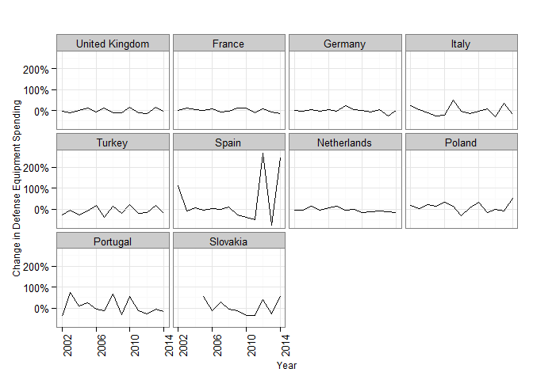
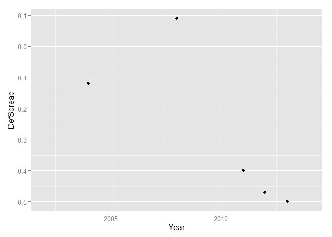
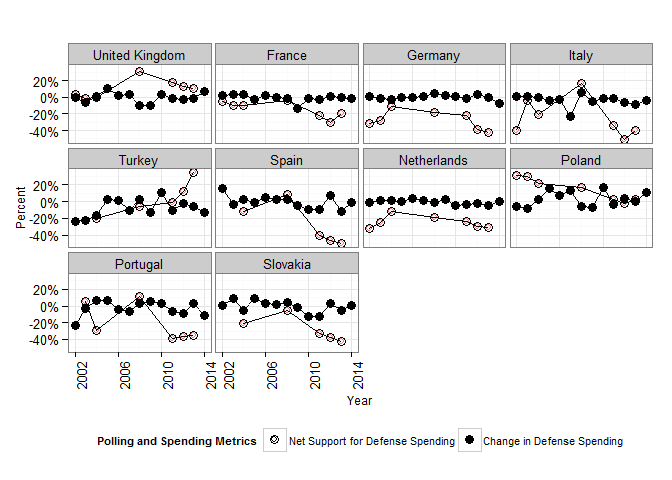
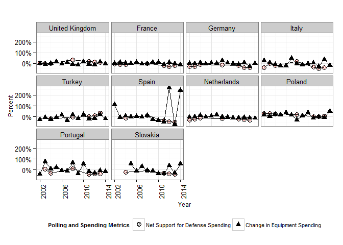
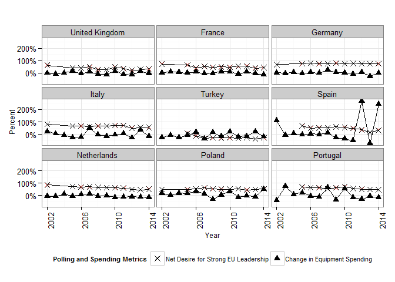
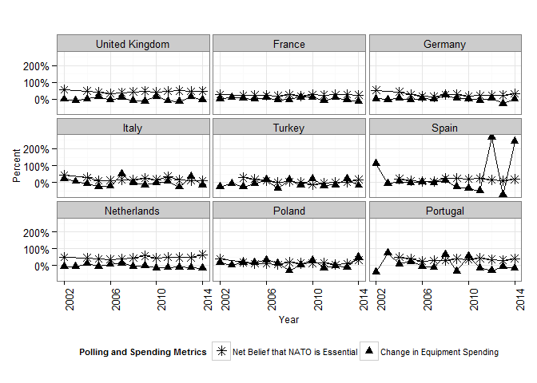
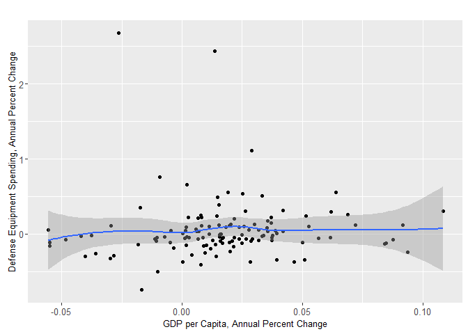
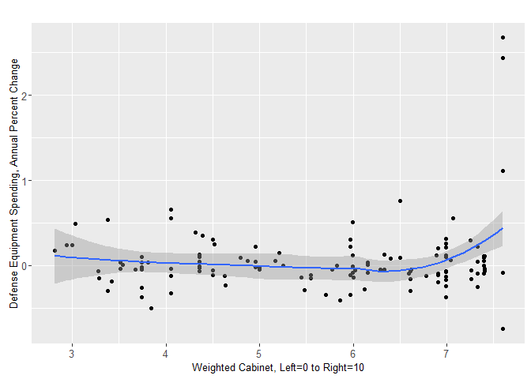

# Europe Data Exploration
Greg Sanders  
October 25, 2015  

This is an R Markdown document. Markdown is a simple formatting syntax for authoring HTML, PDF, and MS Word documents. For more details on using R Markdown see <http://rmarkdown.rstudio.com>.

When you click the **Knit** button a document will be generated that includes both content as well as the output of any embedded R code chunks within the document. You can embed an R code chunk like this:


You can also embed plots, for example:

#Dependent Variables

 

```
## Warning: Removed 3 rows containing missing values (geom_path).
```

```
## Warning: Removed 3 rows containing missing values (geom_text).
```

  

```
## Warning: Removed 8 rows containing missing values (geom_point).
```

 

```
## Warning: Removed 3 rows containing missing values (geom_point).
```

 

```
## Warning: Removed 8 rows containing missing values (geom_point).
```

 

```
## Warning in grid.Call(L_textBounds, as.graphicsAnnot(x$label), x$x, x$y, :
## font family not found in Windows font database
```

```
## Warning in grid.Call.graphics(L_text, as.graphicsAnnot(x$label), x$x, x$y,
## : font family not found in Windows font database
```

```
## Warning: Removed 10 rows containing missing values (stat_smooth).
```

```
## Warning: Removed 10 rows containing missing values (geom_point).
```

```
## Warning in validDetails.text(x): NAs introduced by coercion
```

```
## text[GRID.text.1254]
```

```
## Warning in validDetails.text(x): NAs introduced by coercion
```

```
## text[GRID.text.1255]
```

```
## Warning in validDetails.text(x): NAs introduced by coercion
```

```
## text[GRID.text.1256]
```

```
## Warning in validDetails.text(x): NAs introduced by coercion
```

```
## text[GRID.text.1257]
```

```
## Warning: Removed 13 rows containing missing values (stat_smooth).
```

```
## Warning: Removed 13 rows containing missing values (geom_point).
```

```
## Warning in validDetails.text(x): NAs introduced by coercion
```

```
## text[GRID.text.1302]
```

```
## Warning in validDetails.text(x): NAs introduced by coercion
```

```
## text[GRID.text.1303]
```

```
## Warning in validDetails.text(x): NAs introduced by coercion
```

```
## text[GRID.text.1304]
```

```
## Warning in validDetails.text(x): NAs introduced by coercion
```

 

```
## text[GRID.text.1305]
```


```r
DefTooMuchTooLittle.Def<-LatticeLineWrapper(VAR.color.legend.label="",
                             VAR.main.label="",
                             VAR.X.label="Year",
                             VAR.Y.label="Percent",
                             VAR.Coloration=Coloration,
                             VAR.long.DF=subset(EuropeLong,MetricName %in% c("DefSpendDelt","DefSpread")),
                             # ,VAR.ncol=NA
                             VAR.x.variable="Year",
                             VAR.y.variable="MetricValue",
                             VAR.y.series="MetricName",
                             VAR.facet.primary="Country",
                             # VAR.facet.secondary="Country"
                             # MovingAverage=1
                             # MovingSides=1
                             DataLabels=FALSE
                             #                       ,VAR.override.coloration=NA
)
```

```
## Warning in `levels<-`(`*tmp*`, value = if (nl == nL) as.character(labels)
## else paste0(labels, : duplicated levels in factors are deprecated
```

```
## Warning in `levels<-`(`*tmp*`, value = if (nl == nL) as.character(labels)
## else paste0(labels, : duplicated levels in factors are deprecated
```

```r
DefTooMuchTooLittle.Def+geom_point()+
    aes(shape=factor(category,levels=labels.category.DF$variable))+
    theme(legend.position="bottom")+
    scale_y_continuous(labels = percent_format())
```

```
## Scale for 'y' is already present. Adding another scale for 'y', which will replace the existing scale.
```

 

```r
DefTooMuchTooLittle.Equ<-LatticeLineWrapper(VAR.color.legend.label="",
                             VAR.main.label="",
                             VAR.X.label="Year",
                             VAR.Y.label="Percent",
                             VAR.Coloration=Coloration,
                             VAR.long.DF=subset(EuropeLong,MetricName %in% c("EquSpendDelt","DefSpread")),
                             # ,VAR.ncol=NA
                             VAR.x.variable="Year",
                             VAR.y.variable="MetricValue",
                             VAR.y.series="MetricName",
                             VAR.facet.primary="Country",
                             # VAR.facet.secondary="Country"
                             # MovingAverage=1
                             # MovingSides=1
                             DataLabels=FALSE
                             #                       ,VAR.override.coloration=NA
)
```

```
## Warning in `levels<-`(`*tmp*`, value = if (nl == nL) as.character(labels)
## else paste0(labels, : duplicated levels in factors are deprecated
```

```
## Warning in `levels<-`(`*tmp*`, value = if (nl == nL) as.character(labels)
## else paste0(labels, : duplicated levels in factors are deprecated
```

```r
DefTooMuchTooLittle.Equ+geom_point()+
    aes(shape=factor(category,levels=labels.category.DF$variable))+
    theme(legend.position="bottom")+
    scale_y_continuous(labels = percent_format())
```

```
## Scale for 'y' is already present. Adding another scale for 'y', which will replace the existing scale.
```

 

```r
EUleadership.Def<-LatticeLineWrapper(VAR.color.legend.label="",
                             VAR.main.label="",
                             VAR.X.label="Year",
                             VAR.Y.label="Percent",
                             VAR.Coloration=Coloration,
                             VAR.long.DF=subset(EuropeLong,MetricName %in% c("DefSpendDelt","EUldrSpread")),
                             # ,VAR.ncol=NA
                             VAR.x.variable="Year",
                             VAR.y.variable="MetricValue",
                             VAR.y.series="MetricName",
                             VAR.facet.primary="Country",
                             # VAR.facet.secondary="Country"
                             # MovingAverage=1
                             # MovingSides=1
                             DataLabels=FALSE
                             #                       ,VAR.override.coloration=NA
)
```

```
## Warning in `levels<-`(`*tmp*`, value = if (nl == nL) as.character(labels)
## else paste0(labels, : duplicated levels in factors are deprecated
```

```
## Warning in `levels<-`(`*tmp*`, value = if (nl == nL) as.character(labels)
## else paste0(labels, : duplicated levels in factors are deprecated
```

```r
EUleadership.Def+geom_point()+
    aes(shape=factor(category,levels=labels.category.DF$variable))+
    theme(legend.position="bottom")+
    scale_y_continuous(labels = percent_format())
```

```
## Scale for 'y' is already present. Adding another scale for 'y', which will replace the existing scale.
```

 

```r
EUleadership.Equ<-LatticeLineWrapper(VAR.color.legend.label="",
                             VAR.main.label="",
                             VAR.X.label="Year",
                             VAR.Y.label="Percent",
                             VAR.Coloration=Coloration,
                             VAR.long.DF=subset(EuropeLong,MetricName %in% c("EquSpendDelt","EUldrSpread")),
                             # ,VAR.ncol=NA
                             VAR.x.variable="Year",
                             VAR.y.variable="MetricValue",
                             VAR.y.series="MetricName",
                             VAR.facet.primary="Country",
                             # VAR.facet.secondary="Country"
                             # MovingAverage=1
                             # MovingSides=1
                             DataLabels=FALSE
                             #                       ,VAR.override.coloration=NA
)
```

```
## Warning in `levels<-`(`*tmp*`, value = if (nl == nL) as.character(labels)
## else paste0(labels, : duplicated levels in factors are deprecated
```

```
## Warning in `levels<-`(`*tmp*`, value = if (nl == nL) as.character(labels)
## else paste0(labels, : duplicated levels in factors are deprecated
```

```r
EUleadership.Equ+geom_point()+
    aes(shape=factor(category,levels=labels.category.DF$variable))+
    theme(legend.position="bottom")+
    scale_y_continuous(labels = percent_format())
```

```
## Scale for 'y' is already present. Adding another scale for 'y', which will replace the existing scale.
```

 

```r
NATOessen.Def<-LatticeLineWrapper(VAR.color.legend.label="",
                             VAR.main.label="",
                             VAR.X.label="Year",
                             VAR.Y.label="Percent",
                             VAR.Coloration=Coloration,
                             VAR.long.DF=subset(EuropeLong,MetricName %in% c("DefSpendDelt","NATOessSpread")),
                             # ,VAR.ncol=NA
                             VAR.x.variable="Year",
                             VAR.y.variable="MetricValue",
                             VAR.y.series="MetricName",
                             VAR.facet.primary="Country",
                             # VAR.facet.secondary="Country"
                             # MovingAverage=1
                             # MovingSides=1
                             DataLabels=FALSE
                             #                       ,VAR.override.coloration=NA
)
```

```
## Warning in `levels<-`(`*tmp*`, value = if (nl == nL) as.character(labels)
## else paste0(labels, : duplicated levels in factors are deprecated
```

```
## Warning in `levels<-`(`*tmp*`, value = if (nl == nL) as.character(labels)
## else paste0(labels, : duplicated levels in factors are deprecated
```

```r
NATOessen.Def+geom_point()+
    aes(shape=factor(category,levels=labels.category.DF$variable))+
    theme(legend.position="bottom")+
    scale_y_continuous(labels = percent_format())
```

```
## Scale for 'y' is already present. Adding another scale for 'y', which will replace the existing scale.
```

 

```r
NATOessen.Equ<-LatticeLineWrapper(VAR.color.legend.label="",
                             VAR.main.label="",
                             VAR.X.label="Year",
                             VAR.Y.label="Percent",
                             VAR.Coloration=Coloration,
                             VAR.long.DF=subset(EuropeLong,MetricName %in% c("EquSpendDelt","NATOessSpread")),
                             # ,VAR.ncol=NA
                             VAR.x.variable="Year",
                             VAR.y.variable="MetricValue",
                             VAR.y.series="MetricName",
                             VAR.facet.primary="Country",
                             # VAR.facet.secondary="Country"
                             # MovingAverage=1
                             # MovingSides=1
                             DataLabels=FALSE
                             #                       ,VAR.override.coloration=NA
)
```

```
## Warning in `levels<-`(`*tmp*`, value = if (nl == nL) as.character(labels)
## else paste0(labels, : duplicated levels in factors are deprecated
```

```
## Warning in `levels<-`(`*tmp*`, value = if (nl == nL) as.character(labels)
## else paste0(labels, : duplicated levels in factors are deprecated
```

```r
NATOessen.Equ+geom_point()+
    aes(shape=factor(category,levels=labels.category.DF$variable))+
    theme(legend.position="bottom")+
    scale_y_continuous(labels = percent_format())
```

```
## Scale for 'y' is already present. Adding another scale for 'y', which will replace the existing scale.
```

 

```r
NATO.EUconv.Def<-LatticeLineWrapper(VAR.color.legend.label="",
                             VAR.main.label="",
                             VAR.X.label="Year",
                             VAR.Y.label="Percent",
                             VAR.Coloration=Coloration,
                             VAR.long.DF=subset(EuropeLong,MetricName %in% c("DefSpendDelt","NATO.EUspread")),
                             # ,VAR.ncol=NA
                             VAR.x.variable="Year",
                             VAR.y.variable="MetricValue",
                             VAR.y.series="MetricName",
                             VAR.facet.primary="Country",
                             # VAR.facet.secondary="Country"
                             # MovingAverage=1
                             # MovingSides=1
                             DataLabels=FALSE
                             #                       ,VAR.override.coloration=NA
)
```

```
## Warning in `levels<-`(`*tmp*`, value = if (nl == nL) as.character(labels)
## else paste0(labels, : duplicated levels in factors are deprecated
```

```
## Warning in `levels<-`(`*tmp*`, value = if (nl == nL) as.character(labels)
## else paste0(labels, : duplicated levels in factors are deprecated
```

```r
NATO.EUconv.Def+geom_point()+
    aes(shape=factor(category,levels=labels.category.DF$variable))+
    theme(legend.position="bottom")+
    scale_y_continuous(labels = percent_format())
```

```
## Scale for 'y' is already present. Adding another scale for 'y', which will replace the existing scale.
```

 

```r
NATO.EUconv.Equ<-LatticeLineWrapper(VAR.color.legend.label="",
                             VAR.main.label="",
                             VAR.X.label="Year",
                             VAR.Y.label="Percent",
                             VAR.Coloration=Coloration,
                             VAR.long.DF=subset(EuropeLong,MetricName %in% c("EquSpendDelt","NATO.EUspread")),
                             # ,VAR.ncol=NA
                             VAR.x.variable="Year",
                             VAR.y.variable="MetricValue",
                             VAR.y.series="MetricName",
                             VAR.facet.primary="Country",
                             # VAR.facet.secondary="Country"
                             # MovingAverage=1
                             # MovingSides=1
                             DataLabels=FALSE
                             #                       ,VAR.override.coloration=NA
)
```

```
## Warning in `levels<-`(`*tmp*`, value = if (nl == nL) as.character(labels)
## else paste0(labels, : duplicated levels in factors are deprecated
```

```
## Warning in `levels<-`(`*tmp*`, value = if (nl == nL) as.character(labels)
## else paste0(labels, : duplicated levels in factors are deprecated
```

```r
NATO.EUconv.Equ+geom_point()+
    aes(shape=factor(category,levels=labels.category.DF$variable))+
    theme(legend.position="bottom")+
    scale_y_continuous(labels = percent_format())
```

```
## Scale for 'y' is already present. Adding another scale for 'y', which will replace the existing scale.
```

 
#Macroeconomic Variables


```
## Warning: Removed 20 rows containing missing values (stat_smooth).
```

```
## Warning: Removed 22 rows containing missing values (stat_smooth).
```

```
## Warning: Removed 20 rows containing missing values (stat_smooth).
```

```
## Warning: Removed 21 rows containing missing values (stat_smooth).
```

```
## Warning: Removed 20 rows containing missing values (geom_point).
```

```
## Warning: Removed 22 rows containing missing values (geom_point).
```

```
## Warning: Removed 20 rows containing missing values (geom_point).
```

```
## Warning: Removed 21 rows containing missing values (geom_point).
```

```
## Warning in validDetails.text(x): NAs introduced by coercion
```

```
## text[GRID.text.4145]
```

```
## Warning in validDetails.text(x): NAs introduced by coercion
```

```
## text[GRID.text.4146]
```

```
## Warning in validDetails.text(x): NAs introduced by coercion
```

```
## text[GRID.text.4147]
```

```
## Warning in validDetails.text(x): NAs introduced by coercion
```

```
## text[GRID.text.4148]
```

```
## Warning: Removed 20 rows containing missing values (stat_smooth).
```

```
## Warning: Removed 20 rows containing missing values (geom_point).
```

```
## Warning in validDetails.text(x): NAs introduced by coercion
```

```
## text[GRID.text.4193]
```

```
## Warning in validDetails.text(x): NAs introduced by coercion
```

```
## text[GRID.text.4194]
```

```
## Warning in validDetails.text(x): NAs introduced by coercion
```

```
## text[GRID.text.4195]
```

```
## Warning in validDetails.text(x): NAs introduced by coercion
```

```
## text[GRID.text.4196]
```

```
## Warning: Removed 22 rows containing missing values (stat_smooth).
```

```
## Warning: Removed 22 rows containing missing values (geom_point).
```

```
## Warning in validDetails.text(x): NAs introduced by coercion
```

```
## text[GRID.text.4241]
```

```
## Warning in validDetails.text(x): NAs introduced by coercion
```

```
## text[GRID.text.4242]
```

```
## Warning in validDetails.text(x): NAs introduced by coercion
```

```
## text[GRID.text.4243]
```

```
## Warning in validDetails.text(x): NAs introduced by coercion
```

 

```
## text[GRID.text.4244]
```

 


#Parliamentary Variables

#Left Right


```
## Warning in validDetails.text(x): NAs introduced by coercion
```

```
## text[GRID.text.4596]
```

```
## Warning in validDetails.text(x): NAs introduced by coercion
```

```
## text[GRID.text.4597]
```

```
## Warning in validDetails.text(x): NAs introduced by coercion
```

```
## text[GRID.text.4598]
```

```
## Warning in validDetails.text(x): NAs introduced by coercion
```

```
## text[GRID.text.4599]
```

```
## Warning: Removed 3 rows containing missing values (stat_smooth).
```

```
## Warning: Removed 3 rows containing missing values (geom_point).
```

```
## Warning in validDetails.text(x): NAs introduced by coercion
```

```
## text[GRID.text.4644]
```

```
## Warning in validDetails.text(x): NAs introduced by coercion
```

```
## text[GRID.text.4645]
```

```
## Warning in validDetails.text(x): NAs introduced by coercion
```

```
## text[GRID.text.4646]
```

```
## Warning in validDetails.text(x): NAs introduced by coercion
```

 

```
## text[GRID.text.4647]
```

 


#Liberty Authority


```
## Warning in validDetails.text(x): NAs introduced by coercion
```

```
## text[GRID.text.5075]
```

```
## Warning in validDetails.text(x): NAs introduced by coercion
```

```
## text[GRID.text.5076]
```

```
## Warning in validDetails.text(x): NAs introduced by coercion
```

```
## text[GRID.text.5077]
```

```
## Warning in validDetails.text(x): NAs introduced by coercion
```

```
## text[GRID.text.5078]
```

```
## Warning: Removed 3 rows containing missing values (stat_smooth).
```

```
## Warning: Removed 3 rows containing missing values (geom_point).
```

```
## Warning in validDetails.text(x): NAs introduced by coercion
```

```
## text[GRID.text.5123]
```

```
## Warning in validDetails.text(x): NAs introduced by coercion
```

```
## text[GRID.text.5124]
```

```
## Warning in validDetails.text(x): NAs introduced by coercion
```

```
## text[GRID.text.5125]
```

```
## Warning in validDetails.text(x): NAs introduced by coercion
```

 

```
## text[GRID.text.5126]
```

```
## Warning: Removed 1 rows containing missing values (geom_path).
```

```
## Warning: Removed 1 rows containing missing values (geom_point).
```

 


#EU Anti Pro


```
## Warning in validDetails.text(x): NAs introduced by coercion
```

```
## text[GRID.text.5554]
```

```
## Warning in validDetails.text(x): NAs introduced by coercion
```

```
## text[GRID.text.5555]
```

```
## Warning in validDetails.text(x): NAs introduced by coercion
```

```
## text[GRID.text.5556]
```

```
## Warning in validDetails.text(x): NAs introduced by coercion
```

```
## text[GRID.text.5557]
```

```
## Warning: Removed 3 rows containing missing values (stat_smooth).
```

```
## Warning: Removed 3 rows containing missing values (geom_point).
```

```
## Warning in validDetails.text(x): NAs introduced by coercion
```

```
## text[GRID.text.5602]
```

```
## Warning in validDetails.text(x): NAs introduced by coercion
```

```
## text[GRID.text.5603]
```

```
## Warning in validDetails.text(x): NAs introduced by coercion
```

```
## text[GRID.text.5604]
```

```
## Warning in validDetails.text(x): NAs introduced by coercion
```

 

```
## text[GRID.text.5605]
```

```
## Warning: Removed 1 rows containing missing values (geom_path).
```

```
## Warning: Removed 1 rows containing missing values (geom_point).
```

 
