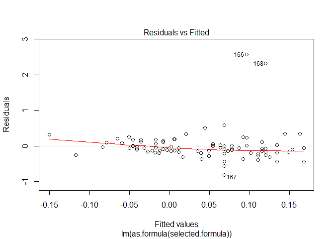
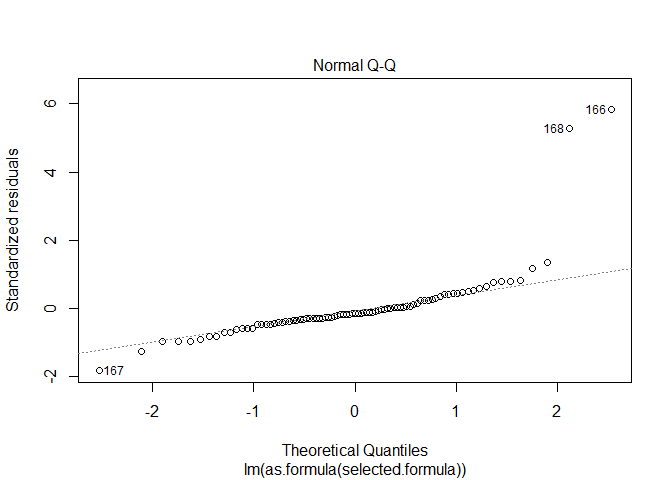
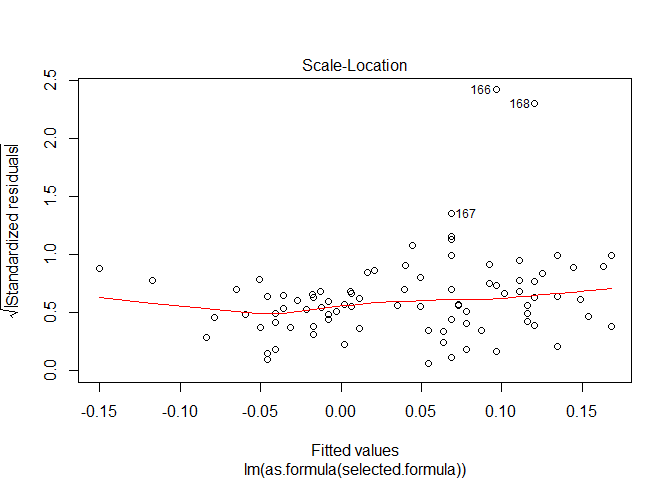
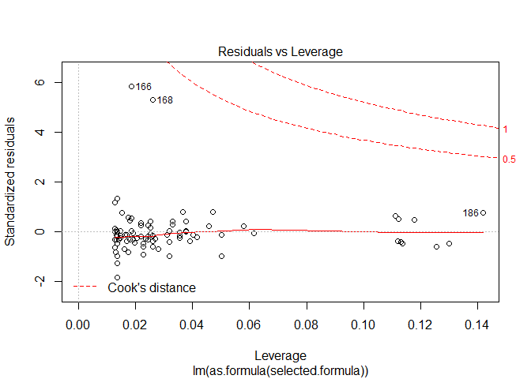

# European Defense and Public Opinion: Selected Models
Greg Sanders  
October 19, 2015  


**Load and subset the data we want**


**load and subset the data we want**


#Hypothesis 1: Public Support for Defense Spending

Hypothesis 1 a: Net public support for more defense spending results in an increase of defense spending.
Hypothesis 1 b: Net public support for more defense spending results in an increase of investment spending.


```r
Europe_model<-panelmodels(selected.formula="DefSpendDelt_lead ~ DefSpread_lag1 + GDPpCapDelt",
                              source.data=DefSpread,
                              regression.name="Too Much/Little & Def",
                             include.random=FALSE)
```

```
## series Unit.Currency is constant and has been removed
## series Unit.Currency is constant and has been removed
## series Unit.Currency is constant and has been removed
## series Unit.Currency is constant and has been removed
```

```r
# summary(Europe_model$ols[[1]])
summary(Europe_model$pooling[[1]])
```

```
## Oneway (individual) effect Pooling Model
## 
## Call:
## plm(formula = as.formula(selected.formula), data = source.data, 
##     model = "pooling")
## 
## Unbalanced Panel: n=10, T=4-6, N=53
## 
## Residuals :
##     Min.  1st Qu.   Median  3rd Qu.     Max. 
## -0.15800 -0.02970  0.00201  0.02970  0.15300 
## 
## Coefficients :
##                  Estimate Std. Error t-value Pr(>|t|)   
## (Intercept)    0.01460359 0.00913337  1.5989 0.116138   
## DefSpread_lag1 0.00130297 0.00037575  3.4677 0.001089 **
## GDPpCapDelt    0.12951220 0.08431222  1.5361 0.130818   
## ---
## Signif. codes:  0 '***' 0.001 '**' 0.01 '*' 0.05 '.' 0.1 ' ' 1
## 
## Total Sum of Squares:    0.21334
## Residual Sum of Squares: 0.16665
## R-Squared      :  0.21888 
##       Adj. R-Squared :  0.20649 
## F-statistic: 7.00525 on 2 and 50 DF, p-value: 0.0020795
```

```r
# summary(Europe_model$between[[1]])
# summary(Europe_model$fd[[1]])
# summary(Europe_model$within[[1]])
# summary(Europe_model$random[[1]])
# plot(Europe_model$ols[[1]])
#190, #86, #194,81


Europe_model<-rbind(
    Europe_model[1,],
    panelmodels(selected.formula="EquSpendDelt ~ DefSpread_lag2 + GDPpCapDelt + left_right_ls_spread",
                              source.data=DefSpread,
                              regression.name="Too Much/Little & Equ")
)
```

```
## series Unit.Currency is constant and has been removed
## series Unit.Currency is constant and has been removed
## series Unit.Currency is constant and has been removed
## series Unit.Currency is constant and has been removed
## series Unit.Currency is constant and has been removed
```

```r
# summary(Europe_model$ols[[2]])
# summary(Europe_model$pooling[[2]])
# summary(Europe_model$between[[2]])
# summary(Europe_model$fd[[2]])
# summary(Europe_model$within[[2]])
summary(Europe_model$random[[2]])
```

```
## Oneway (individual) effect Random Effect Model 
##    (Swamy-Arora's transformation)
## 
## Call:
## plm(formula = as.formula(selected.formula), data = source.data, 
##     model = "random")
## 
## Unbalanced Panel: n=10, T=3-5, N=43
## 
## Effects:
##                   var std.dev share
## idiosyncratic 0.02513 0.15853 0.548
## individual    0.02073 0.14398 0.452
## theta  : 
##    Min. 1st Qu.  Median    Mean 3rd Qu.    Max. 
##  0.4635  0.5177  0.5582  0.5347  0.5582  0.5582 
## 
## Residuals :
##     Min.  1st Qu.   Median     Mean  3rd Qu.     Max. 
## -0.38300 -0.09680  0.02050  0.00175  0.08230  0.33400 
## 
## Coefficients :
##                        Estimate Std. Error t-value Pr(>|t|)   
## (Intercept)           0.1633234  0.0719289  2.2706 0.028771 * 
## DefSpread_lag2        0.0052647  0.0016268  3.2363 0.002472 **
## GDPpCapDelt           0.9122738  0.5052552  1.8056 0.078709 . 
## left_right_ls_spread -0.0164080  0.0055691 -2.9463 0.005403 **
## ---
## Signif. codes:  0 '***' 0.001 '**' 0.01 '*' 0.05 '.' 0.1 ' ' 1
## 
## Total Sum of Squares:    1.4122
## Residual Sum of Squares: 0.9403
## R-Squared      :  0.33423 
##       Adj. R-Squared :  0.30314 
## F-statistic: 6.52344 on 3 and 39 DF, p-value: 0.0011053
```

```r
# plot(Europe_model$ols[[2]])
screenreg(list(Europe_model$pooling[[1]],Europe_model$random[[2]]),
          custom.model.name=c(as.character(Europe_model$name[1:2])),
          digits=3,
          stars=c(0.01,0.05,0.1),
          reorder.coef=c(1,2,4,3,5),
          groups = list("Intercept" = 1,"Polling" = 2:3, "MacroEconomics" = 4,"Parliamentary" = 5)
          )
```

```
## 
## ======================================================================
##                           Too Much/Little & Def  Too Much/Little & Equ
## ----------------------------------------------------------------------
## Intercept                                                             
##                                                                       
##     (Intercept)            0.015                  0.163 **            
##                           (0.009)                (0.072)              
## Polling                                                               
##                                                                       
##     DefSpread_lag1         0.001 ***                                  
##                           (0.000)                                     
##     DefSpread_lag2                                0.005 ***           
##                                                  (0.002)              
## MacroEconomics                                                        
##                                                                       
##     GDPpCapDelt            0.130                  0.912 *             
##                           (0.084)                (0.505)              
## Parliamentary                                                         
##                                                                       
##     left_right_ls_spread                         -0.016 ***           
##                                                  (0.006)              
## ----------------------------------------------------------------------
## R^2                        0.219                  0.334               
## Adj. R^2                   0.206                  0.303               
## Num. obs.                 53                     43                   
## ======================================================================
## *** p < 0.01, ** p < 0.05, * p < 0.1
```

#Hypothesis 2: Public Support for Active European Foreign Policy

Hypothesis 2a: Net public support of individual European countries for a greater presence of the EU in international affairs results in an increase of investment defense spending.
Hypothesis 2b: Net public support of individual European countries for a greater presence of the EU in international affairs results in an increase of investment spending.


```r
Europe_model<-rbind(
    Europe_model[1:2,],
    panelmodels(selected.formula="DefSpendDelt ~ EUldrSpread + IntlCnf + GDPpCapDelt +
                                 eu_anti_pro_ls_spread",
                source.data=DefSpread,
                regression.name="EU leader. & Def",
                include.random=TRUE)
)
```

```
## series Unit.Currency is constant and has been removed
## series Unit.Currency is constant and has been removed
## series Unit.Currency is constant and has been removed
## series Unit.Currency is constant and has been removed
## series Unit.Currency is constant and has been removed
```

```r
# summary(Europe_model$ols[[3]])
summary(Europe_model$pooling[[3]])
```

```
## Oneway (individual) effect Pooling Model
## 
## Call:
## plm(formula = as.formula(selected.formula), data = source.data, 
##     model = "pooling")
## 
## Balanced Panel: n=9, T=9, N=81
## 
## Residuals :
##    Min. 1st Qu.  Median 3rd Qu.    Max. 
## -0.2430 -0.0367 -0.0015  0.0355  0.1690 
## 
## Coefficients :
##                          Estimate  Std. Error t-value  Pr(>|t|)    
## (Intercept)           -0.07045548  0.02008632 -3.5076 0.0007628 ***
## EUldrSpread            0.00076175  0.00030298  2.5142 0.0140442 *  
## IntlCnf                0.05650246  0.03845436  1.4693 0.1458686    
## GDPpCapDelt            0.14977761  0.08997599  1.6646 0.1001024    
## eu_anti_pro_ls_spread  0.00345681  0.00162745  2.1241 0.0369176 *  
## ---
## Signif. codes:  0 '***' 0.001 '**' 0.01 '*' 0.05 '.' 0.1 ' ' 1
## 
## Total Sum of Squares:    0.35139
## Residual Sum of Squares: 0.28674
## R-Squared      :  0.18399 
##       Adj. R-Squared :  0.17263 
## F-statistic: 4.28404 on 4 and 76 DF, p-value: 0.0035242
```

```r
# summary(Europe_model$between[[3]])
# summary(Europe_model$fd[[3]])
# summary(Europe_model$within[[3]])
# summary(Europe_model$random[[3]])
# plot(Europe_model$ols[[3]])
Europe_model<-rbind(
    Europe_model[1:3,],
    panelmodels(selected.formula="EquSpendDelt ~ EUldrSpread_lag1 + CivilWar + Cab_liberty_authority + Cab_eu_anti_pro",
                source.data=DefSpread,
                regression.name="EU leader. & Equ",
                include.random=FALSE)
)
```

```
## series Unit.Currency is constant and has been removed
## series Unit.Currency is constant and has been removed
## series Unit.Currency is constant and has been removed
## series Unit.Currency is constant and has been removed
```

```r
# summary(Europe_model$ols[[4]])
summary(Europe_model$pooling[[4]])
```

```
## Oneway (individual) effect Pooling Model
## 
## Call:
## plm(formula = as.formula(selected.formula), data = source.data, 
##     model = "pooling")
## 
## Unbalanced Panel: n=9, T=8-9, N=78
## 
## Residuals :
##    Min. 1st Qu.  Median 3rd Qu.    Max. 
## -0.9530 -0.1550 -0.0365  0.0921  2.4800 
## 
## Coefficients :
##                         Estimate Std. Error t-value Pr(>|t|)
## (Intercept)           -0.4013221  0.4223822 -0.9501   0.3452
## EUldrSpread_lag1      -0.0016561  0.0032985 -0.5021   0.6171
## CivilWar              -0.3959759  0.3694849 -1.0717   0.2874
## Cab_liberty_authority  0.0542623  0.0375685  1.4444   0.1529
## Cab_eu_anti_pro        0.0317095  0.0383287  0.8273   0.4108
## 
## Total Sum of Squares:    10.827
## Residual Sum of Squares: 10.503
## R-Squared      :  0.029948 
##       Adj. R-Squared :  0.028029 
## F-statistic: 0.563433 on 4 and 73 DF, p-value: 0.68993
```

```r
# summary(Europe_model$between[[4]])
# summary(Europe_model$fd[[4]])
# summary(Europe_model$within[[4]])
# summary(Europe_model$random[[4]])
# plot(Europe_model$ols[[4]])

screenreg(list(Europe_model$pooling[[3]],Europe_model$pooling[[4]]),
          custom.model.name=c(as.character(Europe_model$name[3:4])),
          digits=3,
          stars=c(0.01,0.05,0.1),
          reorder.coef=c(1,2,6,3,7,4,8,9,5),
          groups = list("Intercept" = 1,"Polling" = 2:3, "Security"=4:5, "Macroeconomic" = 6, "Parliamentary"=7:9)
          )
```

```
## 
## =============================================================
##                            EU leader. & Def  EU leader. & Equ
## -------------------------------------------------------------
## Intercept                                                    
##                                                              
##     (Intercept)            -0.070 ***        -0.401          
##                            (0.020)           (0.422)         
## Polling                                                      
##                                                              
##     EUldrSpread             0.001 **                         
##                            (0.000)                           
##     EUldrSpread_lag1                         -0.002          
##                                              (0.003)         
## Security                                                     
##                                                              
##     IntlCnf                 0.057                            
##                            (0.038)                           
##     CivilWar                                 -0.396          
##                                              (0.369)         
## Macroeconomic                                                
##                                                              
##     GDPpCapDelt             0.150                            
##                            (0.090)                           
## Parliamentary                                                
##                                                              
##     Cab_liberty_authority                     0.054          
##                                              (0.038)         
##     Cab_eu_anti_pro                           0.032          
##                                              (0.038)         
##     eu_anti_pro_ls_spread   0.003 **                         
##                            (0.002)                           
## -------------------------------------------------------------
## R^2                         0.184             0.030          
## Adj. R^2                    0.173             0.028          
## Num. obs.                  81                78              
## =============================================================
## *** p < 0.01, ** p < 0.05, * p < 0.1
```

#Hypothesis 3: Public Support for NATO

Hypothesis 3 a: Net public support for believing that NATO is essential to your country's security will increase defense spending. 
Hypothesis 3 b: Net public support for believing that NATO is essential to your country's security will increase defense spending. 
Hypothesis 3 cb: Net public support for believing that NATO is essential to your country's security will increase investment spending.


```r
Europe_model<-rbind(
    Europe_model[1:4,],
    panelmodels(selected.formula="DefSpendDelt_lead ~ NATOessSpread_lag2",
                source.data=DefSpread,
                regression.name="NATO-EU Conv. & Def",
                include.random=TRUE)
)
```

```
## series Unit.Currency is constant and has been removed
## series Unit.Currency is constant and has been removed
## series Unit.Currency is constant and has been removed
## series Unit.Currency is constant and has been removed
## series Unit.Currency is constant and has been removed
```

```r
# summary(Europe_model$ols[[5]])
# summary(Europe_model$pooling[[5]])
# summary(Europe_model$between[[5]])
summary(Europe_model$fd[[5]])
```

```
## Oneway (individual) effect First-Difference Model
## 
## Call:
## plm(formula = as.formula(selected.formula), data = source.data, 
##     model = "fd")
## 
## Unbalanced Panel: n=9, T=8-9, N=78
## 
## Residuals :
##     Min.  1st Qu.   Median  3rd Qu.     Max. 
## -0.20700 -0.04850 -0.00319  0.04430  0.26600 
## 
## Coefficients :
##                      Estimate Std. Error t-value Pr(>|t|)
## (intercept)        -0.0057496  0.0122968 -0.4676   0.6416
## NATOessSpread_lag2 -0.0013953  0.0013795 -1.0115   0.3154
## 
## Total Sum of Squares:    0.68825
## Residual Sum of Squares: 0.6779
## R-Squared      :  0.01504 
##       Adj. R-Squared :  0.014604 
## F-statistic: 1.02309 on 1 and 67 DF, p-value: 0.31543
```

```r
# summary(Europe_model$within[[5]])
# summary(Europe_model$random[[5]])
# plot(Europe_model$ols[[5]])

Europe_model<-rbind(
    Europe_model[1:5,],
    panelmodels(selected.formula="DefSpendDelt_lead ~ NATOessSpread_lag2",
                source.data=DefSpread,
                regression.name="NATO Ess. & Def",
                include.random=FALSE)
)
```

```
## series Unit.Currency is constant and has been removed
## series Unit.Currency is constant and has been removed
## series Unit.Currency is constant and has been removed
## series Unit.Currency is constant and has been removed
```

```r
# summary(Europe_model$ols[[6]])
# summary(Europe_model$pooling[[6]])
# summary(Europe_model$between[[6]])
summary(Europe_model$fd[[6]])
```

```
## Oneway (individual) effect First-Difference Model
## 
## Call:
## plm(formula = as.formula(selected.formula), data = source.data, 
##     model = "fd")
## 
## Unbalanced Panel: n=9, T=8-9, N=78
## 
## Residuals :
##     Min.  1st Qu.   Median  3rd Qu.     Max. 
## -0.20700 -0.04850 -0.00319  0.04430  0.26600 
## 
## Coefficients :
##                      Estimate Std. Error t-value Pr(>|t|)
## (intercept)        -0.0057496  0.0122968 -0.4676   0.6416
## NATOessSpread_lag2 -0.0013953  0.0013795 -1.0115   0.3154
## 
## Total Sum of Squares:    0.68825
## Residual Sum of Squares: 0.6779
## R-Squared      :  0.01504 
##       Adj. R-Squared :  0.014604 
## F-statistic: 1.02309 on 1 and 67 DF, p-value: 0.31543
```

```r
# summary(Europe_model$within[[6]])
# summary(Europe_model$random[[6]])

# plot(Europe_model$ols[[6]])

Europe_model<-rbind(
    Europe_model[1:6,],
    panelmodels(selected.formula="EquSpendDelt_lead ~ NATO.EUspread_lag2  + GDPpCapDelt + eu_anti_pro_ls_spread",
                source.data=DefSpread,
                regression.name="NATO-EU Conv. & Equ",
                include.random=FALSE)
)
```

```
## series Unit.Currency is constant and has been removed
## series Unit.Currency is constant and has been removed
## series Unit.Currency is constant and has been removed
## series Unit.Currency is constant and has been removed
```

```r
# summary(Europe_model$ols[[7]])
# summary(Europe_model$pooling[[7]])
# summary(Europe_model$between[[7]])
summary(Europe_model$fd[[7]])
```

```
## Oneway (individual) effect First-Difference Model
## 
## Call:
## plm(formula = as.formula(selected.formula), data = source.data, 
##     model = "fd")
## 
## Balanced Panel: n=8, T=7, N=56
## 
## Residuals :
##     Min.  1st Qu.   Median  3rd Qu.     Max. 
## -3.15000 -0.28200 -0.00547  0.17400  2.96000 
## 
## Coefficients :
##                         Estimate Std. Error t-value Pr(>|t|)  
## (intercept)            0.0176465  0.1268702  0.1391   0.8900  
## NATO.EUspread_lag2     0.0069745  0.0094359  0.7391   0.4637  
## GDPpCapDelt            2.2416591  1.1564084  1.9385   0.0590 .
## eu_anti_pro_ls_spread -0.0327333  0.0386637 -0.8466   0.4018  
## ---
## Signif. codes:  0 '***' 0.001 '**' 0.01 '*' 0.05 '.' 0.1 ' ' 1
## 
## Total Sum of Squares:    36.258
## Residual Sum of Squares: 32.76
## R-Squared      :  0.096473 
##       Adj. R-Squared :  0.088434 
## F-statistic: 1.56602 on 3 and 44 DF, p-value: 0.21108
```

```r
# summary(Europe_model$within[[7]])
# summary(Europe_model$random[[3]])
# plot(Europe_model$ols[[7]])

Europe_model<-rbind(
    Europe_model[1:7,],
    panelmodels(selected.formula="EquSpendDelt_lead ~ NATOessSpread_lag1  + CivilWar",
                source.data=DefSpread,
                regression.name="NATO Ess. & Equ",
                include.random=FALSE)
)
```

```
## series Unit.Currency is constant and has been removed
## series Unit.Currency is constant and has been removed
## series Unit.Currency is constant and has been removed
## series Unit.Currency is constant and has been removed
```

```r
# summary(Europe_model$ols[[8]])
# summary(Europe_model$pooling[[8]])
# summary(Europe_model$between[[8]])
summary(Europe_model$fd[[8]])
```

```
## Oneway (individual) effect First-Difference Model
## 
## Call:
## plm(formula = as.formula(selected.formula), data = source.data, 
##     model = "fd")
## 
## Unbalanced Panel: n=9, T=9-10, N=87
## 
## Residuals :
##    Min. 1st Qu.  Median 3rd Qu.    Max. 
## -3.3300 -0.2400 -0.0553  0.1650  3.1000 
## 
## Coefficients :
##                      Estimate Std. Error t-value Pr(>|t|)
## (intercept)        -0.0046714  0.0827747 -0.0564   0.9551
## NATOessSpread_lag1 -0.0130350  0.0092191 -1.4139   0.1615
## 
## Total Sum of Squares:    39.823
## Residual Sum of Squares: 38.803
## R-Squared      :  0.02563 
##       Adj. R-Squared :  0.024973 
## F-statistic: 1.99914 on 1 and 76 DF, p-value: 0.16147
```

```r
# summary(Europe_model$within[[8]])
# summary(Europe_model$random[[8]])
plot(Europe_model$ols[[8]])
```

    

```r
screenreg(list(Europe_model$fd[[5]],Europe_model$fd[[6]],Europe_model$fd[[7]],Europe_model$fd[[8]]),
          custom.model.name=c(as.character(Europe_model$name[5:8])),
          digits=4,
          stars=c(0.01,0.05,0.1),
          reorder.coef=c(1,2,3,6,4,5),
          groups = list("Intercept" = 1,"Polling" = 2:4, "Macroeconomic" = 5, "Parliamentary"=6)

          )
```

```
## 
## =====================================================================================================
##                            NATO-EU Conv. & Def  NATO Ess. & Def  NATO-EU Conv. & Equ  NATO Ess. & Equ
## -----------------------------------------------------------------------------------------------------
## Intercept                                                                                            
##                                                                                                      
##     (intercept)            -0.0057              -0.0057           0.0176              -0.0047        
##                            (0.0123)             (0.0123)         (0.1269)             (0.0828)       
## Polling                                                                                              
##                                                                                                      
##     NATOessSpread_lag2     -0.0014              -0.0014                                              
##                            (0.0014)             (0.0014)                                             
##     NATO.EUspread_lag2                                            0.0070                             
##                                                                  (0.0094)                            
##     NATOessSpread_lag1                                                                -0.0130        
##                                                                                       (0.0092)       
## Macroeconomic                                                                                        
##                                                                                                      
##     GDPpCapDelt                                                   2.2417 *                           
##                                                                  (1.1564)                            
## Parliamentary                                                                                        
##                                                                                                      
##     eu_anti_pro_ls_spread                                        -0.0327                             
##                                                                  (0.0387)                            
## -----------------------------------------------------------------------------------------------------
## R^2                         0.0150               0.0150           0.0965               0.0256        
## Adj. R^2                    0.0146               0.0146           0.0884               0.0250        
## Num. obs.                  69                   69               48                   78             
## =====================================================================================================
## *** p < 0.01, ** p < 0.05, * p < 0.1
```

#Dependent Variable cross-analyses

##All Tests Using Top-Line Defense Spending as a Dependent Variable


```r
screenreg(list(Europe_model$pooling[[1]],Europe_model$pooling[[3]],Europe_model$fd[[5]],Europe_model$fd[[6]]),
          custom.model.name=c(as.character(Europe_model$name[c(1,3,5,6)])),
          digits=4,
          stars=c(0.01,0.05,0.1),
          reorder.coef=c(1,7,2,4,8,5,3,6),
          groups = list("Intercept" = 1:2,"Polling" = 3:5, "Security"=6,"Macroeconomic" = 7, "Parliamentary"=8)
          )
```

```
## 
## ========================================================================================================
##                            Too Much/Little & Def  EU leader. & Def  NATO-EU Conv. & Def  NATO Ess. & Def
## --------------------------------------------------------------------------------------------------------
## Intercept                                                                                               
##                                                                                                         
##     (Intercept)             0.0146                -0.0705 ***                                           
##                            (0.0091)               (0.0201)                                              
##     (intercept)                                                     -0.0057              -0.0057        
##                                                                     (0.0123)             (0.0123)       
## Polling                                                                                                 
##                                                                                                         
##     DefSpread_lag1          0.0013 ***                                                                  
##                            (0.0004)                                                                     
##     EUldrSpread                                    0.0008 **                                            
##                                                   (0.0003)                                              
##     NATOessSpread_lag2                                              -0.0014              -0.0014        
##                                                                     (0.0014)             (0.0014)       
## Security                                                                                                
##                                                                                                         
##     IntlCnf                                        0.0565                                               
##                                                   (0.0385)                                              
## Macroeconomic                                                                                           
##                                                                                                         
##     GDPpCapDelt             0.1295                 0.1498                                               
##                            (0.0843)               (0.0900)                                              
## Parliamentary                                                                                           
##                                                                                                         
##     eu_anti_pro_ls_spread                          0.0035 **                                            
##                                                   (0.0016)                                              
## --------------------------------------------------------------------------------------------------------
## R^2                         0.2189                 0.1840            0.0150               0.0150        
## Adj. R^2                    0.2065                 0.1726            0.0146               0.0146        
## Num. obs.                  53                     81                69                   69             
## ========================================================================================================
## *** p < 0.01, ** p < 0.05, * p < 0.1
```

##All Tests Using Defense Investment Spending as a Dependent Variable


```r
screenreg(list(Europe_model$random[[2]],Europe_model$pooling[[4]],Europe_model$fd[[7]],Europe_model$fd[[8]]),
          custom.model.name=c(as.character(Europe_model$name[c(2,4,7,8)])),
          digits=4,
          stars=c(0.01,0.05,0.1),
          reorder.coef=c(1,9,2,5,10,12,6,3,4,7,11,8),
          groups = list("Intercept" = 1:2,"Polling" = 3:6, "Security"=7,"Macroeconomic" = 8, "Parliamentary"=9:12)
          )
```

```
## 
## ========================================================================================================
##                            Too Much/Little & Equ  EU leader. & Equ  NATO-EU Conv. & Equ  NATO Ess. & Equ
## --------------------------------------------------------------------------------------------------------
## Intercept                                                                                               
##                                                                                                         
##     (Intercept)             0.1633 **             -0.4013                                               
##                            (0.0719)               (0.4224)                                              
##     (intercept)                                                      0.0176              -0.0047        
##                                                                     (0.1269)             (0.0828)       
## Polling                                                                                                 
##                                                                                                         
##     DefSpread_lag2          0.0053 ***                                                                  
##                            (0.0016)                                                                     
##     EUldrSpread_lag1                              -0.0017                                               
##                                                   (0.0033)                                              
##     NATO.EUspread_lag2                                               0.0070                             
##                                                                     (0.0094)                            
##     NATOessSpread_lag1                                                                   -0.0130        
##                                                                                          (0.0092)       
## Security                                                                                                
##                                                                                                         
##     CivilWar                                      -0.3960                                               
##                                                   (0.3695)                                              
## Macroeconomic                                                                                           
##                                                                                                         
##     GDPpCapDelt             0.9123 *                                 2.2417 *                           
##                            (0.5053)                                 (1.1564)                            
## Parliamentary                                                                                           
##                                                                                                         
##     left_right_ls_spread   -0.0164 ***                                                                  
##                            (0.0056)                                                                     
##     Cab_liberty_authority                          0.0543                                               
##                                                   (0.0376)                                              
##     eu_anti_pro_ls_spread                                           -0.0327                             
##                                                                     (0.0387)                            
##     Cab_eu_anti_pro                                0.0317                                               
##                                                   (0.0383)                                              
## --------------------------------------------------------------------------------------------------------
## R^2                         0.3342                 0.0299            0.0965               0.0256        
## Adj. R^2                    0.3031                 0.0280            0.0884               0.0250        
## Num. obs.                  43                     78                48                   78             
## ========================================================================================================
## *** p < 0.01, ** p < 0.05, * p < 0.1
```
