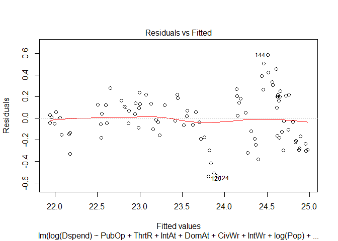
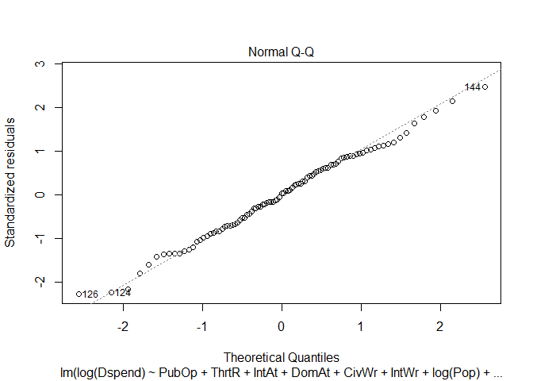
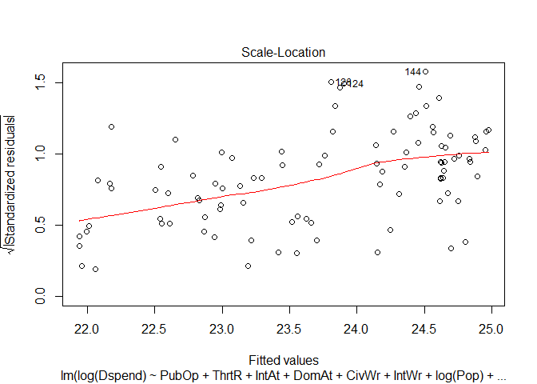
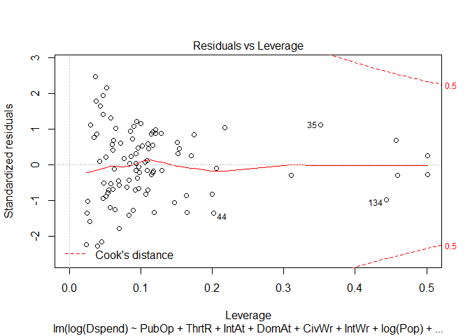
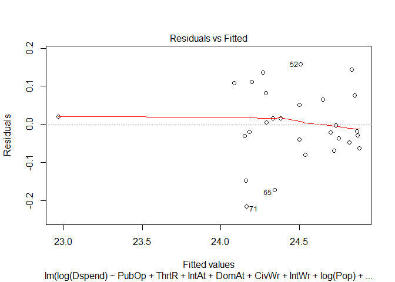
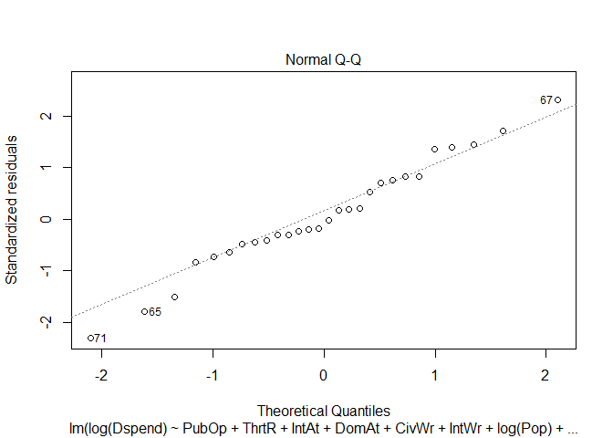
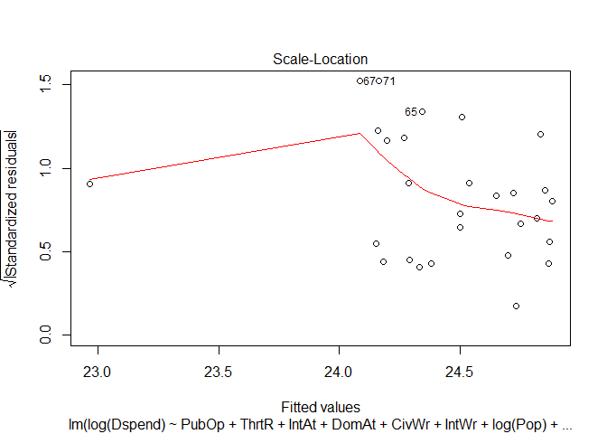
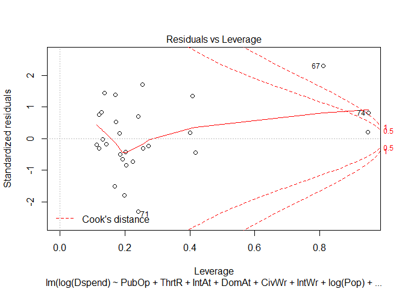

# SSI Regression
src  
Wednesday, April 08, 2015  

###Analysis for estimating the effect EU Public opinion has on Defense Spending 

**Load the Data**

```r
# setwd("C:/Users/scohen/My Documents/Europe/Europe/Data/") #Your working directory here!
# #source("SSIRegression.R")
# 
# CompilePubOpData <- function(filename, lag = 1) {
#   ## start by setting up some items for later use.
#   ## Namely, loading needed packages and setting a path to my files.
#   require(plm)
#   require(plyr)
#   require(reshape)
#   
#   ## Set this path to the folder into which your git hub will download data
#   #path <- "K:/Development/Europe/" #     path <- "C:/Users/MRiley/My Documents/Europe/"
#   #path <- "C:/Users/scohen/My Documents/Europe/Europe/"
#   path <- ("C:/Users/MRiley/My Documents/Europe/")
#   
#   ## Next I'm going to load all of my data. The data: in order is..
#   ## public opinion, governance data from PolityIV, Terrorism data from GTD,
#   ## data we compiled on conflicts and a country's membership to the EU,
#   ## GDP per capita data (constant 2005 $), GDP data (also Const 2005 $), population data,
#   ## data on NATO membership, spending data, and neighbor spending data.
#   data.a <- read.csv(paste(path, filename, sep =""), header = TRUE) 
#   data.gov <- read.csv(paste(path, "SSI_Govern.csv", sep =""), header = TRUE)
#   data.ter <- read.csv(paste(path, "Terrorism Data.csv", sep =""), header = TRUE)
#   data.intlcnf <- read.csv(paste(path, "SSI_IntlConfl.csv", sep =""), header = TRUE)
#   data.cvlwr <- read.csv(paste(path, "SSI_CivilWar.csv", sep =""), header = TRUE)
#   data.gdppc <- read.csv(paste(path, "SSI_GDPperCAP.csv", sep =""), header = TRUE)
#   data.gdp <- read.csv(paste(path, "SSI_Const05_GDP.csv", sep =""), header = TRUE)
#   data.pop <- read.csv(paste(path, "SSI_Population.csv", sep =""), header = TRUE)
#   data.nato <- read.csv(paste(path, "SSI_NATO.csv", sep =""), header = TRUE)
#   data.euds <- read.csv(paste(path, "EUDefenseSpending_EUROS.csv", sep =""), header = TRUE)
#   data.nghspnd <- read.csv(paste(path, "SSIMilSpendingData.CSV", sep=""), header = TRUE, na.strings = "#VALUE!")
#   
#   
#   #### This next section is where we change the column names of the data sets that don't need
#   #### to be reshaped. 
#   
#   ## Then we change the coloumnames to make them more universal
#   colnames(data.gov)[colnames(data.gov)=="country"] <- "Country"
#   colnames(data.gov)[colnames(data.gov)=="year"] <- "Year"
#   colnames(data.ter)[colnames(data.ter)=="country_txt"] <- "Country"
#   colnames(data.ter)[colnames(data.ter)=="iyear"] <- "Year"
#   data.euds <- rename(data.euds, c("X2001"="2001", "X2002"="2002", "X2003"="2003", "X2004"="2004", "X2005"="2005", "X2006"="2006", "X2007"="2007", "X2008"="2008", "X2009"="2009", "X2010"="2010", "X2011"="2011", "X2012"="2012", "X2013"="2013"))
#   colnames(data.gdppc)[colnames(data.gdppc)=="United.Kingdom"] <- "UK"
#   colnames(data.gdppc)[colnames(data.gdppc)=="Slovak.Republic"] <- "Slovakia"
#   colnames(data.gdppc)[colnames(data.gdppc)=="Russian.Federation"] <- "Russia"
#   colnames(data.pop)[colnames(data.pop)=="United.Kingdom"] <- "UK"
#   colnames(data.pop)[colnames(data.pop)=="Slovak.Republic"] <- "Slovakia"
#   colnames(data.pop)[colnames(data.pop)=="Russian.Federation"] <- "Russia"   
#   colnames(data.euds)[colnames(data.euds)=="United Kingdom"] <- "UK"
#   colnames(data.euds)[colnames(data.euds)=="Slovak.Republic"] <- "Slovakia"
#   colnames(data.euds)[colnames(data.euds)=="Russian.Federation"] <- "Russia"
#   colnames(data.euds)[colnames(data.euds)=="Serbia*"] <- "Serbia"
#   
#   #### In this next component, we will reshape and fit data so we can synthesize with with
#   #### the other data that we have.
#   
#   ##reshaping EU defense spending data and creating log(GDP)
#   data.gdp <- rename(data.gdp, c("X2000"="2000", "X2001"="2001", "X2002"="2002", "X2003"="2003", "X2004"="2004", "X2005"="2005", "X2006"     ="2006", "X2007"="2007", "X2008"="2008", "X2009"="2009", "X2010"="2010", "X2011"="2011", "X2012"="2012", "X2013"="2013"))
#   data.gdp <- melt(data.gdp, id="Country")
#   data.gdp <- rename(data.gdp, c("variable"="Year", "value"="GDP2005usd"))
#   data.gdp <- arrange(data.gdp, Country)
#   #data.gdp$logGDP <- log(data.gdp$GDP2005usd)
#   
#   ##reshaping neighbor spending data 
#   data.nghspnd <- rename(data.nghspnd, c("X2000"="2000", "X2001"="2001", "X2002"="2002", "X2003"="2003", "X2004"="2004", "X2005"="2005", "X2006"     ="2006", "X2007"="2007", "X2008"="2008", "X2009"="2009", "X2010"="2010", "X2011"="2011", "X2012"="2012", "X2013"="2013"))
#   data.nghspnd <- melt(data.nghspnd, id=c("COUNTRY", "Country.List"))
#   data.nghspnd <- rename(data.nghspnd, c("COUNTRY"="Country","variable"="Year", "value"="neighspend"))
#   data.nghspnd <- data.nghspnd[,c(1,3,4)]
#   data.nghspnd <- arrange(data.nghspnd, Country)
#   
#   ## Reshaping international conflict data
#   data.intlcnf <- melt(data.intlcnf, id = "Year")
#   data.intlcnf <- rename(data.intlcnf, c("variable"="Country", "value"="IntlCnf"))
#   data.intlcnf$Year <- as.integer(as.character(data.intlcnf$Year))
#   data.intlcnf$Country <- as.character(data.intlcnf$Country)
#   
#   ## Reshaping civil war data
#   data.cvlwr <- data.cvlwr[-c(1), ]
#   data.cvlwr <- melt(data.cvlwr, id = "Year")
#   data.cvlwr <- rename(data.cvlwr, c("variable"="Country", "value"="CivilWar"))
#   data.cvlwr$Year <- as.integer(as.character(data.cvlwr$Year))
#   data.cvlwr$Country <- as.character(data.cvlwr$Country)
#   
#   ## Combining Neighbor Spending and GDP data to create a threat ratio variable
#   ## The value of this variable is NghSpnd/GDP
#   threatvariable <- as.data.frame(NULL)
#   c.loop <- unique(data.nghspnd$Country)
#   t.loop <- unique(data.nghspnd$Year)
#   
#   for (i in c.loop) {
#     numerator <- data.nghspnd[data.nghspnd$Country == i,]
#     denominator <- data.gdp[data.gdp$Country == i,]
#     for (t in t.loop){
#       numerator.use <- numerator[numerator$Year == t,]
#       denominator.use <- denominator[denominator$Year == t,]
#       x <- (numerator.use[1,3]/denominator.use[1,3])*1000000
#       row <- data.frame(Country = i, Year = t, ThreatRatio = x)
#       threatvariable <- rbind(threatvariable, row)
#     }
#     
#   }
#   threatvariable$Country <- as.character(threatvariable$Country)
#   threatvariable$Year <- as.integer(as.character(threatvariable$Year))
#   
#   
#   ## We need to reshape and rename the EU defense spending data
#   data.euds <- rename(data.euds, c("X2001"="2001", "X2002"="2002", "X2003"="2003", "X2004"="2004", "X2005"="2005", "X2006"     ="2006", "X2007"="2007", "X2008"="2008", "X2009"="2009", "X2010"="2010", "X2011"="2011", "X2012"="2012", "X2013"="2013"))
#   data.euds <- melt(data.euds, id=c("Country", "Unit.Currency"))
#   data.euds <- rename(data.euds, c("variable"="Year", "value"="DefSpnd"))
#   data.euds <- data.euds[,c(1,3,4)]
#   data.euds[,2] <- as.integer(as.character(data.euds[,2]))
#   data.euds$Year <- data.euds$Year-lag
#   data.euds[,3] <- data.euds[,3]*1000000
#   data.euds$Country <- as.character(data.euds$Country)
#   data.euds$Country[data.euds$Country == "United Kingdom"] <- "UK" 
#   #data.euds$logeuds <- log(data.euds$DefSpnd)
#   
#   ## Also need to reshape the GDP per Capita data, and then rename some of the columns
#   data.pcap <- melt(data.gdppc, id = "Year")
#   colnames(data.pcap)[colnames(data.pcap)=="year"] <- "Year"
#   colnames(data.pcap)[colnames(data.pcap)=="variable"] <- "Country"
#   colnames(data.pcap)[colnames(data.pcap)=="value"] <- "GDPpCap"
#   
#   ## Also need to reshape the population data, and then rename some of the columns
#   data.population <- melt(data.pop, id = "Year")
#   colnames(data.population)[colnames(data.population)=="year"] <- "Year"
#   colnames(data.population)[colnames(data.population)=="variable"] <- "Country"
#   colnames(data.population)[colnames(data.population)=="value"] <- "Population"
#   
#   ## Also need to reshape the in NATO/alliance, and then rename some of the columns
#   data.ally <- melt(data.nato, id = "Year")
#   colnames(data.ally)[colnames(data.ally)=="year"] <- "Year"
#   colnames(data.ally)[colnames(data.ally)=="variable"] <- "Country"
#   colnames(data.ally)[colnames(data.ally)=="value"] <- "NATOally"
#   
#   
#   ## This next section is to synthesize the terrorism data and boil it down to
#   ## the information we actually need for the regression
#   data.ter <- data.ter[,2:6]
#   data.ter$Country <- as.character(data.ter$Country)
#   data.ter$Country[data.ter$Country == "Great Britain"] <- "UK"
#   countryloop <- sort(unique(data.ter$Country))
#   timeloop <- sort(unique(data.ter$Year), decreasing= FALSE)
#   attacks <- as.data.frame(NULL)
#   
#   
#   complete.ter <- data.ter[complete.cases(data.ter),]
#   #     ddply(complete.ter,
#   #           .(Country,Year),
#   #           summarise,
#   #           attacks=nrow())
#   for (i in countryloop){ 
#     use <- complete.ter[complete.ter$Country== i,]
#     for (t in timeloop){
#       use.a <- use[use$Year == t,]
#       row <- data.frame(Country=i, Year=t, Attacks=nrow(use.a), IntAt=sum(use.a[,3]), DomAt=nrow(use.a)-sum(use.a[,3]))
#       attacks <- rbind(attacks, row)
#       
#     }
#     
#   }
#   
#   
#   ## Now it is time to start combining the data, so we can run the regression
#   out1 <- plyr::join(data.a, data.gov, by = c("Country", "Year"))
#   out2 <- plyr::join(out1, data.intlcnf, by = c("Country", "Year"))
#   out3 <- plyr::join(out2, data.cvlwr, by = c("Country", "Year"))
#   out4 <- plyr::join(out3, data.pcap, by = c("Country", "Year"))
#   out5 <- plyr::join(out4, data.population, by = c("Country", "Year"))
#   out6 <- plyr::join(out5, data.ally, by = c("Country", "Year"))
#   out7 <- plyr::join(out6, attacks, by = c("Country", "Year"))
#   out8 <- plyr::join(out7, data.euds, by = c("Country", "Year"))
#   output <- plyr::join(out8, threatvariable, by = c("Country", "Year"))
#   
#   View(output)  
#   
#   output
#   
#   
# } 
# 
# 
# require("Hmisc")
# require(texreg)
# require(plm)
# require(ggplot)
```


###U.S. Leadership Data

**load and subset the data we want**

```r
source("SSIRegression.R")

setwd("C:/Users/scohen/My Documents/Europe/Europe/") #Your working directory here!

uslead.1lag <- CompilePubOpData("SSI_US_Leader_Data.csv", lag = 1)
```

```
## Loading required package: plm
```

```
## Warning: package 'plm' was built under R version 3.1.3
```

```
## Loading required package: Formula
```

```
## Warning: package 'Formula' was built under R version 3.1.3
```

```
## Loading required package: plyr
```

```
## Warning: package 'plyr' was built under R version 3.1.3
```

```
## Loading required package: reshape2
```

```r
regdat <- uslead.1lag[34:152,]

regdat$NATOally[is.na(regdat$NATOally)]<-0
```

**load packages**

```r
require(Hmisc)
```

```
## Loading required package: Hmisc
```

```
## Warning: package 'Hmisc' was built under R version 3.1.3
```

```
## Loading required package: grid
## Loading required package: lattice
## Loading required package: survival
## Loading required package: splines
## Loading required package: ggplot2
## 
## Attaching package: 'Hmisc'
## 
## The following objects are masked from 'package:plyr':
## 
##     is.discrete, summarize
## 
## The following objects are masked from 'package:base':
## 
##     format.pval, round.POSIXt, trunc.POSIXt, units
```

```r
require(texreg)
```

```
## Loading required package: texreg
```

```
## Warning: package 'texreg' was built under R version 3.1.3
```

```
## Version:  1.34.5
## Date:     2015-03-15
## Author:   Philip Leifeld (University of Konstanz)
## 
## Please cite the JSS article in your publications -- see citation("texreg").
```

```r
require(plm)
require(ggplot)
```

```
## Loading required package: ggplot
```

```
## Warning in library(package, lib.loc = lib.loc, character.only = TRUE,
## logical.return = TRUE, : there is no package called 'ggplot'
```


**Re-label data**

```r
Dspend  <- regdat$DefSpnd
ThrtR <- regdat$ThreatRatio
IntAt <- regdat$IntAt
DomAt <- regdat$DomAt
CivWr <- regdat$CivilWar
IntWr <- regdat$IntlCnf
Pop <- regdat$Population
GDPpC <- regdat$GDPpCap
Dem <- regdat$democ
NATO <- regdat$NATOally
PubOp <- regdat$Spread
```

**create data frame to test correlation between variables and test them**

```r
reg_df<-data.frame(
  Dspend  = regdat$DefSpnd,
  ThrtR = regdat$ThreatRatio,
  IntAt = regdat$IntAt,
  DomAt = regdat$DomAt,
  CivWr = regdat$CivilWar,
  IntWr=  regdat$IntlCnf,
  Pop =  regdat$Population,
  GDPpC = regdat$GDPpCap,
  Dem = regdat$democ,
  NATO = regdat$NATOally,
  PubOp =regdat$Spread
)

rcorr(as.matrix(reg_df))
```

```
##        Dspend ThrtR IntAt DomAt CivWr IntWr   Pop GDPpC   Dem  NATO PubOp
## Dspend   1.00 -0.51  0.37 -0.13 -0.17 -0.16  0.70  0.47 -0.11  0.15  0.05
## ThrtR   -0.51  1.00 -0.16 -0.14 -0.08  0.05 -0.29 -0.61  0.13  0.10  0.04
## IntAt    0.37 -0.16  1.00 -0.05  0.01 -0.11  0.26  0.13 -0.23  0.07 -0.02
## DomAt   -0.13 -0.14 -0.05  1.00  0.58  0.21  0.20 -0.30 -0.34  0.05 -0.38
## CivWr   -0.17 -0.08  0.01  0.58  1.00  0.66  0.30 -0.52 -0.80  0.06 -0.53
## IntWr   -0.16  0.05 -0.11  0.21  0.66  1.00  0.18 -0.44 -0.67  0.05 -0.37
## Pop      0.70 -0.29  0.26  0.20  0.30  0.18  1.00 -0.01 -0.38  0.28 -0.29
## GDPpC    0.47 -0.61  0.13 -0.30 -0.52 -0.44 -0.01  1.00  0.35 -0.32  0.40
## Dem     -0.11  0.13 -0.23 -0.34 -0.80 -0.67 -0.38  0.35  1.00 -0.08  0.57
## NATO     0.15  0.10  0.07  0.05  0.06  0.05  0.28 -0.32 -0.08  1.00 -0.01
## PubOp    0.05  0.04 -0.02 -0.38 -0.53 -0.37 -0.29  0.40  0.57 -0.01  1.00
## 
## n
##        Dspend ThrtR IntAt DomAt CivWr IntWr Pop GDPpC Dem NATO PubOp
## Dspend    119    95    96    96    96    96  96    96  96   96    96
## ThrtR      95   119   104   104   104   104 104   104 104  104   104
## IntAt      96   104   119   106   106   106 106   106 106  106   106
## DomAt      96   104   106   119   106   106 106   106 106  106   106
## CivWr      96   104   106   106   119   117 106   106 106  117   117
## IntWr      96   104   106   106   117   119 106   106 106  117   117
## Pop        96   104   106   106   106   106 119   106 106  106   106
## GDPpC      96   104   106   106   106   106 106   119 106  106   106
## Dem        96   104   106   106   106   106 106   106 119  106   106
## NATO       96   104   106   106   117   117 106   106 106  119   119
## PubOp      96   104   106   106   117   117 106   106 106  119   119
## 
## P
##        Dspend ThrtR  IntAt  DomAt  CivWr  IntWr  Pop    GDPpC  Dem   
## Dspend        0.0000 0.0002 0.1898 0.0965 0.1194 0.0000 0.0000 0.2817
## ThrtR  0.0000        0.0959 0.1635 0.4362 0.6138 0.0025 0.0000 0.1876
## IntAt  0.0002 0.0959        0.5960 0.9374 0.2799 0.0080 0.1684 0.0198
## DomAt  0.1898 0.1635 0.5960        0.0000 0.0346 0.0351 0.0020 0.0004
## CivWr  0.0965 0.4362 0.9374 0.0000        0.0000 0.0015 0.0000 0.0000
## IntWr  0.1194 0.6138 0.2799 0.0346 0.0000        0.0622 0.0000 0.0000
## Pop    0.0000 0.0025 0.0080 0.0351 0.0015 0.0622        0.8918 0.0000
## GDPpC  0.0000 0.0000 0.1684 0.0020 0.0000 0.0000 0.8918        0.0003
## Dem    0.2817 0.1876 0.0198 0.0004 0.0000 0.0000 0.0000 0.0003       
## NATO   0.1503 0.2952 0.4887 0.6112 0.5162 0.6113 0.0032 0.0010 0.4081
## PubOp  0.5980 0.6816 0.8574 0.0000 0.0000 0.0000 0.0024 0.0000 0.0000
##        NATO   PubOp 
## Dspend 0.1503 0.5980
## ThrtR  0.2952 0.6816
## IntAt  0.4887 0.8574
## DomAt  0.6112 0.0000
## CivWr  0.5162 0.0000
## IntWr  0.6113 0.0000
## Pop    0.0032 0.0024
## GDPpC  0.0010 0.0000
## Dem    0.4081 0.0000
## NATO          0.9268
## PubOp  0.9268
```

**Summary statistics of data**

```r
summary(regdat)
```

```
##         Country        Year        Desirable      Undesirable   
##  France     :13   Min.   :2002   Min.   : 7.00   Min.   :21.00  
##  Germany    :13   1st Qu.:2005   1st Qu.:34.50   1st Qu.:37.00  
##  Italy      :13   Median :2009   Median :48.00   Median :44.00  
##  Netherlands:13   Mean   :2009   Mean   :45.09   Mean   :47.92  
##  Poland     :13   3rd Qu.:2012   3rd Qu.:58.00   3rd Qu.:60.00  
##  UK         :13   Max.   :2014   Max.   :75.00   Max.   :81.00  
##  (Other)    :41                                                 
##      Spread            democ            autoc            IntlCnf       
##  Min.   :-71.000   Min.   : 8.000   Min.   :0.00000   Min.   :0.00000  
##  1st Qu.:-23.500   1st Qu.:10.000   1st Qu.:0.00000   1st Qu.:0.00000  
##  Median :  2.000   Median :10.000   Median :0.00000   Median :0.00000  
##  Mean   : -2.824   Mean   : 9.726   Mean   :0.06604   Mean   :0.05983  
##  3rd Qu.: 20.000   3rd Qu.:10.000   3rd Qu.:0.00000   3rd Qu.:0.00000  
##  Max.   : 53.000   Max.   :10.000   Max.   :1.00000   Max.   :1.00000  
##                    NA's   :13       NA's   :13        NA's   :2        
##     CivilWar          GDPpCap        Population          NATOally     
##  Min.   :0.00000   Min.   : 6047   Min.   : 9449213   Min.   :0.0000  
##  1st Qu.:0.00000   1st Qu.:20473   1st Qu.:38121860   1st Qu.:1.0000  
##  Median :0.00000   Median :34343   Median :58291144   Median :1.0000  
##  Mean   :0.09402   Mean   :31783   Mean   :48666674   Mean   :0.9496  
##  3rd Qu.:0.00000   3rd Qu.:42106   3rd Qu.:64619966   3rd Qu.:1.0000  
##  Max.   :1.00000   Max.   :59593   Max.   :82534176   Max.   :1.0000  
##  NA's   :2         NA's   :13      NA's   :13                         
##     Attacks            IntAt           DomAt            DefSpnd         
##  Min.   :  0.000   Min.   :0.000   Min.   :  0.000   Min.   :3.094e+09  
##  1st Qu.:  0.000   1st Qu.:0.000   1st Qu.:  0.000   1st Qu.:1.015e+10  
##  Median :  1.000   Median :0.000   Median :  0.000   Median :1.832e+10  
##  Mean   :  5.075   Mean   :0.283   Mean   :  4.792   Mean   :2.911e+10  
##  3rd Qu.:  3.000   3rd Qu.:0.000   3rd Qu.:  2.000   3rd Qu.:5.001e+10  
##  Max.   :141.000   Max.   :4.000   Max.   :141.000   Max.   :7.929e+10  
##  NA's   :13        NA's   :13      NA's   :13        NA's   :23         
##   ThreatRatio      
##  Min.   :0.000473  
##  1st Qu.:0.038633  
##  Median :0.054909  
##  Mean   :0.081452  
##  3rd Qu.:0.076154  
##  Max.   :0.350996  
##  NA's   :15
```

**OLS models, adding each variable individually**

```r
Aresults1 <- lm(log(Dspend) ~ PubOp, regdat) 
Aresults2 <- lm(log(Dspend) ~ PubOp + ThrtR, regdat)
Aresults3 <- lm(log(Dspend) ~ PubOp + ThrtR + IntAt, regdat)
Aresults4 <- lm(log(Dspend) ~ PubOp + ThrtR + IntAt + DomAt, regdat)
Aresults5 <- lm(log(Dspend) ~ PubOp + ThrtR + IntAt + DomAt + CivWr, regdat)
Aresults6 <- lm(log(Dspend) ~ PubOp + ThrtR + IntAt + DomAt + CivWr + IntWr, regdat)
Aresults7 <- lm(log(Dspend) ~ PubOp + ThrtR + IntAt + DomAt + CivWr + IntWr + log(Pop), regdat)
Aresults8 <- lm(log(Dspend) ~ PubOp + ThrtR + IntAt + DomAt + CivWr + IntWr + log(Pop) + log(GDPpC), regdat)
Aresults9 <- lm(log(Dspend) ~ PubOp + ThrtR + IntAt + DomAt + CivWr + IntWr + log(Pop) + log(GDPpC) + Dem, regdat)
Aresults10 <- lm(log(Dspend) ~ PubOp + ThrtR + IntAt + DomAt + CivWr + IntWr + log(Pop) + log(GDPpC) + Dem + NATO, regdat)
screenreg(list(Aresults1, Aresults2, Aresults3, Aresults4, Aresults5, Aresults6, Aresults7, Aresults8, Aresults9, Aresults10))
```

```
## 
## =========================================================================================================================
##              Model 1    Model 2    Model 3    Model 4    Model 5    Model 6    Model 7    Model 8    Model 9    Model 10 
## -------------------------------------------------------------------------------------------------------------------------
## (Intercept)  23.71 ***  24.14 ***  24.01 ***  24.07 ***  24.07 ***  24.07 ***   4.18 ***  -2.61       2.84       2.76    
##              (0.10)     (0.11)     (0.12)     (0.13)     (0.13)     (0.13)     (0.88)     (1.43)     (1.77)     (1.80)   
## PubOp        -0.00      -0.00      -0.00      -0.00      -0.00      -0.00       0.00       0.00       0.00 **    0.00 ** 
##              (0.00)     (0.00)     (0.00)     (0.00)     (0.00)     (0.00)     (0.00)     (0.00)     (0.00)     (0.00)   
## ThrtR                   -5.25 ***  -4.80 ***  -4.94 ***  -4.94 ***  -5.02 ***  -3.96 ***  -1.11      -1.33 *    -1.30 *  
##                         (0.91)     (0.88)     (0.90)     (0.90)     (0.92)     (0.36)     (0.59)     (0.54)     (0.55)   
## IntAt                               0.35 **    0.33 **    0.33 **    0.34 **    0.09       0.08       0.01       0.01    
##                                    (0.12)     (0.12)     (0.12)     (0.12)     (0.05)     (0.04)     (0.04)     (0.04)   
## DomAt                                         -0.01      -0.01      -0.01      -0.01 *    -0.01 *    -0.01      -0.01    
##                                               (0.01)     (0.02)     (0.02)     (0.01)     (0.01)     (0.01)     (0.01)   
## CivWr                                                    -0.28      -0.48      -0.61 **    0.11      -0.61 *    -0.60 *  
##                                                          (0.39)     (0.56)     (0.21)     (0.22)     (0.26)     (0.26)   
## IntWr                                                                0.27       0.06       0.20       0.03       0.03    
##                                                                     (0.52)     (0.20)     (0.17)     (0.16)     (0.16)   
## log(Pop)                                                                        1.14 ***   1.13 ***   1.11 ***   1.11 ***
##                                                                                (0.05)     (0.04)     (0.04)     (0.04)   
## log(GDPpC)                                                                                 0.64 ***   0.56 ***   0.57 ***
##                                                                                           (0.11)     (0.11)     (0.11)   
## Dem                                                                                                  -0.42 ***  -0.42 ***
##                                                                                                      (0.09)     (0.09)   
## NATO                                                                                                             0.07    
##                                                                                                                 (0.19)   
## -------------------------------------------------------------------------------------------------------------------------
## R^2           0.00       0.27       0.33       0.34       0.34       0.35       0.90       0.93       0.94       0.94    
## Adj. R^2     -0.01       0.25       0.31       0.31       0.31       0.30       0.90       0.92       0.94       0.94    
## Num. obs.    96         95         95         95         95         95         95         95         95         95       
## RMSE          0.96       0.83       0.80       0.80       0.80       0.80       0.31       0.27       0.24       0.24    
## =========================================================================================================================
## *** p < 0.001, ** p < 0.01, * p < 0.05
```

```r
plot(Aresults10)
```

    

**Fixed effects model**

```r
Bresults1 <- plm(log(Dspend) ~ PubOp + ThrtR + IntAt + DomAt + CivWr + IntWr + log(Pop) + log(GDPpC) + Dem + NATO, data=regdat, index=c("Country", "Year"), model="within")
summary(Bresults1)
```

```
## Oneway (individual) effect Within Model
## 
## Call:
## plm(formula = log(Dspend) ~ PubOp + ThrtR + IntAt + DomAt + CivWr + 
##     IntWr + log(Pop) + log(GDPpC) + Dem + NATO, data = regdat, 
##     model = "within", index = c("Country", "Year"))
## 
## Unbalanced Panel: n=10, T=2-11, N=94
## 
## Residuals :
##      Min.   1st Qu.    Median   3rd Qu.      Max. 
## -0.180000 -0.043500 -0.000435  0.047100  0.198000 
## 
## Coefficients :
##               Estimate  Std. Error t-value  Pr(>|t|)    
## PubOp      -0.00143442  0.00054929 -2.6114   0.01089 *  
## ThrtR      -1.41940592  2.16164806 -0.6566   0.51343    
## IntAt       0.00977869  0.01451709  0.6736   0.50264    
## DomAt      -0.00656299  0.00269162 -2.4383   0.01712 *  
## IntWr      -0.01706595  0.06852784 -0.2490   0.80401    
## log(Pop)   -3.84771534  0.75512227 -5.0955 2.520e-06 ***
## log(GDPpC)  0.45642716  0.07783498  5.8640 1.138e-07 ***
## Dem        -0.01702442  0.13162073 -0.1293   0.89743    
## NATO        7.03351872  1.19624692  5.8797 1.067e-07 ***
## ---
## Signif. codes:  0 '***' 0.001 '**' 0.01 '*' 0.05 '.' 0.1 ' ' 1
## 
## Total Sum of Squares:    2.522
## Residual Sum of Squares: 0.53779
## R-Squared      :  0.78676 
##       Adj. R-Squared :  0.62773 
## F-statistic: 30.7464 on 9 and 75 DF, p-value: < 2.22e-16
```

```r
#plot(Bresults1)
```

**Comparing OLS to fixed effects model and testing for fixed effects**

```r
screenreg(list(Aresults10, Bresults1))
```

```
## 
## =================================
##              Model 1    Model 2  
## ---------------------------------
## (Intercept)   2.76               
##              (1.80)              
## PubOp         0.00 **   -0.00 *  
##              (0.00)     (0.00)   
## ThrtR        -1.30 *    -1.42    
##              (0.55)     (2.16)   
## IntAt         0.01       0.01    
##              (0.04)     (0.01)   
## DomAt        -0.01      -0.01 *  
##              (0.01)     (0.00)   
## CivWr        -0.60 *             
##              (0.26)              
## IntWr         0.03      -0.02    
##              (0.16)     (0.07)   
## log(Pop)      1.11 ***  -3.85 ***
##              (0.04)     (0.76)   
## log(GDPpC)    0.57 ***   0.46 ***
##              (0.11)     (0.08)   
## Dem          -0.42 ***  -0.02    
##              (0.09)     (0.13)   
## NATO          0.07       7.03 ***
##              (0.19)     (1.20)   
## ---------------------------------
## R^2           0.94       0.79    
## Adj. R^2      0.94       0.63    
## Num. obs.    95         94       
## RMSE          0.24               
## =================================
## *** p < 0.001, ** p < 0.01, * p < 0.05
```

```r
pFtest(Bresults1, Aresults10)
```

```
## 
## 	F test for individual effects
## 
## data:  log(Dspend) ~ PubOp + ThrtR + IntAt + DomAt + CivWr + IntWr +  ...
## F = 67.5808, df1 = 9, df2 = 75, p-value < 2.2e-16
## alternative hypothesis: significant effects
```


###Country spending too much or too little on defense data

**load and subset the data we want**

```r
DefSpnd_IncDec_Data.1lag <- CompilePubOpData("SSI_DefSpnd_IncDec.csv", lag = 1)

regdat1 <- DefSpnd_IncDec_Data.1lag[34:152,]
```

**summary statistics of data**

```r
summary(regdat1)
```

```
##      Country        Year         Increase       Decrease    
##  EU 7    : 7   Min.   :2002   Min.   : 5.0   Min.   :13.00  
##  UK      : 7   1st Qu.:2008   1st Qu.:13.5   1st Qu.:23.50  
##  USA     : 7   Median :2011   Median :21.0   Median :29.00  
##  Portugal: 6   Mean   :2009   Mean   :21.2   Mean   :30.32  
##  EU 9    : 5   3rd Qu.:2012   3rd Qu.:28.0   3rd Qu.:38.00  
##  (Other) :39   Max.   :2013   Max.   :50.0   Max.   :56.00  
##  NA's    :48   NA's   :48     NA's   :48     NA's   :48     
##       Same            IDK             Spread            democ       
##  Min.   :22.00   Min.   : 1.000   Min.   :-50.000   Min.   : 5.000  
##  1st Qu.:37.00   1st Qu.: 3.000   1st Qu.:-23.500   1st Qu.:10.000  
##  Median :42.00   Median : 5.000   Median : -8.000   Median :10.000  
##  Mean   :41.21   Mean   : 7.352   Mean   : -9.127   Mean   : 9.646  
##  3rd Qu.:46.00   3rd Qu.:10.000   3rd Qu.:  4.000   3rd Qu.:10.000  
##  Max.   :56.00   Max.   :26.000   Max.   : 35.000   Max.   :10.000  
##  NA's   :48      NA's   :48       NA's   :48        NA's   :71      
##      autoc           IntlCnf        CivilWar       GDPpCap     
##  Min.   :0.0000   Min.   :0.00   Min.   :0.00   Min.   : 6398  
##  1st Qu.:0.0000   1st Qu.:0.00   1st Qu.:0.00   1st Qu.:11637  
##  Median :0.0000   Median :0.00   Median :0.00   Median :18791  
##  Mean   :0.0625   Mean   :0.05   Mean   :0.15   Mean   :23711  
##  3rd Qu.:0.0000   3rd Qu.:0.00   3rd Qu.:0.00   3rd Qu.:32816  
##  Max.   :1.0000   Max.   :1.00   Max.   :1.00   Max.   :59593  
##  NA's   :71       NA's   :79     NA's   :79     NA's   :78     
##    Population           NATOally     Attacks            IntAt       
##  Min.   :  5372280   Min.   :1    Min.   :  0.000   Min.   :0.0000  
##  1st Qu.: 10483861   1st Qu.:1    1st Qu.:  0.000   1st Qu.:0.0000  
##  Median : 38530725   Median :1    Median :  0.000   Median :0.0000  
##  Mean   : 37913849   Mean   :1    Mean   :  8.857   Mean   :0.1429  
##  3rd Qu.: 59987905   3rd Qu.:1    3rd Qu.:  2.500   3rd Qu.:0.0000  
##  Max.   :143178000   Max.   :1    Max.   :141.000   Max.   :2.0000  
##  NA's   :78          NA's   :82   NA's   :84        NA's   :84      
##      DomAt            DefSpnd           ThreatRatio     
##  Min.   :  0.000   Min.   :9.990e+08   Min.   :0.00047  
##  1st Qu.:  0.000   1st Qu.:3.205e+09   1st Qu.:0.03054  
##  Median :  0.000   Median :8.474e+09   Median :0.06527  
##  Mean   :  8.714   Mean   :1.764e+10   Mean   :0.11274  
##  3rd Qu.:  2.500   3rd Qu.:1.668e+10   3rd Qu.:0.21513  
##  Max.   :141.000   Max.   :6.771e+10   Max.   :0.34702  
##  NA's   :84        NA's   :87          NA's   :81
```

**OLS model adding each variable individually**

```r
Cresults1 <- lm(log(Dspend) ~ PubOp, regdat1) 
Cresults2 <- lm(log(Dspend) ~ PubOp + ThrtR, regdat1)
Cresults3 <- lm(log(Dspend) ~ PubOp + ThrtR + IntAt, regdat1)
Cresults4 <- lm(log(Dspend) ~ PubOp + ThrtR + IntAt + DomAt, regdat)
Cresults5 <- lm(log(Dspend) ~ PubOp + ThrtR + IntAt + DomAt + CivWr, regdat1)
Cresults6 <- lm(log(Dspend) ~ PubOp + ThrtR + IntAt + DomAt + CivWr + IntWr, regdat1)
Cresults7 <- lm(log(Dspend) ~ PubOp + ThrtR + IntAt + DomAt + CivWr + IntWr + log(Pop), regdat1)
Cresults8 <- lm(log(Dspend) ~ PubOp + ThrtR + IntAt + DomAt + CivWr + IntWr + log(Pop) + log(GDPpC), regdat1)
Cresults9 <- lm(log(Dspend) ~ PubOp + ThrtR + IntAt + DomAt + CivWr + IntWr + log(Pop) + log(GDPpC) + Dem, regdat1)
Cresults10 <- lm(log(Dspend) ~ PubOp + ThrtR + IntAt + DomAt + CivWr + IntWr + log(Pop) + log(GDPpC) + Dem + NATO, regdat1)
screenreg(list(Cresults1, Cresults2, Cresults3, Cresults4, Cresults5, Cresults6, Cresults7, Cresults8, Cresults9, Cresults10))
```

```
## 
## =========================================================================================================================
##              Model 1    Model 2    Model 3    Model 4    Model 5    Model 6    Model 7    Model 8    Model 9    Model 10 
## -------------------------------------------------------------------------------------------------------------------------
## (Intercept)  23.71 ***  24.14 ***  24.74 ***  24.07 ***  24.85 ***  24.85 ***  -4.97      -4.76      20.74 **   20.74 ** 
##              (0.10)     (0.11)     (0.28)     (0.13)     (0.26)     (0.26)     (4.31)     (4.78)     (5.57)     (5.57)   
## PubOp        -0.00      -0.00      -0.01 ***  -0.00      -0.01 ***  -0.01 ***  -0.00 **   -0.00 **   -0.00 **   -0.00 ** 
##              (0.00)     (0.00)     (0.00)     (0.00)     (0.00)     (0.00)     (0.00)     (0.00)     (0.00)     (0.00)   
## ThrtR                   -5.25 ***  -7.37      -4.94 ***  -9.25      -9.25      26.39 ***  26.53 ***  -5.37      -5.37    
##                         (0.91)     (5.77)     (0.90)     (5.47)     (5.47)     (6.03)     (6.30)     (7.09)     (7.09)   
## IntAt                              -0.28       0.33 **   -0.26      -0.26      -0.09      -0.08      -0.09      -0.09    
##                                    (0.14)     (0.12)     (0.13)     (0.13)     (0.08)     (0.08)     (0.05)     (0.05)   
## DomAt                                         -0.01      -0.00 *    -0.00 *     0.00       0.00      -0.00      -0.00    
##                                               (0.01)     (0.00)     (0.00)     (0.00)     (0.00)     (0.00)     (0.00)   
## log(Pop)                                                                        1.57 ***   1.58 ***   0.66 **    0.66 ** 
##                                                                                (0.23)     (0.24)     (0.23)     (0.23)   
## log(GDPpC)                                                                                -0.03      -0.29      -0.29    
##                                                                                           (0.26)     (0.17)     (0.17)   
## Dem                                                                                                  -0.51 ***  -0.51 ***
##                                                                                                      (0.09)     (0.09)   
## -------------------------------------------------------------------------------------------------------------------------
## R^2           0.00       0.27       0.51       0.34       0.59       0.59       0.87       0.87       0.95       0.95    
## Adj. R^2     -0.01       0.25       0.44       0.31       0.51       0.51       0.84       0.83       0.93       0.93    
## Num. obs.    96         95         28         95         28         28         28         28         28         28       
## RMSE          0.96       0.83       0.30       0.80       0.28       0.28       0.16       0.17       0.11       0.11    
## =========================================================================================================================
## *** p < 0.001, ** p < 0.01, * p < 0.05
```

```r
plot(Cresults10)
```

    

**Fixed Effects model**

```r
Dresults1 <- plm(log(Dspend) ~ PubOp + ThrtR + IntAt + DomAt + CivWr + IntWr + log(Pop) + log(GDPpC) + Dem + NATO, data=regdat1, index=c("Country", "Year"), model="within")
```

```
## series NATOally is constant and has been removed
```

```r
summary(Dresults1)
```

```
## Oneway (individual) effect Within Model
## 
## Call:
## plm(formula = log(Dspend) ~ PubOp + ThrtR + IntAt + DomAt + CivWr + 
##     IntWr + log(Pop) + log(GDPpC) + Dem + NATO, data = regdat1, 
##     model = "within", index = c("Country", "Year"))
## 
## Unbalanced Panel: n=7, T=2-7, N=30
## 
## Residuals :
##     Min.  1st Qu.   Median  3rd Qu.     Max. 
## -0.14300 -0.03100 -0.00186  0.03950  0.13600 
## 
## Coefficients :
##              Estimate Std. Error t-value Pr(>|t|)
## PubOp      -0.0017127  0.0017101 -1.0016   0.3315
## ThrtR       0.5249552  5.4424199  0.0965   0.9244
## IntAt       0.0652623  0.0506548  1.2884   0.2159
## DomAt       0.0010435  0.0014216  0.7340   0.4736
## IntWr      -0.0084071  0.1176286 -0.0715   0.9439
## log(Pop)    0.8612881  0.4972212  1.7322   0.1025
## log(GDPpC) -0.0730575  0.2114014 -0.3456   0.7342
## 
## Total Sum of Squares:    0.21693
## Residual Sum of Squares: 0.13695
## R-Squared      :  0.36868 
##       Adj. R-Squared :  0.19663 
## F-statistic: 1.33482 on 7 and 16 DF, p-value: 0.29717
```

**comparing OLS to Fixed Effects model**

```r
screenreg(list(Cresults10, Dresults1))
```

```
## 
## ===============================
##              Model 1    Model 2
## -------------------------------
## (Intercept)  20.74 **          
##              (5.57)            
## PubOp        -0.00 **   -0.00  
##              (0.00)     (0.00) 
## ThrtR        -5.37       0.52  
##              (7.09)     (5.44) 
## IntAt        -0.09       0.07  
##              (0.05)     (0.05) 
## DomAt        -0.00       0.00  
##              (0.00)     (0.00) 
## log(Pop)      0.66 **    0.86  
##              (0.23)     (0.50) 
## log(GDPpC)   -0.29      -0.07  
##              (0.17)     (0.21) 
## Dem          -0.51 ***         
##              (0.09)            
## IntWr                   -0.01  
##                         (0.12) 
## -------------------------------
## R^2           0.95       0.37  
## Adj. R^2      0.93       0.20  
## Num. obs.    28         30     
## RMSE          0.11             
## ===============================
## *** p < 0.001, ** p < 0.01, * p < 0.05
```

```r
pFtest(Dresults1, Cresults10)
```

```
## 
## 	F test for individual effects
## 
## data:  log(Dspend) ~ PubOp + ThrtR + IntAt + DomAt + CivWr + IntWr +  ...
## F = 2.695, df1 = 4, df2 = 16, p-value = 0.06852
## alternative hypothesis: significant effects
```


